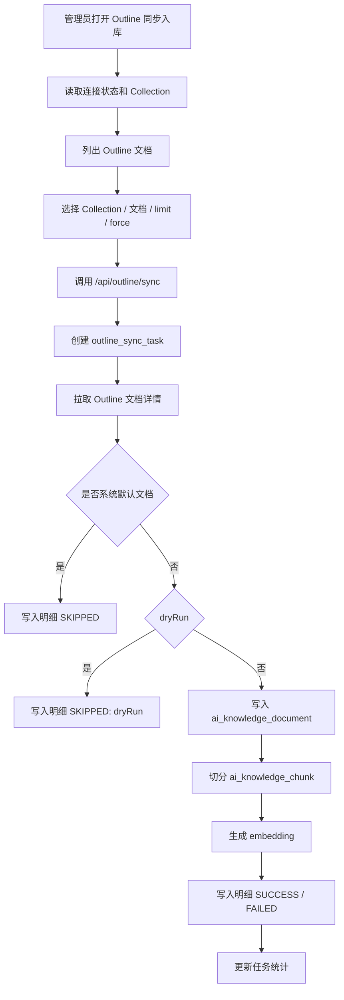
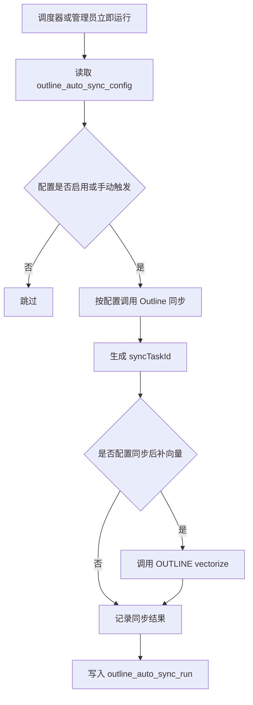
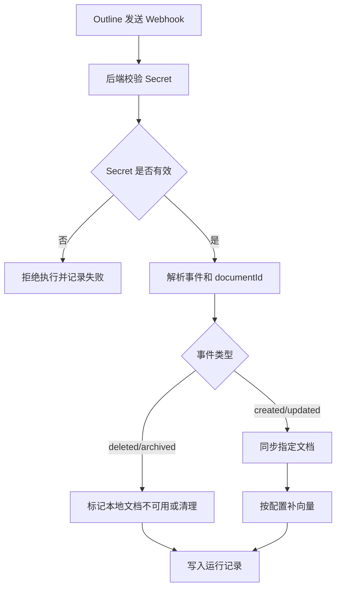

# Outline 文档同步整理规格说明

## 1. 背景与目标

### 1.1 背景

当前系统已接入 Outline 作为外部协作文档来源，并通过本地 AI 知识库实现文档入库、切片、向量化和检索增强。现有能力分布在多个页面和后端模块中：

- Outline 在线连接与搜索：用于确认 Outline 服务可用，并直接检索 Outline 文档。
- Outline 手动同步入库：用于将 Outline 文档同步到本地 `ai_knowledge_document` / `ai_knowledge_chunk`。
- Outline 自动同步：用于定时扫描、Webhook 精准同步，以及同步后的向量化闭环。
- Outline 同步任务与明细：用于展示同步结果、失败原因、跳过原因、chunk 数、向量化状态等。
- AI 方案生成与一张图分析：可引用 Outline 来源作为道路养护知识依据。

随着系统功能增长，Outline 相关入口、职责边界和用户操作路径需要重新整理，避免出现以下问题：

- 用户不知道什么时候应该在线搜索，什么时候应该同步入库。
- 管理员不知道同步任务、自动同步、Webhook、补向量分别负责什么。
- 运营或业务人员无法判断文档是否已进入 AI 知识库、是否可被 RAG 检索使用。
- 研发排查同步失败时缺少统一的任务状态、文档明细、错误原因和向量化闭环口径。

### 1.2 目标

本规格说明用于整理 Outline 文档同步功能的职责划分、用户角色、页面功能、数据流、状态流转和验收标准，作为后续产品优化、前后端实现和运维使用的统一依据。

本次只生成文档，不生成代码。

### 1.3 建设原则

- 职责清晰：在线搜索、手动同步、自动同步、向量化、任务审计分别归口。
- 用户可理解：普通用户只关注“能不能搜到、能不能引用”；管理员关注“同步是否成功、失败如何处理”。
- 信息透明：同步任务、文档明细、跳过原因、失败原因、向量化状态必须可见。
- 可追溯：每次同步都应有任务记录，每篇文档都应有同步明细。
- 可恢复：失败文档应支持重试，待补向量应支持单独补齐。
- 可运营：自动同步配置、Webhook Secret、运行记录、到期扫描应可管理。

## 2. 分步实施计划

本功能不建议一次性铺开所有页面和治理能力，应按“先整理入口，再补齐同步闭环，再做自动化和运营治理”的顺序实施。每一步都要有明确目标、范围、产出和验收口径。

### 2.1 第一步：菜单与入口整理

#### 2.1.1 目标

先解决“用户不知道从哪里进入、Outline 页面散落、普通用户看到过多管理入口”的问题。

第一步只做导航结构和入口职责整理，不优先改同步逻辑。

#### 2.1.2 要做什么

1. 新增父菜单：`Outline 文档同步`。
2. 将现有 Outline 页面收敛到父菜单下。
3. 定义子菜单：
   - `连接状态`
   - `文档搜索`
   - `同步入库`
   - `同步任务`
   - `自动同步`
   - `运行监控`
4. 保留旧路由兼容，旧地址重定向到新地址。
5. 按角色控制子菜单可见性。
6. 普通用户默认只看到只读入口。
7. 管理员和运维人员看到管理入口。

#### 2.1.3 建议路由

| 子菜单 | 新路由 | 当前兼容路由 | 说明 |
| --- | --- | --- | --- |
| 连接状态 | `/agent/outline/status` | `/agent/outline-status` | 查看 Outline 是否启用、可用、可同步 |
| 文档搜索 | `/agent/outline/search` | `/agent/outline-search` | 在线搜索 Outline 原文 |
| 同步入库 | `/agent/outline/sync` | `/agent/outline-sync` | 手动同步、Dry Run、补向量 |
| 同步任务 | `/agent/outline/tasks` | 可复用同步页任务区 | 集中查看同步任务和文档明细 |
| 自动同步 | `/agent/outline/auto-sync` | `/agent/outline-auto-sync` | 配置定时同步和 Webhook |
| 运行监控 | `/agent/outline/runs` | 可复用自动同步运行区 | 查看自动同步运行记录和健康状态 |

#### 2.1.4 产出

- 一个统一父菜单。
- 一组子菜单。
- 一份角色可见性配置。
- 旧路由兼容策略。
- 页面职责说明。

#### 2.1.5 验收

- 普通用户不会在一级菜单看到多个 Outline 入口。
- 业务管理员可以从父菜单按顺序进入连接状态、搜索、同步入库、同步任务。
- 系统管理员可以进入自动同步和运行监控。
- 旧路由仍能访问或自动跳转。
- 父菜单本身不承载复杂业务页面，只做聚合入口。

### 2.2 第二步：连接状态与文档搜索整理

#### 2.2.1 目标

让用户先能判断“Outline 能不能用”“Outline 里有没有这篇文档”，并明确在线搜索不等于已经进入本地知识库。

#### 2.2.2 要做什么

1. 优化连接状态页。
2. 展示 Outline 基础配置状态：
   - `enabled`
   - `usable`
   - `baseUrl`
   - `syncEnabled`
   - `defaultCollectionId`
3. 增加不可用原因提示。
4. 优化文档搜索页。
5. 在文档搜索页明确提示：
   - 在线搜索只查 Outline。
   - 在线搜索不写入本地知识库。
   - 已同步文档才可稳定参与 AI RAG。
6. 搜索结果展示标题、摘要、链接、文档 ID。
7. 普通用户只允许搜索和查看，不允许同步。

#### 2.2.3 产出

- 连接状态页。
- 文档搜索页。
- 在线搜索说明。
- 不可用状态提示。

#### 2.2.4 验收

- Outline 未启用时，页面能明确提示原因。
- Outline Token 或 baseUrl 缺失时，页面能提示管理员检查配置。
- 用户搜索后能看到文档标题、摘要、原文链接。
- 页面明确说明“搜索结果不代表已入库”。

### 2.3 第三步：手动同步入库闭环

#### 2.3.1 目标

让业务管理员可以完整完成“选择文档 → 预演 → 同步 → 查看结果 → 失败重试”的闭环。

#### 2.3.2 要做什么

1. 整理同步入库页。
2. 支持加载 Collection。
3. 支持加载文档列表。
4. 支持选择指定文档。
5. 支持同步参数：
   - Collection
   - limit
   - force
   - dryRun
   - cleanupMissing
   - documentIds
6. 支持 Dry Run 预演。
7. 支持正式同步。
8. 同步完成后展示任务结果：
   - 总数
   - 成功
   - 跳过
   - 失败
   - 错误摘要
9. 支持打开同步任务明细。
10. 支持失败文档重试。

#### 2.3.3 产出

- 同步入库页。
- 同步任务结果展示。
- 同步任务明细。
- 失败重试能力。

#### 2.3.4 验收

- Dry Run 不写入知识库，但能生成任务和明细。
- 正式同步能写入 `ai_knowledge_document` 和 `ai_knowledge_chunk`。
- 内容未变化时能标记 `SKIPPED`。
- 同步失败时能看到失败文档和失败原因。
- 失败文档可以重试。

### 2.4 第四步：向量化状态与可用性判断

#### 2.4.1 目标

解决“同步成功但 AI 不一定能搜到”的问题，让管理员能判断文档是否真正可被 AI 使用。

#### 2.4.2 要做什么

1. 增加 Outline 知识库统计。
2. 展示：
   - 本地 OUTLINE 文档数。
   - OUTLINE chunk 总数。
   - 已向量化 chunk 数。
   - 待补向量 chunk 数。
3. 待补向量大于 0 时突出提示。
4. 提供补向量入口。
5. 支持强制重建向量。
6. 在同步任务结果中展示“是否可用于 AI”。
7. 增加同步后检索验证入口。

#### 2.4.3 产出

- 知识库统计卡片。
- 待补向量提示。
- 补向量按钮。
- 可用于 AI 状态。
- 检索验证入口。

#### 2.4.4 验收

- 页面能看到 pending embedding 数量。
- 点击补向量后 pending 数量减少或归零。
- 同步完成后能判断文档是否可被 AI 检索。
- 可用文档能通过标题或关键词检索召回。

### 2.5 第五步：同步任务独立化

#### 2.5.1 目标

把同步任务从“同步入库页的一块区域”提升为独立子菜单，方便管理员和测试人员集中排查历史任务。

#### 2.5.2 要做什么

1. 新增子菜单：`同步任务`。
2. 展示任务列表。
3. 支持筛选：
   - 状态
   - 时间
   - Collection
   - 是否 Dry Run
4. 支持查看任务明细。
5. 支持按明细状态筛选：
   - 全部
   - 成功
   - 跳过
   - 失败
6. 支持失败重试。
7. 增加失败类型统计。
8. 增加任务摘要：
   - 新增数量
   - 更新数量
   - 跳过数量
   - 失败数量
   - 待补向量数量

#### 2.5.3 产出

- 同步任务页面。
- 任务筛选。
- 明细筛选。
- 失败分类统计。

#### 2.5.4 验收

- 管理员可以不进入同步入库页，直接查看历史任务。
- 失败任务能按错误类型快速定位。
- 明细中能打开 Outline 原文。
- 明细中能看到本地知识库文档 ID、chunk 数、hash、错误原因。

### 2.6 第六步：自动同步与 Webhook

#### 2.6.1 目标

让系统可以自动保持 Outline 文档与本地 AI 知识库同步，降低人工同步成本。

#### 2.6.2 要做什么

1. 新增或整理子菜单：`自动同步`。
2. 支持自动同步配置：
   - 名称
   - Collection
   - 启用状态
   - 间隔时间
   - force
   - cleanupMissing
   - vectorizeAfterSync
   - vectorForce
   - vectorLimit
3. 支持立即运行。
4. 支持 Webhook 配置：
   - webhookEnabled
   - webhookSecret
   - Webhook URL
5. 支持 Webhook 接入说明。
6. 支持 Webhook 测试。
7. 支持同步后自动补向量。

#### 2.6.3 产出

- 自动同步配置页。
- Webhook 配置和说明。
- 立即运行能力。
- 同步后自动向量化策略。

#### 2.6.4 验收

- 可新增和修改自动同步配置。
- 可启停定时同步。
- 可立即运行配置。
- Webhook Secret 正确时能触发同步。
- Secret 错误时拒绝执行。
- Webhook 更新事件能只同步指定文档。

### 2.7 第七步：运行监控与运维诊断

#### 2.7.1 目标

让系统管理员能快速判断自动同步是否健康，避免同步失败、Webhook 失败、待补向量堆积长期无人发现。

#### 2.7.2 要做什么

1. 新增子菜单：`运行监控`。
2. 汇总自动同步运行记录。
3. 展示：
   - 最近成功时间。
   - 最近失败时间。
   - 连续失败次数。
   - Webhook 触发次数。
   - Webhook 失败次数。
   - 待补向量数量。
4. 支持按配置、触发方式、状态、时间筛选。
5. 支持查看运行详情。
6. 支持扫描到期配置。
7. 支持健康状态提示。

#### 2.7.3 产出

- 运行监控页。
- 自动同步健康度卡片。
- Webhook 运行记录。
- 连续失败告警提示。

#### 2.7.4 验收

- 管理员能看到所有自动同步运行记录。
- 能区分定时触发、手动触发、Webhook 触发。
- 连续失败配置能被突出展示。
- 待补向量堆积能被突出展示。

### 2.8 第八步：普通用户使用体验闭环

#### 2.8.1 目标

让普通业务用户在 AI 使用过程中明确知道“答案来自哪里、资料是否可信、缺资料时如何反馈”。

#### 2.8.2 要做什么

1. 优化 AI 答案来源展示。
2. 来源区分：
   - 业务数据。
   - 本地知识库。
   - Outline 文档。
3. 展示来源文档：
   - 标题。
   - 命中片段。
   - 更新时间。
   - 同步时间。
   - 原文链接。
4. 增加“知识缺失反馈”入口。
5. 增加“答案来源不准确”反馈入口。
6. 将反馈关联到问题、对象、引用来源、用户。

#### 2.8.3 产出

- AI 来源展示优化。
- 知识缺失反馈。
- 来源准确性反馈。

#### 2.8.4 验收

- 普通用户能看懂答案引用了哪些文档。
- 用户能打开原文。
- 用户能反馈缺失或错误资料。
- 管理员能看到反馈记录并据此补充文档。

### 2.9 第九步：内容治理与运营看板

#### 2.9.1 目标

从“能同步”升级为“能治理知识质量”，支持平台长期运营。

#### 2.9.2 要做什么

1. 增加知识覆盖看板。
2. 按业务维度统计文档覆盖：
   - 病害类型。
   - 评定指标。
   - 处置工艺。
   - 路面类型。
   - 方案模板。
3. 增加低质量文档识别：
   - 空文档。
   - 过短文档。
   - 默认系统文档。
   - 长期未更新文档。
   - 零引用文档。
4. 增加引用热度统计。
5. 增加待治理任务清单。

#### 2.9.3 产出

- 知识覆盖看板。
- 低质量文档列表。
- 引用热度统计。
- 待治理任务。

#### 2.9.4 验收

- 内容运营能看到哪些主题缺少文档。
- 管理员能识别低质量文档。
- 能看到哪些 Outline 文档被 AI 高频引用。
- 能看到长期未被引用或长期未更新的文档。

### 2.10 推荐实施顺序汇总

| 步骤 | 名称 | 优先级 | 主要目标 |
| --- | --- | --- | --- |
| 第一步 | 菜单与入口整理 | P0 | 把 Outline 能力收敛成父菜单和子菜单 |
| 第二步 | 连接状态与文档搜索整理 | P0 | 让用户知道 Outline 是否可用、文档是否存在 |
| 第三步 | 手动同步入库闭环 | P0 | 完成文档同步、Dry Run、失败重试 |
| 第四步 | 向量化状态与可用性判断 | P0 | 判断文档是否真正可被 AI 使用 |
| 第五步 | 同步任务独立化 | P1 | 集中审计和排查同步任务 |
| 第六步 | 自动同步与 Webhook | P1 | 降低人工同步成本 |
| 第七步 | 运行监控与运维诊断 | P1 | 发现连续失败、Webhook 失败、向量堆积 |
| 第八步 | 普通用户使用体验闭环 | P2 | 让业务用户能理解来源并反馈知识缺失 |
| 第九步 | 内容治理与运营看板 | P2 | 长期治理知识覆盖和文档质量 |

## 3. 当前系统能力梳理

### 3.1 后端模块

当前后端 Outline 能力主要位于 `srmp-agent` 模块：

| 模块 | 类/接口 | 当前职责 |
| --- | --- | --- |
| Outline 在线能力 | `OutlineController` / `OutlineService` | 连接状态、在线搜索、查看 Outline 原文档 |
| Outline 手动同步 | `OutlineSyncController` / `OutlineSyncService` | 获取 Collection、列出文档、同步入库、任务记录、任务明细、失败重试 |
| Outline 向量化 | `OutlineSyncController.vectorize` / `AiKnowledgeReindexService` | 对 OUTLINE 来源 chunk 进行补向量或强制重建向量 |
| Outline 知识库统计 | `OutlineSyncService.knowledgeStats` | 统计本地 OUTLINE 文档数、chunk 数、已向量化数、待补向量数 |
| Outline 自动同步 | `OutlineAutoSyncController` / `OutlineAutoSyncService` | 自动同步配置、立即运行、运行记录、Webhook、到期扫描 |
| 自动任务调度 | `OutlineAutoSyncScheduler` | 周期性扫描到期自动同步配置并执行 |
| AI 来源过滤 | `AiSolutionReferenceSourceGuard` | 过滤 Outline 默认产品说明类文档，避免污染道路养护答案 |

### 3.2 前端页面

当前前端 Outline 页面主要位于 `srmp-web-ui/src/views/agent`：

| 页面 | 路由 | 当前职责 |
| --- | --- | --- |
| Outline 连接状态 | `/agent/outline-status` | 查看 Outline 是否启用、是否可用、baseUrl、syncEnabled |
| Outline 文档搜索 | `/agent/outline-search` | 在线搜索 Outline 文档，适合快速查找原文 |
| Outline 同步入库 | `/agent/outline-sync` | 手动同步、Dry Run、补向量、查看知识库统计、任务列表、任务明细、失败重试 |
| Outline 自动同步 | `/agent/outline-auto-sync` | 自动同步配置、Webhook 配置、运行记录、立即运行、到期扫描、补向量 |
| 知识库文档 | `/agent/knowledge-documents` | 查看本地知识库文档，间接承接 OUTLINE 来源文档管理 |

### 3.3 数据表与数据对象

当前数据库已存在 Outline 同步相关表：

| 表 | 作用 |
| --- | --- |
| `outline_sync_task` | 一次同步任务主记录，保存任务状态、总数、成功数、跳过数、失败数、错误信息、时间 |
| `outline_sync_task_detail` | 每篇 Outline 文档的同步明细，保存文档 ID、标题、URL、状态、动作、chunk 数、hash、错误、跳过原因 |
| `outline_sync_document` | 同步明细历史表或早期同步结果表，用于记录单篇文档同步结果 |
| `outline_auto_sync_config` | 自动同步配置，保存 Collection、间隔、Webhook、向量化策略、启停状态 |
| `outline_auto_sync_run` | 自动同步运行记录，保存触发方式、事件、文档 ID、同步任务 ID、向量化结果 |
| `ai_knowledge_document` | 本地 AI 知识库文档主表，Outline 文档入库后保存为 `source_type='OUTLINE'` |
| `ai_knowledge_chunk` | 本地 AI 知识库切片表，保存 Outline 文档切片和 embedding |

## 4. 角色与职责划分

### 4.1 普通业务用户

普通业务用户主要是道路养护业务人员、巡检人员、方案编制人员。他们不应该直接承担同步配置和运维工作。

核心诉求：

- 查询道路养护知识、规范、处置建议。
- 在 AI 问答或一张图分析中引用已同步的 Outline 知识。
- 需要知道答案引用了哪些文档来源。
- 遇到知识缺失时能反馈“文档未同步”或“知识不可用”。

应开放功能：

- Outline 在线搜索，只读。
- AI 问答中的 Outline 来源展示，只读。
- 方案生成中的引用来源查看，只读。
- 知识库文档检索，只读。

不应开放功能：

- 修改 Outline API 配置。
- 执行全量同步。
- 删除或强制重建知识库。
- 修改自动同步配置和 Webhook Secret。

### 4.2 业务管理员

业务管理员负责本单位或租户范围内的知识维护，通常是养护部门管理员、项目负责人、知识库管理员。

核心诉求：

- 选择需要进入本地 AI 知识库的 Outline Collection。
- 手动同步指定文档或指定 Collection。
- 在正式同步前 Dry Run 预演。
- 查看每次同步结果和失败明细。
- 对失败文档执行重试。
- 查看是否存在待补向量。
- 判断哪些文档可被 AI 检索使用。

应开放功能：

- Outline 连接状态查看。
- Outline Collection 和文档列表查看。
- 手动同步入库。
- Dry Run。
- 指定文档同步。
- 强制更新。
- 同步任务列表。
- 同步任务明细。
- 失败重试。
- Outline 知识库统计。
- 补向量。

受控开放功能：

- 强制重建向量。
- 清理缺失文档。
- 大批量全量同步。

不建议开放功能：

- Webhook Secret 明文管理。
- 系统级 Outline API Token 配置。
- 跨租户同步。

### 4.3 系统管理员 / 运维管理员

系统管理员负责 Outline 服务、后端服务、定时任务、Webhook 和环境变量配置。

核心诉求：

- 配置 Outline 服务地址、Token、默认 Collection。
- 维护本地 Outline Docker 环境或外部 Outline 连接。
- 配置自动同步策略。
- 配置 Webhook Secret 和公网回调地址。
- 排查同步失败、Token 失效、网络异常、向量化失败。
- 定期检查待补向量和同步运行记录。

应开放功能：

- Outline 连接状态。
- 自动同步配置增删改查。
- 自动同步立即运行。
- 到期配置扫描。
- Webhook 接入说明。
- Webhook 测试。
- 自动同步运行记录。
- 强制补向量 / 强制重建向量。
- 系统日志和后端错误追踪。

应具备的配置权限：

- `OUTLINE_ENABLED`
- `OUTLINE_BASE_URL`
- `OUTLINE_API_TOKEN`
- `OUTLINE_SYNC_ENABLED`
- `OUTLINE_DEFAULT_COLLECTION_ID`
- Webhook 对外访问地址。
- Webhook Secret 管理。

### 4.4 研发 / 测试人员

研发和测试人员主要负责接口联调、自动化测试、数据一致性验证和异常复现。

核心诉求：

- 复现同步链路。
- 验证接口契约。
- 验证同步任务状态和明细字段。
- 验证 chunk、embedding、RAG 检索闭环。
- 验证 Outline 默认文档过滤策略。

应关注内容：

- Outline API 调用是否符合 Outline 官方接口。
- 同步入库是否写入 `ai_knowledge_document` 和 `ai_knowledge_chunk`。
- 内容 hash 判断是否正确。
- `force` 是否绕过 hash。
- `dryRun` 是否不写库。
- `documentIds` 是否只同步指定文档。
- `retryFailed` 是否只重试失败文档。
- `vectorize` 是否只处理 OUTLINE 来源。
- 多租户 `tenant_id` 是否隔离。

### 4.5 不同用户使用视角与当前不足

本节从真实使用路径出发，补充不同角色在当前功能设计中可能遇到的问题，并明确后续需要调整的方向。

#### 4.5.1 普通业务用户视角

普通业务用户的目标不是“同步文档”，而是“在需要处置建议、规范依据、方案说明时能快速获得可信答案”。因此他们的使用链路通常是：

```text
提出业务问题 → AI 检索知识 → 查看答案 → 查看引用来源 → 判断是否可信 → 继续追问或生成方案
```

典型场景：

- 在一张图中点击病害、路段或评定单元，询问“这个问题应该怎么处置”。
- 在 AI 问答中询问“横向裂缝中度病害怎么处理”。
- 在方案任务中查看 AI 给出的处置建议和引用来源。
- 搜索某份规范或操作指南，确认是否有相应制度依据。

当前不足：

| 不足 | 影响 | 后续调整 |
| --- | --- | --- |
| 用户不知道答案使用的是 Outline 在线文档还是本地知识库文档 | 无法判断答案是否稳定、是否经过同步治理 | 在 AI 来源展示中明确标记“本地知识库 / Outline 在线来源 / 业务数据来源” |
| 普通用户缺少“知识缺失反馈”入口 | 搜不到资料时只能人工反馈，无法形成闭环 | 在 AI 答案和知识检索结果中增加“未找到资料 / 资料不准确”反馈 |
| Outline 文档搜索和知识库检索概念容易混淆 | 用户可能以为 Outline 搜到就一定能被 AI 引用 | 在搜索页增加说明：在线搜索不等于已入库，已入库文档才可稳定参与 RAG |
| 来源可信度展示不足 | 用户不知道引用内容是否来自最新文档、是否已向量化 | 来源卡片展示文档更新时间、同步时间、来源类型、命中片段 |
| 普通用户可见入口过多会造成干扰 | 同步、Webhook、补向量等运维动作对普通用户无意义 | 普通用户导航只保留知识检索、AI 问答、引用来源、可选 Outline 搜索 |

普通用户后续页面建议：

- AI 问答结果中将来源分为“业务数据”“知识库文档”“Outline 文档”。
- 每个来源展示标题、更新时间、同步状态、命中片段、打开原文。
- 当未召回知识时，提示“当前知识库未命中相关文档，可联系管理员同步 Outline 文档”。
- 增加“反馈知识缺失”按钮，记录问题、当前对象、期望资料类型。

#### 4.5.2 业务管理员视角

业务管理员的目标是“保证业务文档能进入知识库并被 AI 正确引用”。他们关注的是内容范围、同步结果、失败处理和知识可用性。

典型使用链路：

```text
查看 Outline 连接 → 选择 Collection → 预览文档 → Dry Run → 正式同步 → 查看任务明细 → 补向量 → 验证检索召回
```

典型场景：

- 新增了一批道路养护规范，需要同步到 AI 知识库。
- 某份处置指南更新后，需要确认 AI 能引用新版内容。
- 同步后发现部分文档失败，需要定位失败原因并重试。
- 业务用户反馈“AI 没有引用某份资料”，管理员需要确认文档是否已同步、是否已向量化、是否被过滤。

当前不足：

| 不足 | 影响 | 后续调整 |
| --- | --- | --- |
| 文档预览只能看到标题和更新时间，缺少本地同步状态 | 管理员无法直接判断哪些文档已入库、哪些未同步 | 文档列表增加“本地状态、知识库文档 ID、chunk 数、向量化状态、最近同步时间” |
| Dry Run 与正式同步差异说明不够直观 | 管理员可能误以为 Dry Run 已经写入知识库 | Dry Run 结果页明确展示“不会写入知识库、不会生成向量” |
| 失败原因没有按类型聚合 | 大量失败时管理员难以快速判断是 Token、网络、内容为空还是向量化问题 | 任务页增加失败分类统计和可筛选错误类型 |
| 同步后缺少“验证召回”动作 | 管理员不知道同步后 AI 是否真的能搜到 | 同步成功后提供“用标题验证检索”“用关键词验证检索”按钮 |
| 补向量和同步流程割裂 | 同步成功但向量未完成时，业务上仍不可用 | 同步结果中直接展示“可用于 AI：是/否”，并引导补向量 |
| 强制更新、清理过期风险提示不足 | 可能误触发大范围重建或删除 | 高风险操作增加二次确认、影响范围预估、操作记录 |

业务管理员后续页面建议：

- 同步入库页增加“文档同步状态矩阵”：未同步、已同步、内容未变化、待补向量、可检索、失败。
- 任务明细支持按错误类型、Collection、文档标题、同步动作筛选。
- 失败重试前展示失败文档数量和失败类型。
- 正式同步完成后生成操作摘要：新增 N 篇、更新 N 篇、跳过 N 篇、失败 N 篇、待补向量 N 个。
- 支持从任务明细跳转到本地知识库文档详情。

#### 4.5.3 系统管理员 / 运维管理员视角

系统管理员的目标是“保证 Outline 接入稳定、自动同步可靠、Webhook 安全、向量化服务可用”。他们关注配置、调度、日志、告警和安全。

典型使用链路：

```text
配置 Outline 环境 → 检查连接 → 配置自动同步 → 配置 Webhook → 观察运行记录 → 处理失败和告警 → 定期巡检
```

典型场景：

- 首次部署本地 Outline 或接入外部 Outline。
- API Token 过期，导致同步失败。
- Webhook 外网地址变更，需要重新配置。
- embedding 服务异常，导致待补向量持续增加。
- 自动同步任务连续失败，需要告警。

当前不足：

| 不足 | 影响 | 后续调整 |
| --- | --- | --- |
| 连接状态只展示基础字段，缺少实际连通性诊断 | 无法区分配置缺失、Token 错误、网络不通、权限不足 | 状态页增加“诊断检查”：baseUrl 可达、Token 有效、默认 Collection 可访问 |
| 自动同步运行记录缺少趋势和连续失败统计 | 运维无法快速发现长期失败 | 自动同步配置展示连续失败次数、最近成功时间、最近失败原因 |
| Webhook Secret 管理不够规范 | 存在泄露或误配置风险 | Secret 默认脱敏展示，支持重新生成，记录更新时间和操作者 |
| 缺少告警机制 | 同步失败或待补向量堆积时依赖人工发现 | 增加系统通知：连续失败、待补向量超过阈值、Webhook 鉴权失败 |
| 缺少并发控制可见性 | 多个同步任务可能抢占资源或重复处理 | 增加同步锁状态、当前运行任务展示、并发拒绝原因 |
| 删除/归档事件处理策略不够明确 | Outline 删除后本地知识库可能仍被 AI 引用 | 明确 deleted/archived 的本地处理：标记 INACTIVE、保留审计、从检索中排除 |

系统管理员后续页面建议：

- 连接状态页升级为“Outline 接入诊断页”。
- 自动同步页增加健康度卡片：运行中、最近成功、连续失败、待补向量、Webhook 失败次数。
- Webhook 配置支持一键复制、安全重置、测试事件模板。
- 自动同步运行记录支持按配置、触发方式、状态、时间过滤。
- 增加后台巡检任务，定期统计 OUTLINE 文档向量化缺口和同步失败率。

#### 4.5.4 研发 / 测试人员视角

研发和测试人员的目标是“确保接口契约稳定、数据链路闭环、异常可复现”。他们需要明确输入输出、状态机、数据落库和边界条件。

典型使用链路：

```text
准备 Outline 测试文档 → 调接口拉取 → 执行 Dry Run → 执行同步 → 查任务和明细 → 查知识库表 → 验证检索 → 验证 AI 引用
```

典型场景：

- 验证指定文档同步是否只处理 `documentIds`。
- 验证同一文档内容不变时是否跳过。
- 验证 `force=true` 是否重新入库和重建 chunk。
- 验证向量化失败时是否保留同步成功和失败数量。
- 验证 Webhook 的不同事件是否走正确分支。
- 验证多租户隔离。

当前不足：

| 不足 | 影响 | 后续调整 |
| --- | --- | --- |
| 接口响应缺少统一错误码和错误类型 | 自动化测试难以断言失败原因 | 定义 `errorType` 枚举：CONFIG_ERROR、OUTLINE_API_ERROR、EMPTY_CONTENT、INGEST_ERROR、VECTOR_ERROR |
| 同步状态机文档不够细 | 容易出现前后端状态解释不一致 | 补充任务状态和文档明细状态流转图 |
| 缺少测试数据规范 | 不同环境测试结果不稳定 | 建立固定 Outline 测试 Collection 和测试文档模板 |
| Webhook payload 兼容性未完整列举 | Outline 事件结构变化时容易解析失败 | 文档补充 created/updated/deleted/archived 的 payload 示例 |
| 缺少端到端验收脚本口径 | 回归依赖人工点击 | 增加接口 smoke test 清单和断言项 |

研发测试后续建议：

- 补充接口契约测试覆盖 `status/search/documents/sync/vectorize/tasks/details/retry/webhook`。
- 准备标准测试文档：普通文档、空文档、大文档、重复标题文档、默认系统文档、已删除文档。
- 同步任务和明细状态使用枚举统一管理，前端避免硬编码分散。
- 增加测试用 SQL，验证文档、chunk、embedding、metadata 是否完整。

#### 4.5.5 平台运营 / 内容运营视角

平台运营或内容运营关注的是“知识内容质量”和“业务可用性”，不一定参与系统配置。

典型使用链路：

```text
查看知识覆盖情况 → 发现低质量或缺失文档 → 推动业务部门补文档 → 同步后验证 AI 效果 → 持续治理
```

当前不足：

| 不足 | 影响 | 后续调整 |
| --- | --- | --- |
| 缺少知识覆盖统计 | 不知道哪些病害、指标、养护场景缺少文档 | 增加按病害类型、指标类型、路线场景的知识覆盖分析 |
| 缺少低质量文档识别 | 空文档、过短文档、默认说明文档可能污染知识库 | 增加文档质量评分和治理状态 |
| 缺少知识有效性反馈闭环 | AI 答案不好时无法追溯到文档质量 | 将用户反馈关联到引用文档和命中 chunk |
| 缺少文档生命周期视图 | 不知道哪些文档长期未更新或从未被引用 | 展示最近更新时间、最近同步时间、最近引用时间 |

运营后续建议：

- 增加“知识覆盖看板”。
- 增加“待治理文档”列表。
- 增加“高频问题未命中文档”列表。
- 增加“AI 引用最多的 Outline 文档”统计。

## 5. 功能模块划分

### 5.1 Outline 连接状态模块

#### 5.1.1 定位

用于判断 Outline 是否已正确接入，是所有 Outline 能力的前置检查入口。

#### 5.1.2 使用角色

- 普通业务用户：只读查看可用状态。
- 业务管理员：同步前检查可用状态。
- 系统管理员：排查配置问题。

#### 5.1.3 页面信息

页面应展示：

- 是否启用：`enabled`
- 是否可用：`usable`
- Outline 服务地址：`baseUrl`
- 是否允许同步：`syncEnabled`
- 默认 Collection：`defaultCollectionId`
- 不可用时的配置提示。

#### 5.1.4 后端接口

`GET /api/outline/status`

返回字段建议：

| 字段 | 说明 |
| --- | --- |
| `enabled` | Outline 功能是否启用 |
| `usable` | 当前配置是否完整且可使用 |
| `baseUrl` | Outline 服务地址 |
| `syncEnabled` | 是否允许同步入库 |
| `defaultCollectionId` | 默认同步 Collection |
| `message` | 不可用原因，可选 |

#### 5.1.5 状态解释

| 状态 | 含义 | 用户提示 |
| --- | --- | --- |
| `enabled=false` | Outline 功能关闭 | 联系管理员启用 |
| `usable=false` | 配置不完整或 Token 不可用 | 检查 baseUrl / token / 网络 |
| `syncEnabled=false` | 允许搜索但不允许同步 | 只能在线搜索，不能入库 |
| `usable=true` | 可正常使用 | 可以搜索或同步 |

### 5.2 Outline 在线搜索模块

#### 5.2.1 定位

直接调用 Outline 搜索接口，不写入本地知识库，适合快速查找 Outline 原文档。

#### 5.2.2 与本地知识库检索的区别

| 能力 | Outline 在线搜索 | 本地知识库检索 |
| --- | --- | --- |
| 数据来源 | Outline 实时接口 | `ai_knowledge_document` / `ai_knowledge_chunk` |
| 是否入库 | 否 | 是 |
| 是否依赖向量 | 否 | 是 |
| 是否可被 AI RAG 稳定引用 | 不一定 | 是 |
| 适用场景 | 快速查原文 | AI 问答、方案生成、长期知识沉淀 |

#### 5.2.3 使用角色

- 普通业务用户：搜索文档，打开原文。
- 业务管理员：确认文档存在，再决定是否同步。
- 研发测试：验证 Outline API Token 是否能访问文档。

#### 5.2.4 后端接口

`POST /api/outline/search`

请求：

```json
{
  "query": "裂缝处置",
  "limit": 5
}
```

返回：

```json
[
  {
    "id": "outline-document-id",
    "title": "裂缝类病害处置指南",
    "text": "搜索命中的上下文片段",
    "url": "https://outline.example/doc/xxx",
    "score": 0.91
  }
]
```

`GET /api/outline/documents/{id}`

用于查看单篇 Outline 文档详情。

### 5.3 手动同步入库模块

#### 5.3.1 定位

将 Outline 文档同步到本地 AI 知识库，使其成为 AI 问答、方案生成、一张图分析可稳定引用的 RAG 来源。

#### 5.3.2 使用角色

- 业务管理员：主要使用者。
- 系统管理员：辅助排查。
- 普通用户：不建议开放。

#### 5.3.3 同步范围

同步范围应支持：

- 默认 Collection：使用后端配置的 `defaultCollectionId`。
- 指定 Collection：管理员选择某个 Collection。
- 指定文档：用户在文档预览表中勾选若干文档。
- 限制数量：通过 `limit` 控制同步文档数。
- 失败重试：只同步失败任务中的失败文档。

#### 5.3.4 同步模式

| 模式 | 说明 | 是否写入知识库 |
| --- | --- | --- |
| Dry Run | 预演文档拉取和任务记录，不写入本地知识库 | 否 |
| 普通同步 | 文档内容变化才写入，未变化跳过 | 是 |
| 强制同步 | 忽略 hash，重新写入和切片 | 是 |
| 失败重试 | 基于历史任务失败明细重新同步 | 是 |

#### 5.3.5 页面信息结构

手动同步页面建议分为四块：

1. 统计区
   - Outline 文档数。
   - Chunk 总数。
   - 已向量化数。
   - 待补向量数。

2. 同步配置区
   - Collection。
   - 同步数量。
   - 强制更新。
   - 清理过期。
   - 向量批量。
   - 推荐流程提示。

3. 文档预览区
   - 文档标题。
   - 文档 ID。
   - 更新时间。
   - 原文链接。
   - 多选同步。

4. 任务与明细区
   - 任务状态。
   - 总数、成功、跳过、失败。
   - 错误信息。
   - 明细抽屉。
   - 按状态筛选。
   - 失败重试。

#### 5.3.6 后端接口

`GET /api/outline/collections`

获取可同步 Collection 列表。

`POST /api/outline/documents/list`

请求：

```json
{
  "collectionId": "collection-id",
  "limit": 100,
  "offset": 0
}
```

`POST /api/outline/sync`

请求：

```json
{
  "collectionId": "collection-id",
  "limit": 500,
  "force": false,
  "dryRun": false,
  "cleanupMissing": false,
  "documentIds": ["doc-1", "doc-2"]
}
```

响应应返回任务对象：

```json
{
  "id": "sync-task-id",
  "status": "SUCCESS",
  "total_count": 10,
  "success_count": 8,
  "skip_count": 2,
  "fail_count": 0,
  "error_message": null
}
```

### 5.4 同步任务与文档明细模块

#### 5.4.1 定位

提供同步过程的审计和排错能力，是管理员判断同步结果的核心模块。

#### 5.4.2 任务主状态

| 状态 | 说明 |
| --- | --- |
| `RUNNING` | 同步任务执行中 |
| `SUCCESS` | 全部成功或全部成功/跳过，无失败 |
| `PARTIAL_SUCCESS` | 部分成功，部分失败 |
| `FAILED` | 全部失败或任务级异常 |
| `DRY_RUN` | 预演成功 |
| `DRY_RUN_PARTIAL` | 预演部分失败 |

#### 5.4.3 文档明细状态

| 状态 | 说明 | 需要展示的信息 |
| --- | --- | --- |
| `SUCCESS` | 文档成功入库 | knowledgeDocumentId、chunkCount、contentHash |
| `SKIPPED` | 文档跳过 | skipReason、oldContentHash、contentHash |
| `FAILED` | 文档同步失败 | errorType、errorMessage、Outline ID、标题、URL |

#### 5.4.4 明细字段要求

每篇文档同步明细应展示：

- Outline 文档 ID。
- Outline 标题。
- Outline URL。
- Outline 更新时间。
- 同步动作：`UPSERT` / `DELETE` / `SKIP`。
- 同步状态：`SUCCESS` / `SKIPPED` / `FAILED`。
- 跳过原因。
- 错误类型。
- 错误信息。
- 本地知识库文档 ID。
- Chunk 数。
- 内容字符数。
- 当前内容 hash。
- 旧内容 hash。
- 详情说明。
- 创建时间。
- 耗时。

#### 5.4.5 后端接口

`GET /api/outline/sync-tasks?limit=30`

获取同步任务列表。

`GET /api/outline/sync-tasks/{id}`

获取单个任务主记录。

`GET /api/outline/sync-tasks/{id}/details?status=FAILED&limit=1000`

获取任务明细，可按状态筛选。

`POST /api/outline/sync-tasks/{id}/retry-failed`

请求：

```json
{
  "force": true
}
```

只重试该任务下失败的文档。

### 5.5 向量化闭环模块

#### 5.5.1 定位

Outline 文档同步到本地知识库后，需要切片并生成 embedding，才能被向量检索稳定召回。向量化闭环用于检查和补齐这个过程。

#### 5.5.2 使用角色

- 业务管理员：查看待补向量，执行补向量。
- 系统管理员：强制重建向量，排查 embedding 服务异常。
- 研发测试：验证 RAG 召回质量。

#### 5.5.3 统计指标

`GET /api/outline/knowledge-stats`

应展示：

| 指标 | 说明 |
| --- | --- |
| `documentCount` | 本地 OUTLINE 文档数 |
| `chunkCount` | OUTLINE chunk 总数 |
| `embeddedChunkCount` | 已生成 embedding 的 chunk 数 |
| `pendingEmbeddingChunkCount` | 未生成 embedding 的 chunk 数 |
| `documents` | 最近文档向量化情况 |

#### 5.5.4 补向量接口

`POST /api/outline/vectorize`

请求：

```json
{
  "force": false,
  "dryRun": false,
  "limit": 500
}
```

行为：

- 默认只处理 `sourceType=OUTLINE` 且 embedding 为空的 chunk。
- `force=true` 时强制重建 OUTLINE chunk 的 embedding。
- `limit` 控制单次处理数量，避免长时间阻塞。

#### 5.5.5 用户提示

当 `pendingEmbeddingChunkCount > 0` 时，页面必须提示：

- 还有 N 个 OUTLINE chunk 未生成向量。
- RAG 可能降级为关键词检索。
- 建议点击“补向量”。

### 5.6 自动同步模块

#### 5.6.1 定位

自动同步用于减少管理员手工操作，保证 Outline 文档更新后及时进入本地 AI 知识库。

自动同步包含两种触发方式：

- 定时扫描：按配置间隔扫描 Collection。
- Webhook 精准同步：Outline 文档事件触发指定文档同步。

#### 5.6.2 使用角色

- 系统管理员：配置和维护自动同步。
- 业务管理员：查看运行记录，必要时立即运行。
- 普通用户：不开放。

#### 5.6.3 自动同步配置项

| 配置项 | 说明 |
| --- | --- |
| `id` | 配置 ID，新增时可自动生成 |
| `name` | 配置名称 |
| `enabled` | 是否启用定时同步 |
| `collectionId` | 同步范围 |
| `intervalMinutes` | 同步间隔 |
| `force` | 是否强制同步 |
| `cleanupMissing` | 是否清理缺失文档 |
| `vectorizeAfterSync` | 同步后是否补向量 |
| `vectorForce` | 是否强制重建向量 |
| `vectorLimit` | 向量化处理上限 |
| `webhookEnabled` | 是否启用 Webhook |
| `webhookSecret` | Webhook Secret |

#### 5.6.4 自动同步接口

`GET /api/outline/auto-sync/configs`

获取配置列表。

`GET /api/outline/auto-sync/configs/{id}`

获取单个配置。

`POST /api/outline/auto-sync/configs`

新增配置。

`PUT /api/outline/auto-sync/configs/{id}`

更新配置。

`POST /api/outline/auto-sync/configs/{id}/run`

立即运行指定配置。

`GET /api/outline/auto-sync/runs`

获取运行记录。

`POST /api/outline/auto-sync/scan-due`

扫描到期配置并执行。

### 5.7 Webhook 精准同步模块

#### 5.7.1 定位

Webhook 用于 Outline 文档创建、更新、删除、归档时，主动通知系统执行精准同步，避免每次扫描整个 Collection。

#### 5.7.2 支持事件

| 事件 | 处理方式 |
| --- | --- |
| `document.created` | 同步指定文档 |
| `document.updated` | 同步指定文档 |
| `document.deleted` | 将本地 OUTLINE 文档标记为不可用或执行清理 |
| `document.archived` | 将本地 OUTLINE 文档标记为不可用或执行清理 |

#### 5.7.3 Webhook 安全

后端支持三种 Secret 传法：

- `X-Outline-Webhook-Secret`
- `X-Webhook-Secret`
- `Authorization: Bearer <secret>`

校验规则：

- 未启用 Webhook 的配置不应响应同步。
- Secret 不匹配时拒绝执行。
- Secret 不应在普通用户页面明文展示。
- Webhook 日志应记录触发事件、文档 ID、配置 ID、运行状态。

#### 5.7.4 Webhook 接口

`POST /api/outline/auto-sync/webhook`

请求头：

```http
X-Outline-Webhook-Secret: your-secret
```

请求体示例：

```json
{
  "event": "document.updated",
  "model": {
    "id": "outline-document-id",
    "collectionId": "outline-collection-id",
    "title": "裂缝类病害处置指南"
  }
}
```

#### 5.7.5 页面功能

自动同步页面应提供：

- Webhook 地址展示。
- Header 示例。
- 支持事件说明。
- curl 示例。
- Webhook 测试弹窗。
- 手动输入或选择 Document ID。
- 测试结果 JSON 展示。

### 5.8 AI 引用与来源治理模块

#### 5.8.1 定位

Outline 文档同步的最终目的是让 AI 问答和养护方案生成可以引用高质量、领域相关的知识来源。

#### 5.8.2 来源使用场景

- AI 问答。
- 一张图对象分析。
- 框选区域养护建议。
- 方案任务生成。
- 方案草稿引用来源展示。

#### 5.8.3 来源过滤

需要过滤 Outline 默认产品说明类文档，包括但不限于：

- What is Outline
- Getting Started
- Our Editor
- Integrations & API
- Welcome to Outline

过滤目标：

- 避免 AI 把 Outline 产品文档当作道路养护知识。
- 只允许道路养护、病害处置、技术状况评定、低分单元、区域养护相关文档作为答案依据。

#### 5.8.4 来源展示要求

AI 结果中引用 Outline 来源时，应展示：

- 来源类型：Outline。
- 文档标题。
- 命中文本摘要。
- 文档链接。
- 相似度或排序分。
- 是否来自本地知识库。

## 6. 推荐页面与导航整理

### 6.1 导航分组建议

建议将 Outline 相关入口统一归入一个父菜单，避免在“AI 知识管理”下平铺多个 Outline 页面，导致普通用户和管理员都难以判断入口关系。

父菜单建议命名为：`Outline 文档同步`。

父菜单定位：

- 统一承载 Outline 接入状态、在线搜索、同步入库、自动同步、任务审计、向量化闭环。
- 与“知识库文档”“知识库检索”保持同级，但不把所有 Outline 页面散落在知识库一级菜单下。
- 普通用户看到的是只读子菜单；管理员和运维看到的是管理子菜单。

推荐结构：

```text
AI 知识管理
├── 知识库文档
├── 知识库检索
└── Outline 文档同步
    ├── 连接状态
    ├── 文档搜索
    ├── 同步入库
    ├── 同步任务
    ├── 自动同步
    └── 运行监控
```

子菜单说明：

| 父菜单 | 子菜单 | 建议路由 | 主要用户 | 页面定位 |
| --- | --- | --- | --- | --- |
| Outline 文档同步 | 连接状态 | `/agent/outline/status` | 普通用户、业务管理员、系统管理员 | 查看 Outline 是否启用、可用、可同步 |
| Outline 文档同步 | 文档搜索 | `/agent/outline/search` | 普通用户、业务管理员 | 在线搜索 Outline 原文，不写入本地知识库 |
| Outline 文档同步 | 同步入库 | `/agent/outline/sync` | 业务管理员、系统管理员 | 手动同步、Dry Run、指定文档同步、补向量 |
| Outline 文档同步 | 同步任务 | `/agent/outline/tasks` | 业务管理员、系统管理员、研发测试 | 集中查看同步任务、任务明细、失败重试 |
| Outline 文档同步 | 自动同步 | `/agent/outline/auto-sync` | 系统管理员 | 配置定时同步、Webhook、同步后向量化策略 |
| Outline 文档同步 | 运行监控 | `/agent/outline/runs` | 系统管理员、研发测试 | 查看自动同步运行记录、Webhook 触发记录、连续失败和健康状态 |

现有路由可在实现时兼容旧路径：

| 当前路由 | 建议新路由 | 迁移方式 |
| --- | --- | --- |
| `/agent/outline-status` | `/agent/outline/status` | 保留旧路由重定向到新路由 |
| `/agent/outline-search` | `/agent/outline/search` | 保留旧路由重定向到新路由 |
| `/agent/outline-sync` | `/agent/outline/sync` | 保留旧路由重定向到新路由 |
| `/agent/outline-auto-sync` | `/agent/outline/auto-sync` | 保留旧路由重定向到新路由 |

菜单聚合后的收益：

- 用户能明确知道这些页面都属于 Outline 文档同步体系。
- 普通用户不会在一级菜单看到过多运维入口。
- 管理员可以按“状态检查 → 搜索确认 → 同步入库 → 任务排查 → 自动同步”的顺序操作。
- 后续新增“同步任务”“运行监控”“知识覆盖”等页面时不会继续污染一级菜单。

### 6.2 页面职责边界

| 页面 | 核心问题 | 不应承担的职责 |
| --- | --- | --- |
| 连接状态 | Outline 能不能用 | 不做同步配置，不展示任务明细 |
| 文档搜索 | Outline 里有没有这篇文档 | 不写本地知识库，不触发同步 |
| 同步入库 | 怎么把文档写入本地知识库 | 不维护定时/Webhook 配置，不承担运行监控 |
| 同步任务 | 这次同步结果如何，失败原因是什么 | 不配置 Collection，不执行新增自动同步 |
| 自动同步 | 怎么自动触发同步 | 不展示大量文档内容，不替代任务明细 |
| 运行监控 | 自动同步和 Webhook 是否健康 | 不执行文档内容编辑，不替代系统日志 |
| 知识库文档 | 本地知识库里有哪些文档 | 不直接调用 Outline API |

### 6.3 父子菜单可见性建议

`Outline 文档同步` 父菜单是否展示，取决于当前用户是否拥有任一子菜单权限。子菜单按角色进行裁剪。

| 用户角色 | 可见子菜单 | 不可见子菜单 |
| --- | --- | --- |
| 普通业务用户 | 连接状态、文档搜索 | 同步入库、同步任务、自动同步、运行监控 |
| 业务管理员 | 连接状态、文档搜索、同步入库、同步任务 | 自动同步配置、Webhook Secret、运行监控中的系统级信息 |
| 系统管理员 | 全部子菜单 | 无 |
| 研发 / 测试人员 | 连接状态、文档搜索、同步任务、运行监控 | 是否可见同步入库按环境控制 |
| 平台运营 / 内容运营 | 文档搜索、同步任务只读、运行监控只读 | 自动同步配置写操作、Webhook Secret |

权限控制建议：

- 父菜单只做聚合，不直接承载页面。
- 子菜单权限独立控制。
- 普通用户即使能看到父菜单，也不应看到“同步入库”“自动同步”等写操作入口。
- 如果用户只有“文档搜索”权限，点击父菜单时默认进入“文档搜索”。
- 如果用户有管理权限，点击父菜单时默认进入“连接状态”或“同步概览”。

### 6.4 推荐子菜单首页：同步概览

如果后续需要进一步优化，可以在 `Outline 文档同步` 下新增一个默认首页：`同步概览`。

同步概览用于汇总所有子菜单的关键状态，避免管理员在多个页面之间来回切换。

建议展示：

- Outline 连接状态：enabled、usable、syncEnabled。
- 本地知识库状态：文档数、chunk 数、已向量化数、待补向量数。
- 最近同步任务：状态、成功数、失败数、跳过数、时间。
- 自动同步健康：启用配置数、最近成功时间、连续失败配置数。
- Webhook 健康：最近触发时间、失败次数。
- 待处理事项：
  - 待补向量 N 个。
  - 失败任务 N 个。
  - 连续失败配置 N 个。
  - Secret 未配置或不可用。

`同步概览` 可以作为 P1 阶段增强，不要求第一阶段必须实现。

### 6.5 普通用户简化入口

普通用户建议只看到：

- 知识库检索。
- AI 问答。
- 方案引用来源。
- Outline 文档同步 / 文档搜索（可选，只读）。
- Outline 文档同步 / 连接状态（可选，只读，用于解释为什么不可用）。

不建议普通用户看到：

- 同步入库。
- 自动同步。
- 同步任务。
- 运行监控。
- 补向量。
- 强制重建向量。
- Webhook Secret。

## 7. 端到端业务流程

### 7.1 首次接入流程

1. 系统管理员配置 Outline：
   - 启用 Outline。
   - 配置 baseUrl。
   - 配置 API Token。
   - 配置默认 Collection。

2. 系统管理员检查连接状态：
   - 打开 Outline 连接状态页面。
   - 确认 `enabled=true`。
   - 确认 `usable=true`。
   - 确认 `syncEnabled=true`。

3. 业务管理员进行 Dry Run：
   - 打开同步入库页面。
   - 选择 Collection。
   - 设置同步数量。
   - 点击 Dry Run。
   - 查看任务和明细。

4. 业务管理员正式同步：
   - 点击同步到知识库。
   - 查看任务状态。
   - 查看失败和跳过明细。

5. 业务管理员补向量：
   - 查看待补向量数。
   - 点击补向量。
   - 确认待补向量归零。

6. 普通用户使用：
   - 在 AI 问答或方案生成中检索相关知识。
   - 查看 Outline 来源引用。

### 7.2 日常手动更新流程

1. Outline 文档有更新。
2. 业务管理员进入同步入库页面。
3. 选择对应 Collection 或指定文档。
4. 执行 Dry Run。
5. 正式同步。
6. 查看同步任务。
7. 对失败文档执行重试。
8. 补向量。
9. 验证 AI 检索是否能召回新文档。

### 7.3 自动同步流程

1. 系统管理员新增自动同步配置。
2. 设置 Collection、间隔、强制策略、向量化策略。
3. 启用定时。
4. 调度器扫描到期配置。
5. 后端执行同步任务。
6. 如果配置了同步后补向量，则自动执行向量化。
7. 运行记录写入 `outline_auto_sync_run`。
8. 管理员在自动同步页面查看运行结果。

### 7.4 Webhook 精准同步流程

1. 系统管理员在自动同步配置中启用 Webhook。
2. 设置 Webhook Secret。
3. 将 Webhook URL 和 Header 配置到 Outline。
4. Outline 文档更新时发送事件。
5. 后端校验 Secret。
6. 后端解析事件和文档 ID。
7. 只同步指定文档。
8. 同步后按配置补向量。
9. 写入运行记录。

## 8. 权限建议

### 8.1 权限点

| 权限点 | 说明 | 建议角色 |
| --- | --- | --- |
| `outline:status:view` | 查看连接状态 | 普通用户、业务管理员、系统管理员 |
| `outline:search` | 在线搜索 Outline | 普通用户、业务管理员 |
| `outline:document:view` | 查看 Outline 文档详情 | 普通用户、业务管理员 |
| `outline:sync:view` | 查看同步页面和任务 | 业务管理员、系统管理员 |
| `outline:sync:run` | 执行同步 | 业务管理员、系统管理员 |
| `outline:sync:dry-run` | 执行预演 | 业务管理员、系统管理员 |
| `outline:sync:retry` | 重试失败文档 | 业务管理员、系统管理员 |
| `outline:vectorize` | 补向量 | 业务管理员、系统管理员 |
| `outline:vectorize:force` | 强制重建向量 | 系统管理员 |
| `outline:auto-sync:view` | 查看自动同步配置和运行记录 | 业务管理员、系统管理员 |
| `outline:auto-sync:manage` | 新增、修改自动同步配置 | 系统管理员 |
| `outline:webhook:test` | 测试 Webhook | 系统管理员 |
| `outline:webhook:secret` | 查看或修改 Webhook Secret | 系统管理员 |

### 8.2 租户隔离

所有同步任务、任务明细、自动同步配置、运行记录、本地知识库文档和 chunk 都必须按 `tenant_id` 隔离。

要求：

- 用户只能看到当前租户的同步任务。
- 用户只能同步到当前租户的知识库。
- 自动同步配置必须绑定当前租户。
- Webhook 触发后也必须落到对应租户配置。

## 9. 异常与恢复策略

### 9.1 Outline 不可用

可能原因：

- `OUTLINE_ENABLED=false`
- `OUTLINE_BASE_URL` 配置错误
- `OUTLINE_API_TOKEN` 缺失或失效
- 网络不可达
- Outline 服务未启动

页面提示：

- 连接状态页显示不可用。
- 同步页禁止执行同步或给出警告。
- 搜索页返回空结果时提示检查配置。

### 9.2 文档拉取失败

处理方式：

- 任务状态记为 `PARTIAL_SUCCESS` 或 `FAILED`。
- 明细状态记为 `FAILED`。
- 保存 Outline 文档 ID、标题、URL 和错误信息。
- 支持重试失败文档。

### 9.3 文档内容为空

处理方式：

- 如果列表接口没有 text，应调用详情接口补全文档内容。
- 详情仍为空，则标记失败或跳过。
- 明细中展示“文档内容为空”。

### 9.4 内容未变化

处理方式：

- 基于内容 hash 判断。
- 未变化时标记 `SKIPPED`。
- 展示 skipReason：内容未变化。
- 不重复切片和向量化。

### 9.5 向量化失败

处理方式：

- 文档同步可以成功，但应记录 embedding 失败数量。
- 页面显示待补向量。
- 管理员可手动补向量。
- 系统管理员可强制重建向量。

### 9.6 Webhook Secret 错误

处理方式：

- 拒绝执行同步。
- 运行记录或接口返回应明确提示 Secret 不匹配。
- 不暴露正确 Secret。

## 10. 信息展示要求

### 10.1 状态颜色建议

| 状态 | 颜色 |
| --- | --- |
| `SUCCESS` | 绿色 |
| `RUNNING` | 黄色或蓝色 |
| `PARTIAL_SUCCESS` | 橙色 |
| `FAILED` | 红色 |
| `SKIPPED` | 灰色 |
| `DRY_RUN` | 蓝色 |

### 10.2 统计卡片

Outline 同步页面和自动同步页面都应展示关键统计：

- Outline 文档数。
- Chunk 总数。
- 已向量化数。
- 待补向量数。

待补向量数大于 0 时应突出警告。

### 10.3 同步任务列表

任务卡片或表格应展示：

- 任务 ID。
- 状态。
- 同步模式。
- 总数。
- 成功数。
- 跳过数。
- 失败数。
- 错误摘要。
- 创建时间。
- 明细按钮。
- 失败重试按钮。

### 10.4 文档明细表

明细表应支持：

- 按状态筛选：全部、成功、失败、跳过。
- 展开查看完整信息。
- 点击打开 Outline 原文。
- 失败行突出错误。
- 跳过行展示跳过原因。

## 11. 接口契约汇总

### 11.1 在线能力

| 方法 | 路径 | 说明 |
| --- | --- | --- |
| GET | `/api/outline/status` | 查看 Outline 状态 |
| POST | `/api/outline/search` | 在线搜索 Outline 文档 |
| GET | `/api/outline/documents/{id}` | 获取 Outline 文档详情 |

### 11.2 手动同步

| 方法 | 路径 | 说明 |
| --- | --- | --- |
| GET | `/api/outline/collections` | Collection 列表 |
| POST | `/api/outline/documents/list` | 文档列表 |
| POST | `/api/outline/sync` | 执行同步 |
| POST | `/api/outline/vectorize` | OUTLINE 来源补向量 |
| GET | `/api/outline/knowledge-stats` | OUTLINE 本地知识库统计 |
| GET | `/api/outline/sync-tasks` | 同步任务列表 |
| GET | `/api/outline/sync-tasks/{id}` | 同步任务详情 |
| GET | `/api/outline/sync-tasks/{id}/details` | 同步文档明细 |
| POST | `/api/outline/sync-tasks/{id}/retry-failed` | 重试失败文档 |

### 11.3 自动同步

| 方法 | 路径 | 说明 |
| --- | --- | --- |
| GET | `/api/outline/auto-sync/configs` | 自动同步配置列表 |
| GET | `/api/outline/auto-sync/configs/{id}` | 单个配置 |
| POST | `/api/outline/auto-sync/configs` | 新增配置 |
| PUT | `/api/outline/auto-sync/configs/{id}` | 更新配置 |
| POST | `/api/outline/auto-sync/configs/{id}/run` | 立即运行 |
| GET | `/api/outline/auto-sync/runs` | 运行记录 |
| POST | `/api/outline/auto-sync/webhook` | Webhook 触发 |
| POST | `/api/outline/auto-sync/scan-due` | 扫描到期配置 |

## 12. 数据流说明

### 12.1 手动同步数据流



### 12.2 自动同步数据流



### 12.3 Webhook 数据流



## 13. 非功能要求

### 13.1 性能

- 文档列表默认限制数量，避免一次拉取过多。
- 同步 `limit` 应有上限，建议默认 500，最大 2000。
- 向量化应支持批量上限，避免长时间阻塞。
- 自动同步应避免多个任务并发同步同一 Collection。

### 13.2 安全

- Outline API Token 只保存在后端配置，不返回前端。
- Webhook Secret 只允许系统管理员维护。
- 同步、自动同步、强制向量化应受权限控制。
- 所有写操作必须按租户隔离。

### 13.3 可观测

- 同步任务必须有任务主表记录。
- 每篇文档必须有明细记录。
- 自动同步必须有运行记录。
- 失败必须记录可读错误。
- 向量化失败必须体现在统计和提示中。

### 13.4 可靠性

- Outline API 调用失败不应导致整个任务无记录。
- 单篇文档失败不应阻塞其他文档同步。
- 失败文档支持重试。
- 内容未变化时应跳过，避免重复写入。

## 14. 验收标准

### 14.1 连接状态验收

- 当 Outline 配置完整时，状态页显示 `enabled=true`、`usable=true`。
- 当 Token 缺失或 baseUrl 缺失时，状态页显示不可用提示。
- 普通用户只可查看状态，不可修改配置。

### 14.2 在线搜索验收

- 输入关键词后能返回 Outline 搜索结果。
- 搜索结果包含标题、摘要、链接。
- 点击链接可打开 Outline 原文。
- 空关键词不应调用无意义搜索。

### 14.3 手动同步验收

- 可加载 Collection。
- 可加载文档列表。
- 可选择指定文档同步。
- Dry Run 不写入知识库，但生成任务和明细。
- 正式同步写入 `ai_knowledge_document` 和 `ai_knowledge_chunk`。
- 内容未变化时标记跳过。
- 失败文档展示失败原因。
- 失败文档可重试。

### 14.4 向量化验收

- 同步后统计展示 documentCount、chunkCount、embeddedChunkCount、pendingEmbeddingChunkCount。
- 当 pending 大于 0 时页面展示警告。
- 点击补向量后 pending 数量减少或归零。
- 强制重建向量只允许有权限角色操作。

### 14.5 自动同步验收

- 可新增自动同步配置。
- 可编辑配置。
- 可启停定时同步。
- 可立即运行。
- 可查看运行记录。
- 到期扫描能触发应运行的配置。
- 运行记录包含同步任务 ID 和向量化结果。

### 14.6 Webhook 验收

- Webhook Secret 正确时可触发同步。
- Secret 错误时拒绝执行。
- `document.updated` 只同步指定文档。
- `document.deleted` / `document.archived` 可处理本地文档失效。
- 页面可生成接入说明和测试请求。

### 14.7 AI 引用验收

- 同步后的 Outline 文档可被本地知识库检索召回。
- AI 答案可展示 Outline 来源。
- Outline 默认产品说明类文档不会作为道路养护方案依据。

## 15. 后续优化建议

### 15.1 基于用户视角的不足汇总与调整优先级

从不同用户实际使用路径看，当前 Outline 文档同步能力已经具备基础链路，但还存在“普通用户不好理解、管理员不好判断、运维不好诊断、研发不好验证、运营不好治理”的问题。后续调整应按以下优先级推进。

#### 15.1.1 P0：影响核心可用性的调整

P0 调整直接影响“文档是否能被 AI 正确使用”和“管理员能否判断同步是否完成”，应优先实现。

| 调整项 | 目标用户 | 当前不足 | 调整目标 | 验收口径 |
| --- | --- | --- | --- | --- |
| 本地知识库可用状态展示 | 普通用户、业务管理员 | 用户不知道文档是否已入库、是否已向量化 | 文档列表和来源卡片展示“已同步 / 待补向量 / 可检索 / 不可用” | 同步后能在页面明确看到文档是否可被 AI 使用 |
| 同步后检索验证入口 | 业务管理员 | 同步成功不代表能被 AI 召回 | 同步任务完成后可用标题或关键词一键验证检索 | 点击验证能展示命中文档和 chunk |
| 失败原因分类 | 业务管理员、运维、测试 | 失败信息散落在明细中，不易定位 | 增加错误类型和失败分类统计 | 任务页能按错误类型查看失败数量和明细 |
| 待补向量强提示 | 业务管理员、普通用户 | 文档同步成功但未向量化时容易误判可用 | 待补向量大于 0 时，任务页和统计卡突出提示 | pending 数量可见，并有补向量入口 |
| 来源类型清晰展示 | 普通用户 | AI 答案来源不够清楚 | 来源卡片明确区分业务数据、本地知识库、Outline 文档 | 用户能看到来源类型、标题、更新时间和命中片段 |

#### 15.1.2 P1：影响管理效率的调整

P1 调整用于降低管理员和运维人员的操作成本，适合在核心链路稳定后推进。

| 调整项 | 目标用户 | 当前不足 | 调整目标 | 验收口径 |
| --- | --- | --- | --- | --- |
| 文档预览增强 | 业务管理员 | 只看标题和更新时间，不知道同步状态 | 文档预览增加本地状态、chunk 数、最近同步时间、向量状态 | 管理员无需进明细即可判断文档状态 |
| 自动同步健康度 | 系统管理员 | 连续失败、最近成功、Webhook 失败不可见 | 配置列表展示健康状态和连续失败次数 | 自动同步页能快速发现异常配置 |
| Webhook Secret 安全管理 | 系统管理员 | Secret 明文管理风险高 | Secret 脱敏展示，支持重置和复制接入信息 | 页面不直接暴露完整 Secret |
| 高风险操作二次确认 | 业务管理员、系统管理员 | 强制同步、清理、强制重建向量可能误操作 | 操作前展示影响范围并要求确认 | force/cleanup/vectorForce 均有确认弹窗 |
| 任务筛选与搜索 | 业务管理员、测试 | 任务和明细多时难以定位 | 支持按状态、标题、错误类型、时间筛选 | 明细表可快速筛出失败或指定文档 |

#### 15.1.3 P2：提升治理和运营能力的调整

P2 调整用于长期知识治理和效果运营，不阻塞基础同步，但能显著提升平台价值。

| 调整项 | 目标用户 | 当前不足 | 调整目标 | 验收口径 |
| --- | --- | --- | --- | --- |
| 知识覆盖看板 | 内容运营、业务管理员 | 不知道哪些业务场景缺少文档 | 按病害、指标、处置场景统计知识覆盖 | 能看到覆盖薄弱的主题 |
| 文档质量评分 | 内容运营 | 空文档、过短文档、默认文档难治理 | 标记低质量、重复、过短、过期文档 | 待治理文档列表可用 |
| 用户反馈闭环 | 普通用户、运营 | 知识缺失反馈无法追踪 | AI 答案支持反馈并关联来源文档 | 反馈能沉淀为治理任务 |
| 引用热度统计 | 内容运营 | 不知道哪些文档常被 AI 使用 | 统计被引用次数、最近引用时间 | 可查看高频引用和零引用文档 |
| 文档生命周期治理 | 内容运营、管理员 | 过期文档可能长期留在知识库 | 展示最近更新时间、同步时间、失效状态 | 可筛选长期未更新文档 |

#### 15.1.4 后续调整阶段建议

建议按三个阶段推进：

第一阶段：补齐可用性判断。

- 增强文档列表和任务明细中的本地状态。
- 增加“可被 AI 使用”状态。
- 增加检索验证入口。
- 增加失败类型枚举。
- 增强待补向量提示。

第二阶段：优化管理员和运维体验。

- 自动同步健康度卡片。
- Webhook Secret 安全管理。
- 高风险操作二次确认。
- 任务筛选和错误分类。
- 同步任务异步化和进度轮询。

第三阶段：建设知识治理闭环。

- 知识覆盖看板。
- 文档质量评分。
- 用户反馈闭环。
- 引用热度统计。
- 过期文档治理。

### 15.2 产品优化

- 将普通用户和管理员入口分开，减少普通用户看到运维按钮。
- 同步任务增加耗时、处理速度、失败分类统计。
- 自动同步配置增加最近一次成功时间和连续失败次数。
- Webhook 测试增加事件模板。
- 文档预览支持按标题搜索。

### 15.3 技术优化

- 同步任务改为异步执行，接口立即返回 taskId，前端轮询状态。
- 增加同步任务取消能力。
- 增加同一 Collection 并发锁。
- 向量化任务独立任务化，提供向量化任务明细。
- 增加 Outline 文档删除/归档与本地知识库状态同步的明确实现。
- 增加 Prometheus 指标或系统监控看板。

### 15.4 数据治理优化

- 增加文档标签、业务分类、适用路面类型、适用病害类型。
- 对 Outline 文档同步后自动识别道路养护领域相关性。
- 对低质量文档、默认文档、重复文档进行治理。
- 提供“可被 AI 引用 / 不可被 AI 引用”开关。

## 16. 总结

Outline 文档同步能力应被定位为“外部协作文档到本地 AI 知识库的治理通道”，而不是单纯的文件导入功能。系统需要同时服务三类核心用户：

- 普通业务用户：使用知识和查看来源。
- 业务管理员：维护同步内容、查看任务、处理失败、补齐向量。
- 系统管理员：维护连接、自动同步、Webhook、安全和运行稳定性。

整理后的职责边界如下：

- 连接状态负责判断能不能用。
- 在线搜索负责查 Outline 原文。
- 同步入库负责把文档沉淀为本地 AI 知识。
- 任务明细负责审计和排错。
- 向量化负责让文档真正可被 RAG 使用。
- 自动同步负责持续更新。
- Webhook 负责精准实时同步。
- AI 来源治理负责保证引用内容和道路养护业务相关。

以上划分可以作为后续页面重构、权限控制、接口补强和运维手册编写的基础。
