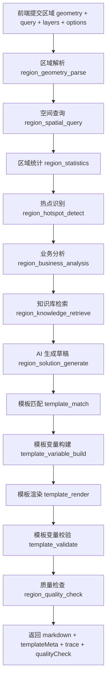

# Phase35 模板 + AI 生成方案原理

## 1. 核心结论

当前方案生成不是单纯让大模型自由输出，也不是只做静态模板填空，而是采用：

```text
业务数据提供事实
AI 提供分析和表达
模板约束结构和章节
Trace 记录生成过程
质量检查判断方案可用性
```

因此，最终返回的方案由五部分共同组成：

- `markdown`：最终方案正文。
- `templateMeta`：本次使用的模板信息。
- `sourceSummaries`：地图对象、区域、模板、知识库等来源摘要。
- `qualityCheck`：质量检查结果。
- `trace`：AI 调用和模板管线的步骤、状态、耗时、数量和错误。

## 2. 生成链路

以“框选区域 -> 生成区域养护建议”为例，完整链路如下：



对应后端入口：

- 区域方案入口：`srmp-gis/src/main/java/com/smartroad/srmp/gis/service/impl/MapRegionSolutionServiceImpl.java`
- 模板管线入口：`srmp-agent/src/main/java/com/smartroad/srmp/agent/solution/service/impl/AiSolutionTemplatePipelineServiceImpl.java`
- 模板渲染器：`srmp-agent/src/main/java/com/smartroad/srmp/agent/solution/template/MarkdownTemplateRenderer.java`

## 3. 各角色分工

### 3.1 业务数据

业务数据负责提供客观事实，避免 AI 凭空编造。

区域方案当前使用的数据包括：

- 区域 geometry。
- 查询条件，如 `routeCode`、`year`、`indexCode`。
- 路线、路段、评定单元数量。
- 病害统计，如总数、重度、中度、轻度、病害类型分布。
- 评定统计，如平均 MQI、PQI、PCI，差/次差数量。
- 热点路段，如路线编码、起止桩号、病害数、重度病害数。
- 数据精度来源，如 `POSTGIS`。

这些数据会进入 `regionSummary`，后续既参与 AI prompt，也参与模板变量构建。

### 3.2 AI

AI 负责把结构化业务数据转成分析性文本，例如：

- 区域综合判断。
- 问题成因分析。
- 养护策略建议。
- 风险提示。
- 优先级建议。

但 AI 输出不会直接作为最终结果裸返回，而是作为 `llmMarkdown` 进入模板管线。这样可以让系统保留 AI 的表达能力，同时用模板控制章节结构和输出格式。

### 3.3 模板

模板负责控制最终文档结构。模板内容保存在 `ai_solution_template` 和 `ai_solution_template_version` 中。

区域默认模板示例：

```md
# {{routeCode}} {{year}} 框选区域养护建议

## 一、区域统计摘要
- 区域面积：{{areaKm2}} km2
- 覆盖路线：{{routeCount}} 条
- 覆盖路段：{{sectionCount}} 段
- 评定单元：{{unitCount}} 个
- 病害数量：{{diseaseCount}} 处，其中重度 {{heavyDiseaseCount}} 处、中度 {{mediumDiseaseCount}} 处
- 平均 MQI：{{avgMqi}}，平均 PQI：{{avgPqi}}，平均 PCI：{{avgPci}}

## 二、热点识别
{{hotspotSummary}}

## 三、区域综合判断
{{regionSummary}}

## 四、养护建议
{{maintenanceSuggestion}}

## 五、风险提示
{{riskNotice}}
```

模板的作用是：

- 固定章节。
- 固定必填变量。
- 统一不同生成入口的输出格式。
- 让方案能被管理、版本化、统计效果。

### 3.4 Trace

Trace 负责解释“为什么慢、哪里失败、用了什么数据、是否走了模板”。

区域方案固定记录这些步骤：

- `region_geometry_parse`
- `region_spatial_query`
- `region_statistics`
- `region_hotspot_detect`
- `region_business_analysis`
- `region_knowledge_retrieve`
- `region_solution_generate`
- `template_match`
- `template_variable_build`
- `template_render`
- `template_validate`
- `region_quality_check`

每一步记录：

- 步骤名称。
- 状态：`SUCCESS`、`FAILED`、`SKIPPED`、`TIMEOUT`。
- 耗时。
- 命中数量。
- 错误信息。
- 部分步骤的结构化数据，如模板编码、版本、变量缺失情况。

## 4. 模板匹配规则

模板匹配优先级如下：

1. 如果请求指定 `templateId`，优先按 `templateId` 匹配。
2. 如果请求指定 `templateCode`，按 `templateCode` 匹配。
3. 否则按三元组匹配：

```text
originType + objectType + solutionType
```

区域方案的三元组是：

```text
originType = MAP_REGION
objectType = MAP_REGION
solutionType = REGION_MAINTENANCE_SUGGESTION
```

单对象方案示例：

```text
originType = MAP_OBJECT
objectType = DISEASE
solutionType = DISEASE_TREATMENT_PLAN
```

路线报告示例：

```text
originType = ROUTE_REPORT
objectType = ROAD_ROUTE
solutionType = ROAD_ASSESSMENT_REPORT
```

匹配到多个模板时，按 `priority`、`is_default`、更新时间选择最优模板。

如果找不到模板，系统会使用兜底模板，并在 `templateMeta.fallback=true` 中体现。

## 5. 变量构建规则

模板变量来自多个来源：

```text
mapObject
objectSummary
regionSummary
businessData
knowledgeSources
outlineSources
fallbackMarkdown
```

区域方案会额外规范化这些变量：

- `diseaseCount`
- `heavyDiseaseCount`
- `mediumDiseaseCount`
- `avgMqi`
- `avgPqi`
- `avgPci`
- `hotspotSummary`
- `regionSummary`
- `maintenanceSuggestion`
- `riskNotice`

其中：

- 数值类变量优先来自业务统计。
- 文本类变量优先从 AI 输出章节中提取。
- 如果 AI 没有对应章节，则根据区域统计和热点信息生成兜底文本。

这样可以避免最终 Markdown 中残留 `{{变量名}}` 占位符。

## 6. 模板渲染和校验

模板渲染器会扫描模板中的 `{{变量}}`，然后从变量表中替换。

渲染结果会产生：

- `renderedMarkdown`：替换后的 Markdown。
- `variables`：实际使用的变量。
- `missingVariables`：模板声明但没有值的变量。
- `unusedVariables`：变量表里有，但模板没有使用的变量。
- `warnings`：变量缺失等提示。

这些信息会进入 `templateMeta`，前端可以展示“用了哪个模板、缺了哪些变量、是否兜底”。

## 7. 返回结构

区域方案接口最终返回的核心结构：

```json
{
  "solutionType": "REGION_MAINTENANCE_SUGGESTION",
  "title": "G210 区域养护建议草稿",
  "markdown": "...最终方案正文...",
  "regionSummary": {},
  "qualityCheck": {},
  "templateMeta": {
    "matched": true,
    "fallback": false,
    "templateId": "tpl-phase35-map-region-maintenance-default",
    "templateCode": "map_region_maintenance_advice_default",
    "templateName": "框选区域养护建议默认模板",
    "templateVersion": "v1",
    "solutionType": "REGION_MAINTENANCE_SUGGESTION",
    "objectType": "MAP_REGION",
    "originType": "MAP_REGION",
    "missingVariables": [],
    "warnings": []
  },
  "sourceSummaries": [],
  "trace": {}
}
```

## 8. 为什么这样设计

### 8.1 只用 AI 的问题

如果直接把业务数据交给 AI 输出：

- 章节格式不稳定。
- 不同入口输出风格不一致。
- 难以知道用了哪些来源。
- 难以做模板效果统计。
- 质量检查和保存任务时缺少结构化元数据。

### 8.2 只用模板的问题

如果只做模板填空：

- 文本表达僵硬。
- 不能结合复杂上下文做综合判断。
- 无法根据不同区域、对象、路线动态调整分析深度。

### 8.3 模板 + AI 的价值

组合后可以同时获得：

- 模板带来的结构稳定。
- AI 带来的分析能力。
- 业务数据带来的事实约束。
- Trace 带来的过程可解释。
- 质量检查带来的可验收性。

## 9. 前端展示建议

方案预览弹窗应展示：

- 方案正文。
- 使用模板卡片：
  - 模板名称。
  - 模板编码。
  - 模板版本。
  - 匹配方式。
  - 是否兜底。
  - 缺失变量。
- 来源摘要：
  - 地图区域。
  - 业务统计。
  - 模板。
  - 知识库。
  - Trace。
- AI Trace 抽屉：
  - 步骤名称。
  - 状态。
  - 耗时。
  - 命中数量。
  - 错误信息。

普通问答、单对象分析、路线分析、区域分析都应复用统一 Trace 展示方式。

## 10. 后续优化方向

1. 模板效果统计
   统计模板使用次数、生成成功率、保存率、人工编辑率、质量评分。

2. 模板变量可视化
   在模板管理页展示变量是否可由当前生成入口自动提供。

3. 模板预览
   支持选择对象、路线或区域后预览模板渲染结果。

4. 模板推荐
   根据 `originType + objectType + solutionType` 自动推荐模板，并允许人工切换。

5. 质量检查分层
   区域、对象、路线报告使用不同质量规则，避免互相覆盖。

6. Trace 统一入口
   普通问答、单对象分析、路线分析、区域方案都通过统一 Trace 面板查看。
