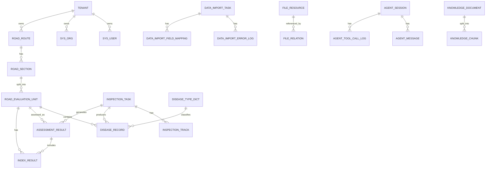

# 智路养护平台一期数据库设计文档

系统名称：智路养护平台  
一期子系统：智路养护 GIS 智能分析平台  
数据库：PostgreSQL + PostGIS  
核心范围：GIS 一张图、道路资产、病害、巡检、评定结果、数据导入、AI 大模型分析  
多租户：支持  

---

# 1. 一期数据库设计目标

一期数据库设计围绕以下能力展开：

```text
道路资产导入
  ↓
路线 / 路段 / 评定单元建库
  ↓
病害数据导入与空间化
  ↓
巡检任务与轨迹入库
  ↓
评定结果入库
  ↓
GIS 一张图展示
  ↓
统计分析与大模型问答
```

数据库需要支撑：

| 能力 | 说明 |
|---|---|
| 多租户隔离 | 所有业务数据按 tenant_id 隔离 |
| GIS 空间查询 | 支持路线、路段、病害、轨迹空间检索 |
| 数据导入 | 支持 Excel、CSV、GeoJSON、WKT、Shapefile 导入 |
| 地图专题展示 | 支持按 MQI、PCI、病害类型、等级渲染 |
| 大模型分析 | 支持结构化查询、工具调用日志、会话记录 |
| 文件资料 | 支持病害图片、巡检影像、导入文件、报告文件关联 |

---

# 2. 一期核心表清单

## 2.1 基础支撑表

| 表名 | 说明 |
|---|---|
| tenant | 租户表 |
| sys_user | 用户表 |
| sys_org | 组织机构表 |
| sys_dict_type | 字典类型表 |
| sys_dict_item | 字典项表 |

## 2.2 道路资产表

| 表名 | 说明 |
|---|---|
| road_route | 路线表 |
| road_section | 路段表 |
| road_evaluation_unit | 评定单元表 |

## 2.3 巡检与病害表

| 表名 | 说明 |
|---|---|
| inspection_task | 巡检任务表 |
| inspection_track | 巡检轨迹表 |
| disease_type_dict | 病害类型字典表 |
| disease_record | 病害记录表 |

## 2.4 评定结果表

| 表名 | 说明 |
|---|---|
| index_result | 指标结果表 |
| assessment_result | 综合评定结果表 |
| road_condition_statistics | 路况统计表 |

## 2.5 数据导入与文件表

| 表名 | 说明 |
|---|---|
| data_import_task | 数据导入任务表 |
| data_import_field_mapping | 导入字段映射表 |
| data_import_error_log | 导入错误日志表 |
| file_resource | 文件资源表 |
| file_relation | 文件关联表 |

## 2.6 大模型分析表

| 表名 | 说明 |
|---|---|
| agent_session | 大模型会话表 |
| agent_message | 大模型消息表 |
| agent_tool_call_log | 大模型工具调用日志表 |
| knowledge_document | 知识库文档表 |
| knowledge_chunk | 知识片段表 |

---

# 3. 数据库初始化

```sql
CREATE EXTENSION IF NOT EXISTS postgis;
CREATE EXTENSION IF NOT EXISTS pgcrypto;
CREATE EXTENSION IF NOT EXISTS vector;
```

如果一期暂不使用向量检索，可以先不启用 `vector` 扩展。

---

# 4. 统一字段规范

所有业务表建议包含以下字段：

| 字段 | 类型 | 说明 |
|---|---|---|
| id | varchar(64) | 主键 |
| tenant_id | varchar(64) | 租户 ID |
| created_by | varchar(64) | 创建人 |
| updated_by | varchar(64) | 更新人 |
| created_at | timestamp | 创建时间 |
| updated_at | timestamp | 更新时间 |
| deleted | boolean | 是否逻辑删除 |

建议统一使用：

```sql
id varchar(64) primary key default gen_random_uuid()::varchar
```

多租户查询必须带：

```sql
WHERE tenant_id = 当前租户ID
```

唯一索引必须包含 `tenant_id`，例如：

```sql
UNIQUE(tenant_id, route_code)
UNIQUE(tenant_id, task_code)
UNIQUE(tenant_id, unit_code)
```

---

# 5. ER 关系图



---

# 6. 基础支撑表设计

## 6.1 租户表：tenant

```sql
CREATE TABLE tenant (
    id              VARCHAR(64) PRIMARY KEY DEFAULT gen_random_uuid()::varchar,
    tenant_code     VARCHAR(100) NOT NULL,
    tenant_name     VARCHAR(200) NOT NULL,
    tenant_type     VARCHAR(50),
    contact_name    VARCHAR(100),
    contact_phone   VARCHAR(50),
    status          VARCHAR(30) DEFAULT 'ENABLED',
    remark          TEXT,
    created_at      TIMESTAMP DEFAULT CURRENT_TIMESTAMP,
    updated_at      TIMESTAMP DEFAULT CURRENT_TIMESTAMP,
    deleted         BOOLEAN DEFAULT FALSE,

    CONSTRAINT uk_tenant_code UNIQUE(tenant_code)
);

COMMENT ON TABLE tenant IS '租户表';
COMMENT ON COLUMN tenant.id IS '租户ID';
COMMENT ON COLUMN tenant.tenant_code IS '租户编码';
COMMENT ON COLUMN tenant.tenant_name IS '租户名称';
COMMENT ON COLUMN tenant.tenant_type IS '租户类型';
COMMENT ON COLUMN tenant.contact_name IS '联系人';
COMMENT ON COLUMN tenant.contact_phone IS '联系电话';
COMMENT ON COLUMN tenant.status IS '状态：ENABLED/DISABLED';
COMMENT ON COLUMN tenant.remark IS '备注';
```

## 6.2 组织机构表：sys_org

```sql
CREATE TABLE sys_org (
    id              VARCHAR(64) PRIMARY KEY DEFAULT gen_random_uuid()::varchar,
    tenant_id       VARCHAR(64) NOT NULL,
    org_code        VARCHAR(100) NOT NULL,
    org_name        VARCHAR(200) NOT NULL,
    parent_id       VARCHAR(64),
    org_type        VARCHAR(50),
    adcode          VARCHAR(20),
    sort_no         INTEGER DEFAULT 0,
    enabled         BOOLEAN DEFAULT TRUE,
    created_at      TIMESTAMP DEFAULT CURRENT_TIMESTAMP,
    updated_at      TIMESTAMP DEFAULT CURRENT_TIMESTAMP,
    deleted         BOOLEAN DEFAULT FALSE,

    CONSTRAINT uk_sys_org_code UNIQUE(tenant_id, org_code)
);

COMMENT ON TABLE sys_org IS '组织机构表';
COMMENT ON COLUMN sys_org.tenant_id IS '租户ID';
COMMENT ON COLUMN sys_org.org_code IS '组织编码';
COMMENT ON COLUMN sys_org.org_name IS '组织名称';
COMMENT ON COLUMN sys_org.parent_id IS '上级组织ID';
COMMENT ON COLUMN sys_org.org_type IS '组织类型：BUREAU/CENTER/STATION/COMPANY';
COMMENT ON COLUMN sys_org.adcode IS '行政区划编码';

CREATE INDEX idx_sys_org_tenant ON sys_org(tenant_id);
CREATE INDEX idx_sys_org_parent ON sys_org(tenant_id, parent_id);
CREATE INDEX idx_sys_org_adcode ON sys_org(tenant_id, adcode);
```

## 6.3 用户表：sys_user

```sql
CREATE TABLE sys_user (
    id              VARCHAR(64) PRIMARY KEY DEFAULT gen_random_uuid()::varchar,
    tenant_id       VARCHAR(64) NOT NULL,
    org_id          VARCHAR(64),
    username        VARCHAR(100) NOT NULL,
    password        VARCHAR(255) NOT NULL,
    real_name       VARCHAR(100),
    phone           VARCHAR(50),
    email           VARCHAR(200),
    status          VARCHAR(30) DEFAULT 'ENABLED',
    last_login_at   TIMESTAMP,
    created_at      TIMESTAMP DEFAULT CURRENT_TIMESTAMP,
    updated_at      TIMESTAMP DEFAULT CURRENT_TIMESTAMP,
    deleted         BOOLEAN DEFAULT FALSE,

    CONSTRAINT uk_sys_user_username UNIQUE(tenant_id, username)
);

COMMENT ON TABLE sys_user IS '用户表';
COMMENT ON COLUMN sys_user.tenant_id IS '租户ID';
COMMENT ON COLUMN sys_user.org_id IS '所属组织ID';
COMMENT ON COLUMN sys_user.username IS '用户名';
COMMENT ON COLUMN sys_user.password IS '密码密文';
COMMENT ON COLUMN sys_user.real_name IS '真实姓名';
COMMENT ON COLUMN sys_user.status IS '状态：ENABLED/DISABLED';

CREATE INDEX idx_sys_user_tenant ON sys_user(tenant_id);
CREATE INDEX idx_sys_user_org ON sys_user(tenant_id, org_id);
```

## 6.4 字典类型表：sys_dict_type

```sql
CREATE TABLE sys_dict_type (
    id              VARCHAR(64) PRIMARY KEY DEFAULT gen_random_uuid()::varchar,
    tenant_id       VARCHAR(64) NOT NULL,
    dict_type       VARCHAR(100) NOT NULL,
    dict_name       VARCHAR(200) NOT NULL,
    description     TEXT,
    enabled         BOOLEAN DEFAULT TRUE,
    created_at      TIMESTAMP DEFAULT CURRENT_TIMESTAMP,
    updated_at      TIMESTAMP DEFAULT CURRENT_TIMESTAMP,
    deleted         BOOLEAN DEFAULT FALSE,

    CONSTRAINT uk_dict_type UNIQUE(tenant_id, dict_type)
);

COMMENT ON TABLE sys_dict_type IS '字典类型表';
COMMENT ON COLUMN sys_dict_type.tenant_id IS '租户ID';
COMMENT ON COLUMN sys_dict_type.dict_type IS '字典类型编码';
COMMENT ON COLUMN sys_dict_type.dict_name IS '字典类型名称';

CREATE INDEX idx_dict_type_tenant ON sys_dict_type(tenant_id);
```

## 6.5 字典项表：sys_dict_item

```sql
CREATE TABLE sys_dict_item (
    id              VARCHAR(64) PRIMARY KEY DEFAULT gen_random_uuid()::varchar,
    tenant_id       VARCHAR(64) NOT NULL,
    dict_type       VARCHAR(100) NOT NULL,
    item_code       VARCHAR(100) NOT NULL,
    item_name       VARCHAR(200) NOT NULL,
    item_value      VARCHAR(200),
    sort_no         INTEGER DEFAULT 0,
    enabled         BOOLEAN DEFAULT TRUE,
    remark          TEXT,
    created_at      TIMESTAMP DEFAULT CURRENT_TIMESTAMP,
    updated_at      TIMESTAMP DEFAULT CURRENT_TIMESTAMP,
    deleted         BOOLEAN DEFAULT FALSE,

    CONSTRAINT uk_dict_item UNIQUE(tenant_id, dict_type, item_code)
);

COMMENT ON TABLE sys_dict_item IS '字典项表';
COMMENT ON COLUMN sys_dict_item.tenant_id IS '租户ID';
COMMENT ON COLUMN sys_dict_item.dict_type IS '字典类型';
COMMENT ON COLUMN sys_dict_item.item_code IS '字典项编码';
COMMENT ON COLUMN sys_dict_item.item_name IS '字典项名称';
COMMENT ON COLUMN sys_dict_item.item_value IS '字典项值';

CREATE INDEX idx_dict_item_type ON sys_dict_item(tenant_id, dict_type);
```

---

# 7. 道路资产表设计

## 7.1 路线表：road_route

```sql
CREATE TABLE road_route (
    id                  VARCHAR(64) PRIMARY KEY DEFAULT gen_random_uuid()::varchar,
    tenant_id           VARCHAR(64) NOT NULL,

    route_code          VARCHAR(50) NOT NULL,
    route_name          VARCHAR(200) NOT NULL,
    route_type          VARCHAR(50) NOT NULL,
    admin_grade         VARCHAR(50),
    technical_grade     VARCHAR(50),

    start_stake         NUMERIC(12,3),
    end_stake           NUMERIC(12,3),
    length_km           NUMERIC(12,3),

    adcode              VARCHAR(20),
    manage_org_id       VARCHAR(64),

    geom                GEOMETRY(LineString, 4326),

    remark              TEXT,
    created_by          VARCHAR(64),
    updated_by          VARCHAR(64),
    created_at          TIMESTAMP DEFAULT CURRENT_TIMESTAMP,
    updated_at          TIMESTAMP DEFAULT CURRENT_TIMESTAMP,
    deleted             BOOLEAN DEFAULT FALSE,

    CONSTRAINT uk_road_route_code UNIQUE(tenant_id, route_code)
);

COMMENT ON TABLE road_route IS '路线表';

COMMENT ON COLUMN road_route.tenant_id IS '租户ID';
COMMENT ON COLUMN road_route.route_code IS '路线编号，如 G210、S101';
COMMENT ON COLUMN road_route.route_name IS '路线名称';
COMMENT ON COLUMN road_route.route_type IS '路线类型：EXPRESSWAY/NATIONAL_HIGHWAY/PROVINCIAL_HIGHWAY/COUNTY_ROAD/TOWNSHIP_ROAD/VILLAGE_ROAD';
COMMENT ON COLUMN road_route.admin_grade IS '行政等级';
COMMENT ON COLUMN road_route.technical_grade IS '技术等级';
COMMENT ON COLUMN road_route.start_stake IS '起点桩号，单位 km';
COMMENT ON COLUMN road_route.end_stake IS '终点桩号，单位 km';
COMMENT ON COLUMN road_route.length_km IS '路线长度，单位 km';
COMMENT ON COLUMN road_route.adcode IS '行政区划编码';
COMMENT ON COLUMN road_route.manage_org_id IS '管养单位ID';
COMMENT ON COLUMN road_route.geom IS '路线空间线形，WGS84 坐标';

CREATE INDEX idx_route_tenant ON road_route(tenant_id);
CREATE INDEX idx_route_code ON road_route(tenant_id, route_code);
CREATE INDEX idx_route_adcode ON road_route(tenant_id, adcode);
CREATE INDEX idx_route_manage_org ON road_route(tenant_id, manage_org_id);
CREATE INDEX idx_route_geom ON road_route USING GIST(geom);
```

## 7.2 路段表：road_section

```sql
CREATE TABLE road_section (
    id                    VARCHAR(64) PRIMARY KEY DEFAULT gen_random_uuid()::varchar,
    tenant_id             VARCHAR(64) NOT NULL,

    route_id              VARCHAR(64) NOT NULL,
    route_code            VARCHAR(50) NOT NULL,
    section_code          VARCHAR(100) NOT NULL,
    section_name          VARCHAR(200),

    direction             VARCHAR(20) DEFAULT 'BOTH',
    start_stake           NUMERIC(12,3) NOT NULL,
    end_stake             NUMERIC(12,3) NOT NULL,
    length_km             NUMERIC(12,3),

    pavement_type         VARCHAR(50),
    technical_grade       VARCHAR(50),
    lane_count            INTEGER,
    road_width            NUMERIC(8,2),
    traffic_volume_level  VARCHAR(50),

    adcode                VARCHAR(20),
    manage_org_id         VARCHAR(64),

    geom                  GEOMETRY(LineString, 4326),

    remark                TEXT,
    created_by            VARCHAR(64),
    updated_by            VARCHAR(64),
    created_at            TIMESTAMP DEFAULT CURRENT_TIMESTAMP,
    updated_at            TIMESTAMP DEFAULT CURRENT_TIMESTAMP,
    deleted               BOOLEAN DEFAULT FALSE,

    CONSTRAINT uk_road_section_code UNIQUE(tenant_id, section_code)
);

COMMENT ON TABLE road_section IS '路段表';

COMMENT ON COLUMN road_section.tenant_id IS '租户ID';
COMMENT ON COLUMN road_section.route_id IS '路线ID';
COMMENT ON COLUMN road_section.route_code IS '路线编号';
COMMENT ON COLUMN road_section.section_code IS '路段编码';
COMMENT ON COLUMN road_section.section_name IS '路段名称';
COMMENT ON COLUMN road_section.direction IS '方向：UP/DOWN/BOTH';
COMMENT ON COLUMN road_section.start_stake IS '起点桩号，单位 km';
COMMENT ON COLUMN road_section.end_stake IS '终点桩号，单位 km';
COMMENT ON COLUMN road_section.length_km IS '路段长度，单位 km';
COMMENT ON COLUMN road_section.pavement_type IS '路面类型';
COMMENT ON COLUMN road_section.technical_grade IS '技术等级';
COMMENT ON COLUMN road_section.lane_count IS '车道数';
COMMENT ON COLUMN road_section.road_width IS '路面宽度，单位 m';
COMMENT ON COLUMN road_section.traffic_volume_level IS '交通量等级';
COMMENT ON COLUMN road_section.geom IS '路段空间线形';

CREATE INDEX idx_section_route ON road_section(tenant_id, route_id);
CREATE INDEX idx_section_route_code ON road_section(tenant_id, route_code);
CREATE INDEX idx_section_stake ON road_section(tenant_id, route_code, direction, start_stake, end_stake);
CREATE INDEX idx_section_adcode ON road_section(tenant_id, adcode);
CREATE INDEX idx_section_geom ON road_section USING GIST(geom);
```

## 7.3 评定单元表：road_evaluation_unit

```sql
CREATE TABLE road_evaluation_unit (
    id                    VARCHAR(64) PRIMARY KEY DEFAULT gen_random_uuid()::varchar,
    tenant_id             VARCHAR(64) NOT NULL,

    route_id              VARCHAR(64) NOT NULL,
    section_id            VARCHAR(64),
    route_code            VARCHAR(50) NOT NULL,
    unit_code             VARCHAR(100) NOT NULL,

    direction             VARCHAR(20) DEFAULT 'BOTH',
    lane_no               INTEGER,

    start_stake           NUMERIC(12,3) NOT NULL,
    end_stake             NUMERIC(12,3) NOT NULL,
    length_m              INTEGER DEFAULT 1000,

    pavement_type         VARCHAR(50),
    technical_grade       VARCHAR(50),
    road_width            NUMERIC(8,2),

    adcode                VARCHAR(20),
    manage_org_id         VARCHAR(64),

    geom                  GEOMETRY(LineString, 4326),
    center_point          GEOMETRY(Point, 4326),

    created_by            VARCHAR(64),
    updated_by            VARCHAR(64),
    created_at            TIMESTAMP DEFAULT CURRENT_TIMESTAMP,
    updated_at            TIMESTAMP DEFAULT CURRENT_TIMESTAMP,
    deleted               BOOLEAN DEFAULT FALSE,

    CONSTRAINT uk_eval_unit_code UNIQUE(tenant_id, unit_code)
);

COMMENT ON TABLE road_evaluation_unit IS '评定单元表';

COMMENT ON COLUMN road_evaluation_unit.tenant_id IS '租户ID';
COMMENT ON COLUMN road_evaluation_unit.route_id IS '路线ID';
COMMENT ON COLUMN road_evaluation_unit.section_id IS '路段ID';
COMMENT ON COLUMN road_evaluation_unit.route_code IS '路线编号';
COMMENT ON COLUMN road_evaluation_unit.unit_code IS '评定单元编码';
COMMENT ON COLUMN road_evaluation_unit.direction IS '方向：UP/DOWN/BOTH';
COMMENT ON COLUMN road_evaluation_unit.lane_no IS '车道编号';
COMMENT ON COLUMN road_evaluation_unit.start_stake IS '起点桩号，单位 km';
COMMENT ON COLUMN road_evaluation_unit.end_stake IS '终点桩号，单位 km';
COMMENT ON COLUMN road_evaluation_unit.length_m IS '评定单元长度，单位 m';
COMMENT ON COLUMN road_evaluation_unit.geom IS '评定单元空间线形';
COMMENT ON COLUMN road_evaluation_unit.center_point IS '评定单元中心点';

CREATE INDEX idx_eval_unit_route ON road_evaluation_unit(tenant_id, route_id);
CREATE INDEX idx_eval_unit_section ON road_evaluation_unit(tenant_id, section_id);
CREATE INDEX idx_eval_unit_route_stake ON road_evaluation_unit(tenant_id, route_code, direction, start_stake, end_stake);
CREATE INDEX idx_eval_unit_adcode ON road_evaluation_unit(tenant_id, adcode);
CREATE INDEX idx_eval_unit_geom ON road_evaluation_unit USING GIST(geom);
CREATE INDEX idx_eval_unit_center ON road_evaluation_unit USING GIST(center_point);
```

---

# 8. 巡检与病害表设计

## 8.1 巡检任务表：inspection_task

```sql
CREATE TABLE inspection_task (
    id                  VARCHAR(64) PRIMARY KEY DEFAULT gen_random_uuid()::varchar,
    tenant_id           VARCHAR(64) NOT NULL,

    task_code           VARCHAR(100) NOT NULL,
    task_name           VARCHAR(200) NOT NULL,
    task_type           VARCHAR(50) NOT NULL,

    route_id            VARCHAR(64),
    route_code          VARCHAR(50),
    start_stake         NUMERIC(12,3),
    end_stake           NUMERIC(12,3),

    year                INTEGER,
    inspect_date        DATE,
    inspect_method      VARCHAR(50),
    data_source         VARCHAR(50),

    status              VARCHAR(50) DEFAULT 'CREATED',

    remark              TEXT,
    created_by          VARCHAR(64),
    updated_by          VARCHAR(64),
    created_at          TIMESTAMP DEFAULT CURRENT_TIMESTAMP,
    updated_at          TIMESTAMP DEFAULT CURRENT_TIMESTAMP,
    deleted             BOOLEAN DEFAULT FALSE,

    CONSTRAINT uk_inspection_task_code UNIQUE(tenant_id, task_code)
);

COMMENT ON TABLE inspection_task IS '巡检任务表';

COMMENT ON COLUMN inspection_task.tenant_id IS '租户ID';
COMMENT ON COLUMN inspection_task.task_code IS '任务编码';
COMMENT ON COLUMN inspection_task.task_name IS '任务名称';
COMMENT ON COLUMN inspection_task.task_type IS '任务类型：ANNUAL_ASSESSMENT/DAILY_PATROL/SPECIAL_INSPECTION';
COMMENT ON COLUMN inspection_task.route_id IS '路线ID';
COMMENT ON COLUMN inspection_task.route_code IS '路线编号';
COMMENT ON COLUMN inspection_task.start_stake IS '巡检起点桩号';
COMMENT ON COLUMN inspection_task.end_stake IS '巡检终点桩号';
COMMENT ON COLUMN inspection_task.year IS '年度';
COMMENT ON COLUMN inspection_task.inspect_date IS '巡检日期';
COMMENT ON COLUMN inspection_task.inspect_method IS '巡检方式：MANUAL/VEHICLE/UAV/IMPORT';
COMMENT ON COLUMN inspection_task.data_source IS '数据来源';
COMMENT ON COLUMN inspection_task.status IS '状态：CREATED/IMPORTING/COMPLETED/ASSESSED';

CREATE INDEX idx_inspection_task_tenant ON inspection_task(tenant_id);
CREATE INDEX idx_inspection_task_route ON inspection_task(tenant_id, route_code);
CREATE INDEX idx_inspection_task_year ON inspection_task(tenant_id, year);
CREATE INDEX idx_inspection_task_status ON inspection_task(tenant_id, status);
```

## 8.2 巡检轨迹表：inspection_track

```sql
CREATE TABLE inspection_track (
    id                  VARCHAR(64) PRIMARY KEY DEFAULT gen_random_uuid()::varchar,
    tenant_id           VARCHAR(64) NOT NULL,

    task_id             VARCHAR(64) NOT NULL,
    route_code          VARCHAR(50),
    track_name          VARCHAR(200),

    start_time          TIMESTAMP,
    end_time            TIMESTAMP,
    mileage_km          NUMERIC(12,3),

    geom                GEOMETRY(LineString, 4326),

    raw_file_id         VARCHAR(64),

    created_at          TIMESTAMP DEFAULT CURRENT_TIMESTAMP,
    updated_at          TIMESTAMP DEFAULT CURRENT_TIMESTAMP,
    deleted             BOOLEAN DEFAULT FALSE
);

COMMENT ON TABLE inspection_track IS '巡检轨迹表';

COMMENT ON COLUMN inspection_track.tenant_id IS '租户ID';
COMMENT ON COLUMN inspection_track.task_id IS '巡检任务ID';
COMMENT ON COLUMN inspection_track.route_code IS '路线编号';
COMMENT ON COLUMN inspection_track.track_name IS '轨迹名称';
COMMENT ON COLUMN inspection_track.start_time IS '轨迹开始时间';
COMMENT ON COLUMN inspection_track.end_time IS '轨迹结束时间';
COMMENT ON COLUMN inspection_track.mileage_km IS '轨迹里程';
COMMENT ON COLUMN inspection_track.geom IS '巡检轨迹空间线形';
COMMENT ON COLUMN inspection_track.raw_file_id IS '原始轨迹文件ID';

CREATE INDEX idx_track_task ON inspection_track(tenant_id, task_id);
CREATE INDEX idx_track_route ON inspection_track(tenant_id, route_code);
CREATE INDEX idx_track_geom ON inspection_track USING GIST(geom);
```

## 8.3 病害类型字典表：disease_type_dict

```sql
CREATE TABLE disease_type_dict (
    id                  VARCHAR(64) PRIMARY KEY DEFAULT gen_random_uuid()::varchar,
    tenant_id           VARCHAR(64) NOT NULL,

    disease_code        VARCHAR(100) NOT NULL,
    disease_name        VARCHAR(200) NOT NULL,
    disease_category    VARCHAR(50) NOT NULL,

    measure_unit        VARCHAR(20),
    related_index       VARCHAR(50),
    severity_enabled    BOOLEAN DEFAULT TRUE,

    enabled             BOOLEAN DEFAULT TRUE,
    sort_no             INTEGER DEFAULT 0,
    remark              TEXT,

    created_at          TIMESTAMP DEFAULT CURRENT_TIMESTAMP,
    updated_at          TIMESTAMP DEFAULT CURRENT_TIMESTAMP,
    deleted             BOOLEAN DEFAULT FALSE,

    CONSTRAINT uk_disease_type_code UNIQUE(tenant_id, disease_code)
);

COMMENT ON TABLE disease_type_dict IS '病害类型字典表';

COMMENT ON COLUMN disease_type_dict.tenant_id IS '租户ID';
COMMENT ON COLUMN disease_type_dict.disease_code IS '病害编码';
COMMENT ON COLUMN disease_type_dict.disease_name IS '病害名称';
COMMENT ON COLUMN disease_type_dict.disease_category IS '病害大类：PAVEMENT/SUBGRADE/BRIDGE_TUNNEL_CULVERT/TRAFFIC_FACILITY';
COMMENT ON COLUMN disease_type_dict.measure_unit IS '计量单位';
COMMENT ON COLUMN disease_type_dict.related_index IS '关联指标，如 PCI/RDI/SCI/TCI';

CREATE INDEX idx_disease_type_category ON disease_type_dict(tenant_id, disease_category);
```

## 8.4 病害记录表：disease_record

```sql
CREATE TABLE disease_record (
    id                  VARCHAR(64) PRIMARY KEY DEFAULT gen_random_uuid()::varchar,
    tenant_id           VARCHAR(64) NOT NULL,

    task_id             VARCHAR(64),
    route_id            VARCHAR(64),
    section_id          VARCHAR(64),
    unit_id             VARCHAR(64),

    route_code          VARCHAR(50) NOT NULL,
    direction           VARCHAR(20),
    lane_no             INTEGER,

    start_stake         NUMERIC(12,3),
    end_stake           NUMERIC(12,3),

    disease_category    VARCHAR(50) NOT NULL,
    disease_type        VARCHAR(100) NOT NULL,
    disease_name        VARCHAR(200),

    severity            VARCHAR(30),
    quantity            NUMERIC(14,4),
    measure_unit        VARCHAR(20),

    damage_area         NUMERIC(14,4),
    damage_length       NUMERIC(14,4),
    damage_width        NUMERIC(14,4),
    damage_depth        NUMERIC(14,4),

    source              VARCHAR(50),
    confidence          NUMERIC(5,4),

    geom                GEOMETRY(Geometry, 4326),

    status              VARCHAR(50) DEFAULT 'UNPROCESSED',
    verified            BOOLEAN DEFAULT FALSE,
    verified_by         VARCHAR(64),
    verified_at         TIMESTAMP,

    remark              TEXT,
    created_by          VARCHAR(64),
    updated_by          VARCHAR(64),
    created_at          TIMESTAMP DEFAULT CURRENT_TIMESTAMP,
    updated_at          TIMESTAMP DEFAULT CURRENT_TIMESTAMP,
    deleted             BOOLEAN DEFAULT FALSE
);

COMMENT ON TABLE disease_record IS '病害记录表';

COMMENT ON COLUMN disease_record.tenant_id IS '租户ID';
COMMENT ON COLUMN disease_record.task_id IS '巡检任务ID';
COMMENT ON COLUMN disease_record.route_id IS '路线ID';
COMMENT ON COLUMN disease_record.section_id IS '路段ID';
COMMENT ON COLUMN disease_record.unit_id IS '评定单元ID';
COMMENT ON COLUMN disease_record.route_code IS '路线编号';
COMMENT ON COLUMN disease_record.direction IS '方向：UP/DOWN/BOTH';
COMMENT ON COLUMN disease_record.lane_no IS '车道编号';
COMMENT ON COLUMN disease_record.start_stake IS '病害起点桩号';
COMMENT ON COLUMN disease_record.end_stake IS '病害终点桩号';
COMMENT ON COLUMN disease_record.disease_category IS '病害大类';
COMMENT ON COLUMN disease_record.disease_type IS '病害类型编码';
COMMENT ON COLUMN disease_record.disease_name IS '病害名称';
COMMENT ON COLUMN disease_record.severity IS '严重程度：LIGHT/MEDIUM/HEAVY';
COMMENT ON COLUMN disease_record.quantity IS '病害数量';
COMMENT ON COLUMN disease_record.measure_unit IS '计量单位';
COMMENT ON COLUMN disease_record.damage_area IS '病害面积，平方米';
COMMENT ON COLUMN disease_record.damage_length IS '病害长度，米';
COMMENT ON COLUMN disease_record.damage_width IS '病害宽度，米';
COMMENT ON COLUMN disease_record.damage_depth IS '病害深度，米';
COMMENT ON COLUMN disease_record.source IS '来源：MANUAL/AI_DETECTION/DEVICE_IMPORT/EXCEL_IMPORT';
COMMENT ON COLUMN disease_record.confidence IS 'AI识别置信度';
COMMENT ON COLUMN disease_record.geom IS '病害空间几何';
COMMENT ON COLUMN disease_record.status IS '状态：UNPROCESSED/VERIFIED/IGNORED';
COMMENT ON COLUMN disease_record.verified IS '是否复核';

CREATE INDEX idx_disease_tenant ON disease_record(tenant_id);
CREATE INDEX idx_disease_task ON disease_record(tenant_id, task_id);
CREATE INDEX idx_disease_unit ON disease_record(tenant_id, unit_id);
CREATE INDEX idx_disease_route_stake ON disease_record(tenant_id, route_code, direction, start_stake, end_stake);
CREATE INDEX idx_disease_type ON disease_record(tenant_id, disease_category, disease_type, severity);
CREATE INDEX idx_disease_status ON disease_record(tenant_id, status);
CREATE INDEX idx_disease_geom ON disease_record USING GIST(geom);
```

---

# 9. 评定结果表设计

## 9.1 指标结果表：index_result

用于存储单个指标结果，例如 PCI、RQI、RDI、PBI、PWI、SRI、PSSI 等。

```sql
CREATE TABLE index_result (
    id                  VARCHAR(64) PRIMARY KEY DEFAULT gen_random_uuid()::varchar,
    tenant_id           VARCHAR(64) NOT NULL,

    task_id             VARCHAR(64),
    assessment_id       VARCHAR(64),
    unit_id             VARCHAR(64),

    route_id            VARCHAR(64),
    section_id          VARCHAR(64),
    route_code          VARCHAR(50) NOT NULL,
    direction           VARCHAR(20),

    start_stake         NUMERIC(12,3),
    end_stake           NUMERIC(12,3),
    year                INTEGER NOT NULL,

    index_code          VARCHAR(50) NOT NULL,
    index_name          VARCHAR(100),
    index_value         NUMERIC(8,3),
    grade               VARCHAR(30),

    raw_metrics         JSONB,
    calculation_version VARCHAR(50),

    calculated_at       TIMESTAMP DEFAULT CURRENT_TIMESTAMP,
    created_at          TIMESTAMP DEFAULT CURRENT_TIMESTAMP,
    updated_at          TIMESTAMP DEFAULT CURRENT_TIMESTAMP,
    deleted             BOOLEAN DEFAULT FALSE
);

COMMENT ON TABLE index_result IS '指标结果表';

COMMENT ON COLUMN index_result.tenant_id IS '租户ID';
COMMENT ON COLUMN index_result.task_id IS '巡检任务ID';
COMMENT ON COLUMN index_result.assessment_id IS '综合评定结果ID';
COMMENT ON COLUMN index_result.unit_id IS '评定单元ID';
COMMENT ON COLUMN index_result.route_code IS '路线编号';
COMMENT ON COLUMN index_result.year IS '年度';
COMMENT ON COLUMN index_result.index_code IS '指标编码：MQI/SCI/PQI/PCI/RQI/RDI/PBI/PWI/SRI/PSSI/BCI/TCI';
COMMENT ON COLUMN index_result.index_name IS '指标名称';
COMMENT ON COLUMN index_result.index_value IS '指标值';
COMMENT ON COLUMN index_result.grade IS '指标等级';
COMMENT ON COLUMN index_result.raw_metrics IS '原始计算指标，JSON格式';
COMMENT ON COLUMN index_result.calculation_version IS '计算版本';

CREATE INDEX idx_index_task ON index_result(tenant_id, task_id);
CREATE INDEX idx_index_assessment ON index_result(tenant_id, assessment_id);
CREATE INDEX idx_index_unit ON index_result(tenant_id, unit_id);
CREATE INDEX idx_index_route_year ON index_result(tenant_id, route_code, year);
CREATE INDEX idx_index_code ON index_result(tenant_id, index_code);
CREATE INDEX idx_index_grade ON index_result(tenant_id, grade);
CREATE INDEX idx_index_raw_metrics_gin ON index_result USING GIN(raw_metrics);

CREATE UNIQUE INDEX uk_index_result_unit_index
ON index_result(tenant_id, task_id, unit_id, index_code)
WHERE deleted = FALSE;
```

## 9.2 综合评定结果表：assessment_result

```sql
CREATE TABLE assessment_result (
    id                  VARCHAR(64) PRIMARY KEY DEFAULT gen_random_uuid()::varchar,
    tenant_id           VARCHAR(64) NOT NULL,

    task_id             VARCHAR(64),
    object_type         VARCHAR(50) NOT NULL,
    object_id           VARCHAR(64) NOT NULL,

    route_id            VARCHAR(64),
    section_id          VARCHAR(64),
    unit_id             VARCHAR(64),

    route_code          VARCHAR(50),
    direction           VARCHAR(20),
    start_stake         NUMERIC(12,3),
    end_stake           NUMERIC(12,3),

    year                INTEGER NOT NULL,
    standard_code       VARCHAR(50) DEFAULT 'JTG_5210_2018',

    mqi                 NUMERIC(8,3),
    sci                 NUMERIC(8,3),
    pqi                 NUMERIC(8,3),
    bci                 NUMERIC(8,3),
    tci                 NUMERIC(8,3),

    pci                 NUMERIC(8,3),
    rqi                 NUMERIC(8,3),
    rdi                 NUMERIC(8,3),
    pbi                 NUMERIC(8,3),
    pwi                 NUMERIC(8,3),
    sri                 NUMERIC(8,3),
    pssi                NUMERIC(8,3),

    grade               VARCHAR(30),
    zero_reason         TEXT,

    assessed_at         TIMESTAMP DEFAULT CURRENT_TIMESTAMP,

    created_by          VARCHAR(64),
    updated_by          VARCHAR(64),
    created_at          TIMESTAMP DEFAULT CURRENT_TIMESTAMP,
    updated_at          TIMESTAMP DEFAULT CURRENT_TIMESTAMP,
    deleted             BOOLEAN DEFAULT FALSE
);

COMMENT ON TABLE assessment_result IS '综合评定结果表';

COMMENT ON COLUMN assessment_result.tenant_id IS '租户ID';
COMMENT ON COLUMN assessment_result.task_id IS '巡检任务ID';
COMMENT ON COLUMN assessment_result.object_type IS '评定对象类型：EVALUATION_UNIT/SECTION/ROUTE/REGION/ORG';
COMMENT ON COLUMN assessment_result.object_id IS '评定对象ID';
COMMENT ON COLUMN assessment_result.route_code IS '路线编号';
COMMENT ON COLUMN assessment_result.start_stake IS '起点桩号';
COMMENT ON COLUMN assessment_result.end_stake IS '终点桩号';
COMMENT ON COLUMN assessment_result.year IS '年度';
COMMENT ON COLUMN assessment_result.standard_code IS '标准编码';
COMMENT ON COLUMN assessment_result.mqi IS '公路技术状况指数';
COMMENT ON COLUMN assessment_result.sci IS '路基技术状况指数';
COMMENT ON COLUMN assessment_result.pqi IS '路面技术状况指数';
COMMENT ON COLUMN assessment_result.bci IS '桥隧构造物技术状况指数';
COMMENT ON COLUMN assessment_result.tci IS '沿线设施技术状况指数';
COMMENT ON COLUMN assessment_result.pci IS '路面损坏状况指数';
COMMENT ON COLUMN assessment_result.rqi IS '路面行驶质量指数';
COMMENT ON COLUMN assessment_result.rdi IS '路面车辙深度指数';
COMMENT ON COLUMN assessment_result.pbi IS '路面跳车指数';
COMMENT ON COLUMN assessment_result.pwi IS '路面磨耗指数';
COMMENT ON COLUMN assessment_result.sri IS '路面抗滑性能指数';
COMMENT ON COLUMN assessment_result.pssi IS '路面结构强度指数';
COMMENT ON COLUMN assessment_result.grade IS '评定等级：EXCELLENT/GOOD/MEDIUM/POOR/BAD';

CREATE INDEX idx_assessment_task ON assessment_result(tenant_id, task_id);
CREATE INDEX idx_assessment_object ON assessment_result(tenant_id, object_type, object_id);
CREATE INDEX idx_assessment_unit ON assessment_result(tenant_id, unit_id);
CREATE INDEX idx_assessment_route_year ON assessment_result(tenant_id, route_code, year);
CREATE INDEX idx_assessment_grade ON assessment_result(tenant_id, grade);

CREATE UNIQUE INDEX uk_assessment_object_task
ON assessment_result(tenant_id, task_id, object_type, object_id)
WHERE deleted = FALSE;
```

## 9.3 路况统计表：road_condition_statistics

```sql
CREATE TABLE road_condition_statistics (
    id                      VARCHAR(64) PRIMARY KEY DEFAULT gen_random_uuid()::varchar,
    tenant_id               VARCHAR(64) NOT NULL,

    task_id                 VARCHAR(64),
    object_type             VARCHAR(50) NOT NULL,
    object_id               VARCHAR(64) NOT NULL,

    route_code              VARCHAR(50),
    adcode                  VARCHAR(20),
    manage_org_id           VARCHAR(64),
    year                    INTEGER NOT NULL,

    total_length_km          NUMERIC(14,3),
    excellent_length_km      NUMERIC(14,3),
    good_length_km           NUMERIC(14,3),
    medium_length_km         NUMERIC(14,3),
    poor_length_km           NUMERIC(14,3),
    bad_length_km            NUMERIC(14,3),

    excellent_rate           NUMERIC(8,3),
    excellent_good_rate      NUMERIC(8,3),
    poor_bad_rate            NUMERIC(8,3),

    avg_mqi                  NUMERIC(8,3),
    avg_sci                  NUMERIC(8,3),
    avg_pqi                  NUMERIC(8,3),
    avg_bci                  NUMERIC(8,3),
    avg_tci                  NUMERIC(8,3),
    avg_pci                  NUMERIC(8,3),

    created_at               TIMESTAMP DEFAULT CURRENT_TIMESTAMP,
    updated_at               TIMESTAMP DEFAULT CURRENT_TIMESTAMP,
    deleted                  BOOLEAN DEFAULT FALSE
);

COMMENT ON TABLE road_condition_statistics IS '路况统计表';

COMMENT ON COLUMN road_condition_statistics.tenant_id IS '租户ID';
COMMENT ON COLUMN road_condition_statistics.task_id IS '巡检任务ID';
COMMENT ON COLUMN road_condition_statistics.object_type IS '统计对象类型：ROUTE/REGION/ORG/SECTION';
COMMENT ON COLUMN road_condition_statistics.object_id IS '统计对象ID';
COMMENT ON COLUMN road_condition_statistics.total_length_km IS '总里程';
COMMENT ON COLUMN road_condition_statistics.excellent_rate IS '优等路率';
COMMENT ON COLUMN road_condition_statistics.excellent_good_rate IS '优良路率';
COMMENT ON COLUMN road_condition_statistics.poor_bad_rate IS '次差路率';

CREATE INDEX idx_statistics_object ON road_condition_statistics(tenant_id, object_type, object_id);
CREATE INDEX idx_statistics_year ON road_condition_statistics(tenant_id, year);
CREATE INDEX idx_statistics_route ON road_condition_statistics(tenant_id, route_code);
CREATE INDEX idx_statistics_adcode ON road_condition_statistics(tenant_id, adcode);
```

---

# 10. 数据导入表设计

## 10.1 数据导入任务表：data_import_task

```sql
CREATE TABLE data_import_task (
    id                  VARCHAR(64) PRIMARY KEY DEFAULT gen_random_uuid()::varchar,
    tenant_id           VARCHAR(64) NOT NULL,

    import_code         VARCHAR(100) NOT NULL,
    import_name         VARCHAR(200) NOT NULL,
    data_type           VARCHAR(50) NOT NULL,
    file_id             VARCHAR(64),

    status              VARCHAR(50) DEFAULT 'CREATED',

    total_count         INTEGER DEFAULT 0,
    success_count       INTEGER DEFAULT 0,
    failed_count        INTEGER DEFAULT 0,

    field_mapping       JSONB,
    import_params       JSONB,

    started_at          TIMESTAMP,
    finished_at         TIMESTAMP,

    error_message       TEXT,

    created_by          VARCHAR(64),
    created_at          TIMESTAMP DEFAULT CURRENT_TIMESTAMP,
    updated_at          TIMESTAMP DEFAULT CURRENT_TIMESTAMP,
    deleted             BOOLEAN DEFAULT FALSE,

    CONSTRAINT uk_import_code UNIQUE(tenant_id, import_code)
);

COMMENT ON TABLE data_import_task IS '数据导入任务表';

COMMENT ON COLUMN data_import_task.tenant_id IS '租户ID';
COMMENT ON COLUMN data_import_task.import_code IS '导入任务编码';
COMMENT ON COLUMN data_import_task.import_name IS '导入任务名称';
COMMENT ON COLUMN data_import_task.data_type IS '数据类型：ROAD_ROUTE/ROAD_SECTION/EVALUATION_UNIT/DISEASE/ASSESSMENT/TRACK';
COMMENT ON COLUMN data_import_task.file_id IS '导入文件ID';
COMMENT ON COLUMN data_import_task.status IS '状态：CREATED/UPLOADED/PARSING/CHECKING/WAIT_CONFIRM/IMPORTING/SUCCESS/FAILED';
COMMENT ON COLUMN data_import_task.total_count IS '总记录数';
COMMENT ON COLUMN data_import_task.success_count IS '成功数';
COMMENT ON COLUMN data_import_task.failed_count IS '失败数';
COMMENT ON COLUMN data_import_task.field_mapping IS '字段映射配置';
COMMENT ON COLUMN data_import_task.import_params IS '导入参数';

CREATE INDEX idx_import_task_tenant ON data_import_task(tenant_id);
CREATE INDEX idx_import_task_type ON data_import_task(tenant_id, data_type);
CREATE INDEX idx_import_task_status ON data_import_task(tenant_id, status);
```

## 10.2 导入字段映射表：data_import_field_mapping

```sql
CREATE TABLE data_import_field_mapping (
    id                  VARCHAR(64) PRIMARY KEY DEFAULT gen_random_uuid()::varchar,
    tenant_id           VARCHAR(64) NOT NULL,

    data_type           VARCHAR(50) NOT NULL,
    source_field        VARCHAR(100) NOT NULL,
    target_field        VARCHAR(100) NOT NULL,
    target_field_name   VARCHAR(200),

    required            BOOLEAN DEFAULT FALSE,
    default_value       VARCHAR(500),
    transform_rule      TEXT,
    sort_no             INTEGER DEFAULT 0,

    created_at          TIMESTAMP DEFAULT CURRENT_TIMESTAMP,
    updated_at          TIMESTAMP DEFAULT CURRENT_TIMESTAMP,
    deleted             BOOLEAN DEFAULT FALSE
);

COMMENT ON TABLE data_import_field_mapping IS '导入字段映射表';

COMMENT ON COLUMN data_import_field_mapping.tenant_id IS '租户ID';
COMMENT ON COLUMN data_import_field_mapping.data_type IS '导入数据类型';
COMMENT ON COLUMN data_import_field_mapping.source_field IS '源字段名';
COMMENT ON COLUMN data_import_field_mapping.target_field IS '目标字段名';
COMMENT ON COLUMN data_import_field_mapping.required IS '是否必填';
COMMENT ON COLUMN data_import_field_mapping.transform_rule IS '转换规则';

CREATE INDEX idx_import_mapping_type ON data_import_field_mapping(tenant_id, data_type);
```

## 10.3 导入错误日志表：data_import_error_log

```sql
CREATE TABLE data_import_error_log (
    id                  VARCHAR(64) PRIMARY KEY DEFAULT gen_random_uuid()::varchar,
    tenant_id           VARCHAR(64) NOT NULL,

    import_task_id      VARCHAR(64) NOT NULL,
    row_no              INTEGER,
    field_name          VARCHAR(100),
    field_value         TEXT,
    error_type          VARCHAR(50),
    error_message       TEXT,
    raw_data            JSONB,

    created_at          TIMESTAMP DEFAULT CURRENT_TIMESTAMP
);

COMMENT ON TABLE data_import_error_log IS '导入错误日志表';

COMMENT ON COLUMN data_import_error_log.tenant_id IS '租户ID';
COMMENT ON COLUMN data_import_error_log.import_task_id IS '导入任务ID';
COMMENT ON COLUMN data_import_error_log.row_no IS '错误行号';
COMMENT ON COLUMN data_import_error_log.field_name IS '错误字段';
COMMENT ON COLUMN data_import_error_log.field_value IS '错误字段值';
COMMENT ON COLUMN data_import_error_log.error_type IS '错误类型';
COMMENT ON COLUMN data_import_error_log.error_message IS '错误信息';
COMMENT ON COLUMN data_import_error_log.raw_data IS '原始行数据';

CREATE INDEX idx_import_error_task ON data_import_error_log(tenant_id, import_task_id);
CREATE INDEX idx_import_error_type ON data_import_error_log(tenant_id, error_type);
```

---

# 11. 文件资料表设计

## 11.1 文件资源表：file_resource

```sql
CREATE TABLE file_resource (
    id                  VARCHAR(64) PRIMARY KEY DEFAULT gen_random_uuid()::varchar,
    tenant_id           VARCHAR(64) NOT NULL,

    file_name           VARCHAR(500) NOT NULL,
    original_name       VARCHAR(500),
    file_ext            VARCHAR(50),
    file_type           VARCHAR(50),
    mime_type           VARCHAR(100),
    file_size           BIGINT,

    storage_type        VARCHAR(50) DEFAULT 'MINIO',
    bucket_name         VARCHAR(100),
    object_key          VARCHAR(500),
    access_url          TEXT,

    checksum            VARCHAR(128),

    created_by          VARCHAR(64),
    created_at          TIMESTAMP DEFAULT CURRENT_TIMESTAMP,
    deleted             BOOLEAN DEFAULT FALSE
);

COMMENT ON TABLE file_resource IS '文件资源表';

COMMENT ON COLUMN file_resource.tenant_id IS '租户ID';
COMMENT ON COLUMN file_resource.file_name IS '文件存储名称';
COMMENT ON COLUMN file_resource.original_name IS '原始文件名';
COMMENT ON COLUMN file_resource.file_ext IS '文件扩展名';
COMMENT ON COLUMN file_resource.file_type IS '文件类型：IMAGE/VIDEO/PDF/EXCEL/GEOJSON/SHAPEFILE/ZIP';
COMMENT ON COLUMN file_resource.mime_type IS 'MIME类型';
COMMENT ON COLUMN file_resource.file_size IS '文件大小，字节';
COMMENT ON COLUMN file_resource.storage_type IS '存储类型';
COMMENT ON COLUMN file_resource.bucket_name IS '对象存储桶';
COMMENT ON COLUMN file_resource.object_key IS '对象存储Key';
COMMENT ON COLUMN file_resource.access_url IS '访问地址';
COMMENT ON COLUMN file_resource.checksum IS '文件校验码';

CREATE INDEX idx_file_tenant ON file_resource(tenant_id);
CREATE INDEX idx_file_type ON file_resource(tenant_id, file_type);
CREATE INDEX idx_file_created ON file_resource(tenant_id, created_at);
```

## 11.2 文件关联表：file_relation

```sql
CREATE TABLE file_relation (
    id                  VARCHAR(64) PRIMARY KEY DEFAULT gen_random_uuid()::varchar,
    tenant_id           VARCHAR(64) NOT NULL,

    file_id             VARCHAR(64) NOT NULL,
    biz_type            VARCHAR(50) NOT NULL,
    biz_id              VARCHAR(64) NOT NULL,

    relation_type       VARCHAR(50),
    sort_no             INTEGER DEFAULT 0,

    created_at          TIMESTAMP DEFAULT CURRENT_TIMESTAMP,
    deleted             BOOLEAN DEFAULT FALSE
);

COMMENT ON TABLE file_relation IS '文件关联表';

COMMENT ON COLUMN file_relation.tenant_id IS '租户ID';
COMMENT ON COLUMN file_relation.file_id IS '文件ID';
COMMENT ON COLUMN file_relation.biz_type IS '业务类型：DISEASE/INSPECTION_TASK/ROUTE/ASSESSMENT/IMPORT_TASK';
COMMENT ON COLUMN file_relation.biz_id IS '业务ID';
COMMENT ON COLUMN file_relation.relation_type IS '关联类型：IMAGE/VIDEO/REPORT/RAW_FILE/ATTACHMENT';

CREATE INDEX idx_file_relation_biz ON file_relation(tenant_id, biz_type, biz_id);
CREATE INDEX idx_file_relation_file ON file_relation(tenant_id, file_id);
```

---

# 12. 大模型分析表设计

## 12.1 大模型会话表：agent_session

```sql
CREATE TABLE agent_session (
    id                  VARCHAR(64) PRIMARY KEY DEFAULT gen_random_uuid()::varchar,
    tenant_id           VARCHAR(64) NOT NULL,

    session_title       VARCHAR(500),
    session_type        VARCHAR(50),
    user_id             VARCHAR(64),

    related_biz_type    VARCHAR(50),
    related_biz_id      VARCHAR(64),

    created_at          TIMESTAMP DEFAULT CURRENT_TIMESTAMP,
    updated_at          TIMESTAMP DEFAULT CURRENT_TIMESTAMP,
    deleted             BOOLEAN DEFAULT FALSE
);

COMMENT ON TABLE agent_session IS '大模型会话表';

COMMENT ON COLUMN agent_session.tenant_id IS '租户ID';
COMMENT ON COLUMN agent_session.session_title IS '会话标题';
COMMENT ON COLUMN agent_session.session_type IS '会话类型：CHAT/ROUTE_ANALYSIS/DISEASE_ANALYSIS/REPORT';
COMMENT ON COLUMN agent_session.user_id IS '用户ID';
COMMENT ON COLUMN agent_session.related_biz_type IS '关联业务类型';
COMMENT ON COLUMN agent_session.related_biz_id IS '关联业务ID';

CREATE INDEX idx_agent_session_user ON agent_session(tenant_id, user_id);
CREATE INDEX idx_agent_session_type ON agent_session(tenant_id, session_type);
```

## 12.2 大模型消息表：agent_message

```sql
CREATE TABLE agent_message (
    id                  VARCHAR(64) PRIMARY KEY DEFAULT gen_random_uuid()::varchar,
    tenant_id           VARCHAR(64) NOT NULL,

    session_id          VARCHAR(64) NOT NULL,
    role                VARCHAR(30) NOT NULL,
    content             TEXT NOT NULL,

    model_name          VARCHAR(100),
    token_usage         INTEGER,
    metadata            JSONB,

    created_at          TIMESTAMP DEFAULT CURRENT_TIMESTAMP
);

COMMENT ON TABLE agent_message IS '大模型消息表';

COMMENT ON COLUMN agent_message.tenant_id IS '租户ID';
COMMENT ON COLUMN agent_message.session_id IS '会话ID';
COMMENT ON COLUMN agent_message.role IS '角色：USER/ASSISTANT/SYSTEM/TOOL';
COMMENT ON COLUMN agent_message.content IS '消息内容';
COMMENT ON COLUMN agent_message.model_name IS '模型名称';
COMMENT ON COLUMN agent_message.token_usage IS 'Token消耗';
COMMENT ON COLUMN agent_message.metadata IS '扩展信息';

CREATE INDEX idx_agent_message_session ON agent_message(tenant_id, session_id, created_at);
CREATE INDEX idx_agent_message_metadata ON agent_message USING GIN(metadata);
```

## 12.3 大模型工具调用日志表：agent_tool_call_log

```sql
CREATE TABLE agent_tool_call_log (
    id                  VARCHAR(64) PRIMARY KEY DEFAULT gen_random_uuid()::varchar,
    tenant_id           VARCHAR(64) NOT NULL,

    session_id          VARCHAR(64),
    message_id          VARCHAR(64),

    tool_name           VARCHAR(100) NOT NULL,
    tool_type           VARCHAR(50),
    request_params      JSONB,
    response_data       JSONB,

    success             BOOLEAN DEFAULT TRUE,
    error_message       TEXT,

    duration_ms         INTEGER,

    created_at          TIMESTAMP DEFAULT CURRENT_TIMESTAMP
);

COMMENT ON TABLE agent_tool_call_log IS '大模型工具调用日志表';

COMMENT ON COLUMN agent_tool_call_log.tenant_id IS '租户ID';
COMMENT ON COLUMN agent_tool_call_log.session_id IS '会话ID';
COMMENT ON COLUMN agent_tool_call_log.message_id IS '消息ID';
COMMENT ON COLUMN agent_tool_call_log.tool_name IS '工具名称';
COMMENT ON COLUMN agent_tool_call_log.tool_type IS '工具类型：SQL/API/GIS/RAG/REPORT';
COMMENT ON COLUMN agent_tool_call_log.request_params IS '请求参数';
COMMENT ON COLUMN agent_tool_call_log.response_data IS '响应数据';
COMMENT ON COLUMN agent_tool_call_log.success IS '是否成功';
COMMENT ON COLUMN agent_tool_call_log.duration_ms IS '耗时毫秒';

CREATE INDEX idx_tool_call_session ON agent_tool_call_log(tenant_id, session_id);
CREATE INDEX idx_tool_call_tool ON agent_tool_call_log(tenant_id, tool_name);
CREATE INDEX idx_tool_call_request_gin ON agent_tool_call_log USING GIN(request_params);
```

## 12.4 知识库文档表：knowledge_document

```sql
CREATE TABLE knowledge_document (
    id                  VARCHAR(64) PRIMARY KEY DEFAULT gen_random_uuid()::varchar,
    tenant_id           VARCHAR(64) NOT NULL,

    doc_name            VARCHAR(500) NOT NULL,
    doc_type            VARCHAR(50),
    file_id             VARCHAR(64),
    source_type         VARCHAR(50),

    status              VARCHAR(50) DEFAULT 'UPLOADED',

    created_by          VARCHAR(64),
    created_at          TIMESTAMP DEFAULT CURRENT_TIMESTAMP,
    updated_at          TIMESTAMP DEFAULT CURRENT_TIMESTAMP,
    deleted             BOOLEAN DEFAULT FALSE
);

COMMENT ON TABLE knowledge_document IS '知识库文档表';

COMMENT ON COLUMN knowledge_document.tenant_id IS '租户ID';
COMMENT ON COLUMN knowledge_document.doc_name IS '文档名称';
COMMENT ON COLUMN knowledge_document.doc_type IS '文档类型：STANDARD/POLICY/CASE/REPORT';
COMMENT ON COLUMN knowledge_document.file_id IS '文件ID';
COMMENT ON COLUMN knowledge_document.source_type IS '来源类型';
COMMENT ON COLUMN knowledge_document.status IS '状态：UPLOADED/PARSING/EMBEDDED/FAILED';

CREATE INDEX idx_knowledge_doc_tenant ON knowledge_document(tenant_id);
CREATE INDEX idx_knowledge_doc_type ON knowledge_document(tenant_id, doc_type);
```

## 12.5 知识片段表：knowledge_chunk

如果启用 pgvector：

```sql
CREATE TABLE knowledge_chunk (
    id                  VARCHAR(64) PRIMARY KEY DEFAULT gen_random_uuid()::varchar,
    tenant_id           VARCHAR(64) NOT NULL,

    document_id         VARCHAR(64) NOT NULL,
    chunk_no            INTEGER NOT NULL,
    content             TEXT NOT NULL,

    metadata            JSONB,
    embedding           VECTOR(1536),

    created_at          TIMESTAMP DEFAULT CURRENT_TIMESTAMP
);

COMMENT ON TABLE knowledge_chunk IS '知识片段表';

COMMENT ON COLUMN knowledge_chunk.tenant_id IS '租户ID';
COMMENT ON COLUMN knowledge_chunk.document_id IS '知识文档ID';
COMMENT ON COLUMN knowledge_chunk.chunk_no IS '片段序号';
COMMENT ON COLUMN knowledge_chunk.content IS '片段内容';
COMMENT ON COLUMN knowledge_chunk.metadata IS '片段元信息';
COMMENT ON COLUMN knowledge_chunk.embedding IS '向量';

CREATE INDEX idx_knowledge_chunk_doc ON knowledge_chunk(tenant_id, document_id);
CREATE INDEX idx_knowledge_chunk_metadata ON knowledge_chunk USING GIN(metadata);
```

如果暂不启用向量库，可以先去掉 `embedding` 字段。

---

# 13. 关键枚举字典

## 13.1 路线类型 route_type

| 编码 | 名称 |
|---|---|
| EXPRESSWAY | 高速公路 |
| NATIONAL_HIGHWAY | 国道 |
| PROVINCIAL_HIGHWAY | 省道 |
| COUNTY_ROAD | 县道 |
| TOWNSHIP_ROAD | 乡道 |
| VILLAGE_ROAD | 村道 |

## 13.2 技术等级 technical_grade

| 编码 | 名称 |
|---|---|
| EXPRESSWAY | 高速公路 |
| FIRST_CLASS | 一级公路 |
| SECOND_CLASS | 二级公路 |
| THIRD_CLASS | 三级公路 |
| FOURTH_CLASS | 四级公路 |
| OTHER | 其他 |

## 13.3 方向 direction

| 编码 | 名称 |
|---|---|
| UP | 上行 |
| DOWN | 下行 |
| BOTH | 双向 |
| LEFT | 左幅 |
| RIGHT | 右幅 |

## 13.4 路面类型 pavement_type

| 编码 | 名称 |
|---|---|
| ASPHALT | 沥青路面 |
| CEMENT | 水泥混凝土路面 |
| GRAVEL | 砂石路面 |
| OTHER | 其他 |

## 13.5 巡检任务类型 inspection_task_type

| 编码 | 名称 |
|---|---|
| ANNUAL_ASSESSMENT | 年度评定 |
| DAILY_PATROL | 日常巡查 |
| SPECIAL_INSPECTION | 专项检测 |
| EMERGENCY_PATROL | 应急巡查 |

## 13.6 病害大类 disease_category

| 编码 | 名称 |
|---|---|
| PAVEMENT | 路面 |
| SUBGRADE | 路基 |
| BRIDGE_TUNNEL_CULVERT | 桥隧涵 |
| TRAFFIC_FACILITY | 沿线设施 |

## 13.7 病害严重程度 severity

| 编码 | 名称 |
|---|---|
| LIGHT | 轻度 |
| MEDIUM | 中度 |
| HEAVY | 重度 |

## 13.8 技术状况指标 road_index_code

| 编码 | 名称 |
|---|---|
| MQI | 公路技术状况指数 |
| SCI | 路基技术状况指数 |
| PQI | 路面技术状况指数 |
| BCI | 桥隧构造物技术状况指数 |
| TCI | 沿线设施技术状况指数 |
| PCI | 路面损坏状况指数 |
| RQI | 路面行驶质量指数 |
| RDI | 路面车辙深度指数 |
| PBI | 路面跳车指数 |
| PWI | 路面磨耗指数 |
| SRI | 路面抗滑性能指数 |
| PSSI | 路面结构强度指数 |

## 13.9 评定等级 assessment_grade

| 编码 | 名称 | 分值范围 |
|---|---|---|
| EXCELLENT | 优 | >= 90 |
| GOOD | 良 | >= 80 且 < 90 |
| MEDIUM | 中 | >= 70 且 < 80 |
| POOR | 次 | >= 60 且 < 70 |
| BAD | 差 | < 60 |

## 13.10 导入状态 import_status

| 编码 | 名称 |
|---|---|
| CREATED | 已创建 |
| UPLOADED | 已上传 |
| PARSING | 解析中 |
| CHECKING | 校验中 |
| CHECK_FAILED | 校验失败 |
| WAIT_CONFIRM | 等待确认 |
| IMPORTING | 导入中 |
| SUCCESS | 导入成功 |
| FAILED | 导入失败 |

---

# 14. GIS 常用查询 SQL

## 14.1 查询路线 GeoJSON

```sql
SELECT
    id,
    route_code,
    route_name,
    ST_AsGeoJSON(geom)::json AS geometry
FROM road_route
WHERE tenant_id = :tenantId
  AND deleted = FALSE;
```

## 14.2 查询某路线病害

```sql
SELECT
    id,
    route_code,
    disease_type,
    disease_name,
    severity,
    start_stake,
    end_stake,
    ST_AsGeoJSON(geom)::json AS geometry
FROM disease_record
WHERE tenant_id = :tenantId
  AND route_code = :routeCode
  AND deleted = FALSE
ORDER BY start_stake;
```

## 14.3 查询某路线某年度评定结果

```sql
SELECT
    a.id,
    a.route_code,
    a.start_stake,
    a.end_stake,
    a.mqi,
    a.pqi,
    a.pci,
    a.grade,
    ST_AsGeoJSON(u.geom)::json AS geometry
FROM assessment_result a
LEFT JOIN road_evaluation_unit u
       ON a.tenant_id = u.tenant_id
      AND a.unit_id = u.id
WHERE a.tenant_id = :tenantId
  AND a.route_code = :routeCode
  AND a.year = :year
  AND a.deleted = FALSE
ORDER BY a.start_stake;
```

## 14.4 空间范围查询病害

```sql
SELECT *
FROM disease_record
WHERE tenant_id = :tenantId
  AND deleted = FALSE
  AND ST_Intersects(
      geom,
      ST_GeomFromGeoJSON(:geojson)
  );
```

## 14.5 桩号定位

```sql
SELECT *
FROM road_evaluation_unit
WHERE tenant_id = :tenantId
  AND route_code = :routeCode
  AND direction = :direction
  AND start_stake <= :stake
  AND end_stake >= :stake
  AND deleted = FALSE
LIMIT 1;
```

---

# 15. 一期推荐索引策略

## 15.1 必备普通索引

| 表 | 索引 |
|---|---|
| road_route | tenant_id, route_code |
| road_section | tenant_id, route_code, direction, start_stake, end_stake |
| road_evaluation_unit | tenant_id, route_code, direction, start_stake, end_stake |
| disease_record | tenant_id, task_id |
| disease_record | tenant_id, route_code, direction, start_stake, end_stake |
| assessment_result | tenant_id, route_code, year |
| assessment_result | tenant_id, grade |
| index_result | tenant_id, unit_id, index_code |
| data_import_task | tenant_id, data_type, status |

## 15.2 必备空间索引

| 表 | 字段 |
|---|---|
| road_route | geom |
| road_section | geom |
| road_evaluation_unit | geom |
| road_evaluation_unit | center_point |
| disease_record | geom |
| inspection_track | geom |

---

# 16. 一期最小可落地表

如果第一阶段要进一步压缩范围，最少保留以下表：

```text
tenant
sys_user
sys_org
sys_dict_type
sys_dict_item

road_route
road_section
road_evaluation_unit

inspection_task
inspection_track

disease_type_dict
disease_record

assessment_result
index_result

data_import_task
data_import_error_log

file_resource
file_relation

agent_session
agent_message
agent_tool_call_log
```

这些表已经可以支撑：

1. 多租户登录；
2. 道路资产导入；
3. GIS 一张图展示；
4. 病害导入与地图展示；
5. 巡检任务与轨迹展示；
6. 技术状况评定结果展示；
7. 数据导入日志；
8. 文件资料关联；
9. AI 大模型问答和工具调用留痕。

---

# 17. 一期数据库设计总结

一期数据库以 **GIS 一张图** 为核心，围绕“道路资产、病害、巡检、评定结果、导入、大模型分析”构建。

核心设计特点：

```text
1. 所有业务表支持 tenant_id 多租户隔离；
2. 使用 PostgreSQL + PostGIS 支撑空间数据；
3. 道路资产采用路线、路段、评定单元三级结构；
4. 病害记录支持点、线、面多种空间形态；
5. 评定结果支持 MQI、PQI、PCI 等指标展示；
6. 数据导入独立建模，支持导入日志和错误追踪；
7. 文件资料通过 file_relation 与业务对象解耦；
8. 大模型分析通过 session、message、tool_call_log 留痕；
9. 为二期养护计划、工单、验收闭环预留扩展空间。
```

一期重点不是做复杂流程，而是先完成：

```text
数据进得来，
地图看得见，
结果查得到，
问题能分析，
报告能生成。
```
