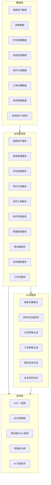
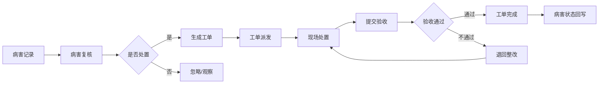
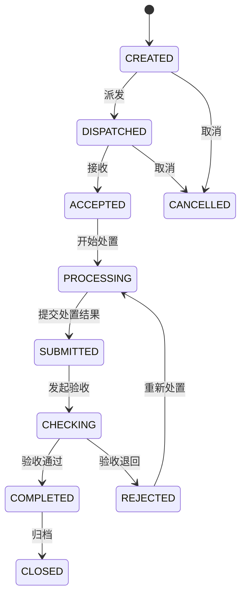

# 智路养护平台二期建设方案

系统名称：智路养护平台  
英文名称：SmartRoad Maintenance Platform  
简称：SRMP  
文档版本：V2.0  
建设阶段：二期  
建设主题：养护业务闭环与智能决策增强  

---

# 1. 文档说明

## 1.1 文档目的

本文档用于指导 **智路养护平台二期建设**，在一期“GIS 一张图 + 数据导入 + 病害展示 + 评定结果展示 + AI 数据分析”的基础上，进一步建设养护计划、工单闭环、项目预算、移动端现场处置、AI 辅助决策等能力。

二期重点从“看得见、查得到、能分析”升级为：

```text
能计划
能派单
能处置
能验收
能复盘
能辅助决策
```

## 1.2 适用范围

本文档适用于：

```text
1. 产品规划
2. 系统架构设计
3. 后端模块拆分
4. 前端页面规划
5. 数据库建模
6. AI 决策能力设计
7. 二期项目实施计划
8. 后续招投标或建设方案编制
```

---

# 2. 一期建设成果回顾

## 2.1 一期建设定位

一期定位为：

```text
GIS 一张图 + 数据导入 + 道路资产展示 + 病害展示 + 巡检评定结果展示 + AI 大模型数据分析
```

一期核心目标是：

```text
数据进得来
地图看得见
病害查得到
评定能展示
AI 能分析
报告能生成
```

## 2.2 一期已建设能力

一期已完成以下核心能力：

| 能力 | 说明 |
|---|---|
| 基础工程骨架 | Spring Boot 多模块后端工程 |
| 多租户能力 | 基于 tenant_id 的字段级租户隔离 |
| 道路资产管理 | 路线、路段、评定单元 |
| GIS 一张图 | 路线、路段、评定单元、病害、评定结果上图 |
| 病害管理 | 病害类型、病害记录、病害 GIS 图层 |
| 评定结果管理 | MQI、PQI、PCI 等评定结果展示 |
| 数据导入 | 支持道路资产、病害、评定结果导入 |
| 文件资料 | 支持文件资源与业务对象关联 |
| AI 分析 | 支持路线分析、病害分析、评定分析、报告草稿 |
| 前端演示 | GIS 一张图页面、图层控制、对象详情、AI 问答 |
| 演示闭环 | G210 演示数据与接口验收脚本 |

## 2.3 一期业务边界

一期主要解决“数据可视化与辅助分析”，尚未形成完整的养护业务闭环。

一期已完成：

```text
病害发现
路况评定
地图展示
AI 分析
报告草稿
```

一期暂未覆盖：

```text
养护计划
工单派发
现场处置
处置验收
预算费用
移动端作业
养护效果复盘
```

---

# 3. 二期建设背景

## 3.1 业务背景

随着一期平台建设完成，系统已经具备道路资产、病害、评定结果的统一入库与 GIS 展示能力。但在实际养护业务中，仅仅“看到问题”和“分析问题”还不足以支撑完整管理闭环。

道路养护管理通常还需要完成：

```text
1. 根据病害和评定结果制定养护计划；
2. 将计划或病害转化为具体工单；
3. 将工单派发给养护单位或现场人员；
4. 现场人员完成处置并上传照片、材料、费用；
5. 管理人员进行验收；
6. 对养护效果进行统计与复盘；
7. 为后续年度计划和预算提供依据。
```

因此，二期建设需要将平台从“分析展示系统”升级为“养护业务闭环系统”。

## 3.2 主要痛点

当前仍存在以下痛点：

| 痛点 | 说明 |
|---|---|
| 病害处置无闭环 | 病害发现后缺少处置、验收、归档流程 |
| 计划编制依赖人工 | 养护计划主要靠经验制定，缺少数据支撑 |
| 工单流转不透明 | 工单状态、处置进度、验收结果难以统一追踪 |
| 现场反馈不及时 | 处置照片、材料用量、现场说明缺少移动端采集 |
| 预算关联弱 | 计划、项目、工单、费用之间缺少联动 |
| 复盘能力不足 | 无法分析养护投入与路况改善之间的关系 |
| AI 决策不深入 | 一期 AI 主要分析数据，尚未参与计划和方案建议 |

## 3.3 二期建设必要性

二期建设的必要性体现在：

```text
1. 将病害数据转化为可执行任务；
2. 将评定结果转化为养护计划；
3. 将养护计划转化为工单和项目；
4. 将现场处置过程数字化；
5. 将养护结果反馈到地图和统计体系；
6. 将 AI 从“分析助手”升级为“决策助手”。
```

---

# 4. 二期总体建设目标

## 4.1 总体目标

二期总体目标是建设一套覆盖养护计划、工单处置、项目预算、现场反馈、验收复盘、AI 决策建议的公路养护业务闭环平台。

二期平台主线：

```text
病害发现
  ↓
病害复核
  ↓
AI 辅助研判
  ↓
养护计划
  ↓
养护工单
  ↓
现场处置
  ↓
验收归档
  ↓
效果评估
  ↓
复盘优化
```

## 4.2 建设目标拆解

| 目标 | 说明 |
|---|---|
| 建立养护计划管理能力 | 支持年度、月度、专项计划编制、审批和执行跟踪 |
| 建立工单闭环能力 | 支持工单创建、派发、处理、验收、归档 |
| 建立病害处置跟踪能力 | 支持病害转工单、处置状态回写、复发分析 |
| 建立项目预算管理能力 | 支持养护项目、预算、费用、材料、人工、机械管理 |
| 建立移动端现场处置能力 | 支持现场拍照、定位、反馈、提交验收 |
| 增强 AI 决策能力 | 支持养护建议、计划草稿、工单草稿、报告生成 |
| 完善前端平台能力 | 从 GIS 单页升级为完整后台管理平台 |
| 提升工程交付能力 | 增加自动验收、演示脚本、配置标准化 |

---

# 5. 二期总体架构

## 5.1 总体架构图



## 5.2 技术架构建议

| 层次 | 技术建议 |
|---|---|
| 后端框架 | Spring Boot 2.7.x |
| 数据访问 | MyBatis Plus |
| 数据库 | PostgreSQL + PostGIS |
| 缓存 | Redis |
| 文件存储 | MinIO |
| 前端 | Vue 3 + Vite + Element Plus |
| 地图 | Leaflet / MapLibre 可选 |
| 图表 | ECharts |
| 移动端 | H5 优先，小程序可扩展 |
| 状态机 | 轻量状态机 / cola-statemachine |
| 消息通知 | 站内信 + WebSocket/SSE |
| AI 接入 | OpenAI-Compatible API + 工具调用 |
| 报告输出 | Markdown / Word / PDF |

---

# 6. 二期业务闭环设计

## 6.1 核心闭环

二期核心闭环为：

```text
病害 / 评定结果
      ↓
问题池
      ↓
复核确认
      ↓
AI 建议
      ↓
养护计划
      ↓
计划审批
      ↓
计划下达
      ↓
生成工单
      ↓
现场处置
      ↓
验收确认
      ↓
归档复盘
```

## 6.2 病害到工单闭环



## 6.3 计划到工单闭环


---

# 7. 二期系统模块拆分

## 7.1 新增后端模块

在一期模块基础上，二期建议新增以下模块：

```text
srmp-maintenance-plan       养护计划模块
srmp-maintenance-order      养护工单模块
srmp-maintenance-project    养护项目模块
srmp-maintenance-budget     预算费用模块
srmp-workflow               审批流程模块
srmp-notification           消息通知模块
srmp-mobile-api             移动端接口模块
srmp-maintenance-ai         AI养护决策增强模块
```

## 7.2 模块依赖关系

```text
srmp-maintenance-plan
 ├── srmp-road-asset
 ├── srmp-disease
 ├── srmp-assessment
 ├── srmp-workflow
 └── srmp-maintenance-ai

srmp-maintenance-order
 ├── srmp-disease
 ├── srmp-maintenance-plan
 ├── srmp-file
 ├── srmp-notification
 └── srmp-workflow

srmp-maintenance-project
 ├── srmp-road-asset
 ├── srmp-maintenance-plan
 ├── srmp-maintenance-order
 └── srmp-file

srmp-maintenance-budget
 ├── srmp-maintenance-project
 ├── srmp-maintenance-order
 └── srmp-base

srmp-mobile-api
 ├── srmp-maintenance-order
 ├── srmp-file
 ├── srmp-gis
 └── srmp-security

srmp-maintenance-ai
 ├── srmp-agent
 ├── srmp-disease
 ├── srmp-assessment
 ├── srmp-maintenance-plan
 └── srmp-maintenance-order
```

## 7.3 模块说明

| 模块 | 说明 |
|---|---|
| srmp-maintenance-plan | 年度/月度/专项养护计划 |
| srmp-maintenance-order | 工单派发、处置、验收闭环 |
| srmp-maintenance-project | 养护项目、项目进度、项目资料 |
| srmp-maintenance-budget | 预算、费用、材料、人工、机械 |
| srmp-workflow | 轻量审批流、审批记录 |
| srmp-notification | 站内信、待办提醒、消息模板 |
| srmp-mobile-api | 移动端工单接口 |
| srmp-maintenance-ai | 养护建议、计划生成、优先级排序 |

---

# 8. 核心模块设计

## 8.1 养护计划模块

### 8.1.1 模块目标

养护计划模块用于根据病害记录、技术状况评定结果、路线等级、交通量、预算约束等因素，形成年度、月度或专项养护计划。

### 8.1.2 功能清单

```text
1. 年度计划管理
2. 月度计划管理
3. 专项计划管理
4. 计划草稿生成
5. 计划明细维护
6. 计划审批
7. 计划下达
8. 计划调整
9. 计划转工单
10. 计划执行进度跟踪
11. 计划完成率统计
```

### 8.1.3 计划状态

```text
DRAFT             草稿
SUBMITTED         已提交
APPROVING         审批中
APPROVED          已审批
REJECTED          已驳回
ISSUED            已下达
EXECUTING         执行中
COMPLETED         已完成
CANCELLED         已取消
```

### 8.1.4 核心表

```text
maintenance_plan
maintenance_plan_item
maintenance_plan_approval
maintenance_plan_adjust_log
```

---

## 8.2 养护工单模块

### 8.2.1 模块目标

养护工单模块用于将病害、计划明细或人工上报问题转化为可执行任务，并形成派发、处置、验收、归档闭环。

### 8.2.2 功能清单

```text
1. 工单创建
2. 病害转工单
3. 计划转工单
4. 工单派发
5. 工单接收
6. 工单处置
7. 处置前后照片上传
8. 材料用量填写
9. 处置结果提交
10. 验收审核
11. 工单退回
12. 工单归档
13. 工单地图展示
```

### 8.2.3 工单状态

```text
CREATED        已创建
DISPATCHED     已派发
ACCEPTED       已接收
PROCESSING     处理中
SUBMITTED      已提交
CHECKING       验收中
REJECTED       已退回
COMPLETED      已完成
CLOSED         已归档
CANCELLED      已取消
```

### 8.2.4 工单状态机



### 8.2.5 核心表

```text
maintenance_work_order
maintenance_work_order_disease
maintenance_work_order_log
maintenance_work_order_photo
maintenance_work_order_material
maintenance_acceptance
```

---

## 8.3 病害处置跟踪模块

### 8.3.1 模块目标

在一期病害记录基础上，增加病害处置状态、病害合并拆分、病害转工单、处置效果回写能力。

### 8.3.2 功能清单

```text
1. 病害确认
2. 病害合并
3. 病害拆分
4. 病害转计划
5. 病害转工单
6. 病害处置状态跟踪
7. 处置前后对比
8. 病害复发分析
```

### 8.3.3 病害处置状态

```text
UNPROCESSED      未处置
CONFIRMED        已确认
PLANNED          已纳入计划
ORDER_CREATED    已生成工单
PROCESSING       处置中
COMPLETED        已处置
ACCEPTED         已验收
IGNORED          已忽略
```

### 8.3.4 与一期 disease_record 的关系

建议不重构一期 `disease_record` 主表，而是新增扩展字段或扩展表：

```text
方案一：在 disease_record 增加 treatment_status、work_order_id
方案二：新增 disease_treatment 表，记录病害处置过程
```

推荐方案二，避免一期数据结构过度膨胀。

---

## 8.4 养护项目管理模块

### 8.4.1 模块目标

用于管理中修、大修、预防性养护、专项治理等规模较大的养护项目。

### 8.4.2 功能清单

```text
1. 项目立项
2. 项目范围维护
3. 关联路线/路段/评定单元
4. 关联病害
5. 项目预算
6. 项目进度
7. 项目资料
8. 项目验收
9. 项目绩效评估
```

### 8.4.3 核心表

```text
maintenance_project
maintenance_project_section
maintenance_project_disease
maintenance_project_budget
maintenance_project_progress
maintenance_project_file
```

---

## 8.5 预算费用模块

### 8.5.1 模块目标

建立计划、项目、工单与预算费用之间的关联，实现养护资金使用情况统计。

### 8.5.2 功能清单

```text
1. 年度预算
2. 项目预算
3. 工单费用
4. 材料费用
5. 人工费用
6. 机械费用
7. 费用审核
8. 费用统计
9. 投入产出分析
```

### 8.5.3 核心表

```text
maintenance_budget
maintenance_cost
maintenance_material_usage
maintenance_labor_usage
maintenance_equipment_usage
```

---

## 8.6 移动端现场处置模块

### 8.6.1 模块目标

支持现场人员通过 H5 或小程序完成工单接收、现场处置、照片上传、材料填写、结果提交。

### 8.6.2 功能清单

```text
1. 登录认证
2. 我的工单
3. 工单详情
4. 地图定位
5. 导航到现场
6. 处置前照片
7. 处置后照片
8. 材料用量填写
9. 处置说明
10. 提交验收
11. 离线缓存
```

### 8.6.3 移动端设计原则

```text
少填表
多拍照
自动定位
自动带出路线桩号
弱网可用
现场快速提交
```

---

## 8.7 AI 养护决策增强模块

### 8.7.1 模块目标

将一期 AI 分析能力升级为 AI 决策建议能力，支持生成计划草稿、工单草稿、优先级排序和处置建议。

### 8.7.2 功能清单

```text
1. 病害处置建议
2. 养护优先级排序
3. 计划草稿生成
4. 工单草稿生成
5. 预算约束下的计划推荐
6. 养护效果复盘
7. 病害复发风险分析
8. 月报/季报/年报生成
```

### 8.7.3 AI 使用边界

```text
AI 可以生成建议
AI 可以生成草稿
AI 可以排序优先级
AI 可以生成报告
AI 不直接审批
AI 不直接派单
AI 不直接修改正式业务数据
```

### 8.7.4 AI 工具能力

```text
queryDiseaseTool              查询病害
queryAssessmentTool           查询评定结果
queryWorkOrderTool            查询工单
queryPlanTool                 查询计划
generatePlanDraftTool         生成计划草稿
generateWorkOrderDraftTool    生成工单草稿
rankPriorityTool              优先级排序
generateReportTool            生成报告
```

---

# 9. 二期前端规划

## 9.1 前端建设目标

一期前端主要是 GIS 一张图页面，二期需要升级为完整后台管理平台。

二期前端目标：

```text
1. 完整 Layout 框架
2. 登录页
3. 菜单路由
4. 权限控制
5. 列表页
6. 表单页
7. GIS 联动
8. AI 助手
9. 移动端 H5 页面
```

## 9.2 前端菜单规划

```text
首页驾驶舱

GIS 一张图
├── 路网一张图
├── 病害分布图
├── 评定专题图
└── 养护工单图

道路资产
├── 路线管理
├── 路段管理
└── 评定单元

病害管理
├── 病害列表
├── 病害复核
├── 病害合并拆分
└── 病害处置跟踪

评定结果
├── 综合评定结果
├── 指标结果
└── 路况统计

养护计划
├── 年度计划
├── 月度计划
├── 专项计划
├── 计划审批
└── 计划执行看板

养护工单
├── 工单列表
├── 待派发工单
├── 处理中工单
├── 待验收工单
└── 已完成工单

养护项目
├── 项目列表
├── 项目进度
├── 项目预算
└── 项目资料

预算费用
├── 年度预算
├── 项目费用
├── 工单费用
└── 费用统计

智能决策
├── 养护建议
├── 计划生成
├── 优先级排序
├── 报告生成
└── AI 问答

系统管理
├── 租户管理
├── 用户管理
├── 角色权限
├── 组织机构
└── 数据字典
```

## 9.3 二期优先补齐页面

| 优先级 | 页面 | 说明 |
|---|---|---|
| P0 | 登录页 | 平台入口 |
| P0 | Layout 主框架 | 菜单、顶部栏、面包屑 |
| P0 | 病害列表 | 病害转工单入口 |
| P0 | 工单列表 | 工单闭环核心 |
| P0 | 工单详情 | 状态流转、处置反馈 |
| P1 | 养护计划列表 | 计划管理入口 |
| P1 | 计划详情 | 计划明细与审批 |
| P1 | 数据导入页 | 完善一期导入体验 |
| P1 | 首页驾驶舱 | 统计展示 |
| P2 | 项目预算 | 后续扩展 |

---

# 10. 二期数据库主题规划

## 10.1 养护计划主题

```text
maintenance_plan
maintenance_plan_item
maintenance_plan_approval
maintenance_plan_adjust_log
```

## 10.2 工单闭环主题

```text
maintenance_work_order
maintenance_work_order_disease
maintenance_work_order_log
maintenance_work_order_photo
maintenance_work_order_material
maintenance_acceptance
```

## 10.3 病害处置主题

```text
disease_treatment
disease_merge_log
disease_split_log
disease_recurrence_analysis
```

## 10.4 项目管理主题

```text
maintenance_project
maintenance_project_section
maintenance_project_disease
maintenance_project_budget
maintenance_project_progress
maintenance_project_file
```

## 10.5 预算费用主题

```text
maintenance_budget
maintenance_cost
maintenance_material_usage
maintenance_labor_usage
maintenance_equipment_usage
```

## 10.6 移动端主题

```text
mobile_work_order_cache
mobile_offline_submit_log
mobile_checkin_log
```

## 10.7 AI 决策主题

```text
ai_maintenance_suggestion
ai_plan_generation_task
ai_report_generation_task
ai_decision_feedback
```

## 10.8 消息通知主题

```text
notification_message
notification_receiver
notification_template
```

---

# 11. 二期接口规划

## 11.1 养护计划接口

```text
POST   /api/maintenance-plans/page
POST   /api/maintenance-plans
GET    /api/maintenance-plans/{id}
PUT    /api/maintenance-plans/{id}
DELETE /api/maintenance-plans/{id}

POST   /api/maintenance-plans/{id}/submit
POST   /api/maintenance-plans/{id}/approve
POST   /api/maintenance-plans/{id}/reject
POST   /api/maintenance-plans/{id}/issue
POST   /api/maintenance-plans/{id}/generate-orders
```

## 11.2 养护工单接口

```text
POST   /api/maintenance-orders/page
POST   /api/maintenance-orders
GET    /api/maintenance-orders/{id}
PUT    /api/maintenance-orders/{id}
DELETE /api/maintenance-orders/{id}

POST   /api/maintenance-orders/from-disease
POST   /api/maintenance-orders/{id}/dispatch
POST   /api/maintenance-orders/{id}/accept
POST   /api/maintenance-orders/{id}/start
POST   /api/maintenance-orders/{id}/submit
POST   /api/maintenance-orders/{id}/approve
POST   /api/maintenance-orders/{id}/reject
POST   /api/maintenance-orders/{id}/close
```

## 11.3 移动端接口

```text
GET    /api/mobile/orders/my
GET    /api/mobile/orders/{id}
POST   /api/mobile/orders/{id}/accept
POST   /api/mobile/orders/{id}/start
POST   /api/mobile/orders/{id}/upload-photo
POST   /api/mobile/orders/{id}/submit
POST   /api/mobile/checkin
```

## 11.4 AI 决策接口

```text
POST /api/maintenance-ai/suggest-treatment
POST /api/maintenance-ai/rank-priority
POST /api/maintenance-ai/generate-plan-draft
POST /api/maintenance-ai/generate-order-draft
POST /api/maintenance-ai/generate-report
POST /api/maintenance-ai/analyze-effect
```

---

# 12. 二期实施计划

## 12.1 阶段 2.1：前端平台化补齐

### 目标

将当前一期前端从 GIS 单页升级为完整管理平台。

### 建设内容

```text
1. 登录页
2. Layout 主框架
3. 菜单路由
4. 权限菜单
5. 首页驾驶舱
6. 道路资产列表页
7. 病害列表页
8. 评定结果列表页
9. 数据导入页
10. AI 分析页
```

### 交付物

```text
srmp-web-ui 完整管理端骨架
基础菜单路由
核心列表页
GIS 页面集成到 Layout
```

---

## 12.2 阶段 2.2：养护工单闭环

### 目标

实现从病害到工单再到验收的业务闭环。

### 建设内容

```text
1. 工单数据模型
2. 工单 CRUD
3. 病害转工单
4. 工单状态机
5. 工单派发
6. 工单处置
7. 处置照片
8. 工单验收
9. 工单地图展示
```

### 交付物

```text
养护工单后端模块
工单状态机
工单管理页面
工单地图图层
```

---

## 12.3 阶段 2.3：养护计划管理

### 目标

支持年度、月度、专项养护计划管理。

### 建设内容

```text
1. 计划数据模型
2. 计划 CRUD
3. 计划明细
4. 计划审批
5. 计划下达
6. 计划转工单
7. 计划执行统计
8. AI 生成计划草稿
```

### 交付物

```text
养护计划模块
计划审批流程
计划执行看板
AI 计划草稿生成
```

---

## 12.4 阶段 2.4：移动端现场处置

### 目标

支持现场人员通过移动端完成工单处理。

### 建设内容

```text
1. 我的工单
2. 工单详情
3. 地图定位
4. 处置前照片
5. 处置后照片
6. 材料用量填写
7. 处置说明
8. 提交验收
```

### 交付物

```text
移动端 H5
移动端接口
现场处置闭环
```

---

## 12.5 阶段 2.5：AI 养护决策增强

### 目标

让 AI 从分析助手升级为决策助手。

### 建设内容

```text
1. 病害处置建议
2. 养护优先级排序
3. 计划草稿生成
4. 工单草稿生成
5. 预算约束下的计划推荐
6. 报告自动生成
```

### 交付物

```text
AI 养护决策模块
AI 工具调用增强
AI 决策反馈机制
```

---

# 13. 二期 MVP 建议

## 13.1 MVP 范围

二期 MVP 不宜过大，建议优先建设：

```text
1. 前端 Layout + 菜单路由
2. 病害列表
3. 病害转工单
4. 工单列表
5. 工单状态流转
6. 工单处置反馈
7. 工单验收
8. 工单地图展示
9. AI 生成处置建议
```

## 13.2 MVP 闭环

```text
病害记录
  ↓
生成工单
  ↓
派发
  ↓
处置
  ↓
验收
  ↓
地图和统计更新
```

## 13.3 MVP 验收标准

| 验收项 | 标准 |
|---|---|
| 病害转工单 | 可从病害记录生成工单 |
| 工单状态流转 | 可完成创建、派发、处置、验收 |
| 附件上传 | 可上传处置前后照片 |
| 工单地图展示 | 可在 GIS 中看到工单位置 |
| AI 建议 | 可生成病害处置建议 |
| 统计更新 | 工单完成后统计数据更新 |

---

# 14. 二期风险与控制措施

## 14.1 风险清单

| 风险 | 说明 | 控制措施 |
|---|---|---|
| 工单状态复杂 | 状态流转不清会影响业务 | 先定义状态机，再开发 |
| 病害与工单关系复杂 | 可能一对一、一对多、多对一 | 建立关联表 maintenance_work_order_disease |
| 计划与工单边界不清 | 计划是管理对象，工单是执行对象 | 明确计划转工单流程 |
| 移动端弱网 | 现场网络不稳定 | 支持本地缓存和失败重试 |
| 附件数据量大 | 图片视频占用存储 | MinIO + 文件生命周期管理 |
| AI 输出不可控 | AI 建议可能不准确 | 只生成草稿，不自动执行 |
| 前端页面增多 | 维护复杂度上升 | 建立统一 Layout、组件和权限 |

## 14.2 控制原则

```text
1. 先闭环，后优化；
2. 先轻流程，后复杂审批；
3. 先 H5，后小程序；
4. AI 只辅助，不替代人工决策；
5. 计划、工单、验收三者边界清晰；
6. 所有关键状态变化必须有日志；
7. 所有移动端提交必须可追溯。
```

---

# 15. 二期交付物清单

## 15.1 文档交付物

```text
1. 二期建设方案
2. 二期系统模块设计
3. 二期数据库设计
4. 养护工单状态机设计
5. 养护计划业务流程设计
6. 移动端接口设计
7. 二期前端页面设计
8. AI 养护决策设计
9. 二期实施计划与里程碑
```

## 15.2 系统交付物

```text
1. 前端平台化管理端
2. 养护计划模块
3. 养护工单模块
4. 病害处置闭环
5. 移动端 H5
6. AI 养护决策能力
7. 工单 GIS 图层
8. 计划执行看板
9. 验收与复盘报表
```

---

# 16. 总结

智路养护平台一期已经完成了道路资产、病害、评定结果、数据导入、GIS 展示和 AI 分析能力，实现了“看得见、查得到、能分析”的基础能力。

二期建设应围绕“养护业务闭环”展开，核心是：

```text
病害发现
  ↓
计划制定
  ↓
工单派发
  ↓
现场处置
  ↓
验收归档
  ↓
效果复盘
```

二期最重要的建设方向不是继续增加展示能力，而是让系统真正支撑养护业务执行。

建议二期优先从以下两个方向启动：

```text
1. 前端平台化补齐
2. 养护工单闭环
```

在此基础上，再逐步建设：

```text
养护计划
移动端现场处置
项目预算
AI 养护决策增强
```

最终将智路养护平台建设成为集：

```text
道路资产管理
路况评定
病害管理
GIS 一张图
养护计划
工单闭环
移动处置
预算费用
AI 决策
统计复盘
```

于一体的综合性公路养护智能管理平台。
