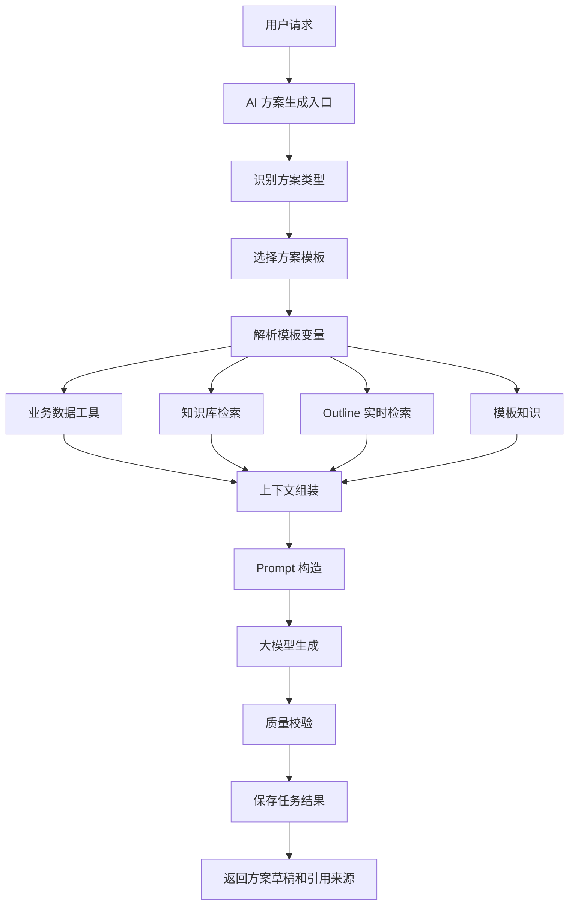

# 智路养护平台 AI 方案生成能力增强规划

系统名称：智路养护平台  
英文名称：SmartRoad Maintenance Platform  
简称：SRMP  
文档版本：V1.0  
规划主题：知识库 + Outline 模板 + 业务数据分析 + AI 方案生成  

---

# 1. 文档说明

## 1.1 文档目的

本文档用于规划智路养护平台后续 AI 能力增强方向。

当前系统已经具备：

```text
1. GIS 一张图；
2. 业务数据分析；
3. 本地知识库；
4. Outline 在线搜索；
5. Outline 同步入库；
6. AI 问答；
7. AI 知识库验收脚本；
8. 数据库初始化脚本。
```

下一步如果希望实现：

```text
Outline 中更新了用户方案模板、专业知识或规范说明后，
AI 能快速应用这些内容，
结合业务数据生成专业分析方案。
```

那么系统需要从“AI 问答”升级为：

```text
知识库 + 业务数据工具 + 方案模板 + AI 生成流程编排
```

---

# 2. 当前能力与主要缺口

## 2.1 当前能力

当前 AI 能力主要包括：

```text
1. 基于业务数据进行路线分析；
2. 基于业务数据进行病害分析；
3. 基于业务数据进行评定结果分析；
4. 基于本地知识库进行问答；
5. 基于 Outline 在线搜索进行问答；
6. 支持将 Outline 文档同步到本地知识库；
7. AI 问答支持 useBusinessData / useKnowledge / useOutline。
```

当前典型链路：

```text
用户提问
  ↓
查询业务数据 / 知识库 / Outline
  ↓
大模型生成回答
```

## 2.2 当前不足

当前 AI 仍偏向“问答助手”，不足以支撑正式业务方案生成。

主要缺口：

```text
1. 缺少方案模板管理；
2. 缺少模板版本管理；
3. 缺少模板变量解析；
4. 缺少业务数据自动填充机制；
5. 缺少方案生成任务；
6. 缺少生成结果留痕；
7. 缺少引用来源记录；
8. 缺少方案质量校验；
9. 缺少对 Outline 模板更新的快速应用机制。
```

---

# 3. 目标能力

## 3.1 总体目标

将 AI 从“数据问答助手”升级为：

```text
方案生成助手
专业知识应用助手
业务数据分析助手
报告草稿生成助手
模板化决策辅助助手
```

最终实现：

```text
用户选择路线和年度
  ↓
系统选择最新方案模板
  ↓
系统查询业务数据
  ↓
系统检索知识库和 Outline
  ↓
AI 按模板生成方案草稿
  ↓
展示数据依据、知识来源、模板来源
  ↓
人工确认、导出或继续修改
```

## 3.2 典型业务场景

### 场景一：根据最新模板生成技术状况分析方案

用户提问：

```text
根据最新模板生成 G210 2026 年技术状况分析方案
```

系统执行：

```text
1. 查找技术状况分析模板；
2. 判断是否为 Outline 最新同步模板；
3. 查询 G210 2026 年评定结果；
4. 查询 G210 2026 年病害统计；
5. 检索 MQI/PQI/PCI 专业知识；
6. 检索养护建议规则；
7. 按模板生成方案草稿；
8. 返回引用来源。
```

### 场景二：根据专家知识生成病害治理建议

用户提问：

```text
结合专家知识，分析 G210 当前病害治理重点
```

系统执行：

```text
1. 查询 G210 病害数据；
2. 统计病害类型、严重程度、空间分布；
3. 检索专家经验知识；
4. 检索病害处置建议模板；
5. 生成治理建议和优先级。
```

### 场景三：Outline 更新模板后快速应用

业务人员在 Outline 中更新：

```text
《技术状况评定报告模板》
```

系统执行：

```text
1. 同步 Outline 文档；
2. 识别为 SOLUTION_TEMPLATE；
3. 更新本地模板版本；
4. 解析模板变量；
5. AI 方案生成时自动使用最新版本。
```

---

# 4. 推荐总体架构

## 4.1 架构说明

建议将 AI 方案生成能力设计为：

```text
用户请求
  ↓
任务类型识别
  ↓
方案模板选择
  ↓
模板变量解析
  ↓
业务数据工具调用
  ↓
知识库 / Outline 检索
  ↓
Prompt 组装
  ↓
AI 生成方案
  ↓
质量校验
  ↓
结果保存与引用来源记录
```

## 4.2 架构图



---

# 5. 需要重点完善的能力

## 5.1 方案模板管理

### 5.1.1 目标

支持系统管理不同类型的方案模板，并支持模板版本、模板来源和模板变量识别。

模板可以来自：

```text
1. 系统内置模板；
2. 本地手工录入；
3. Markdown 文档；
4. Outline 同步文档；
5. 后续上传文档。
```

### 5.1.2 模板示例

```markdown
# {{routeCode}} {{year}} 年技术状况分析方案

## 一、路线概况
{{routeSummary}}

## 二、评定结果
{{assessmentSummary}}

## 三、主要病害
{{diseaseSummary}}

## 四、问题分析
{{problemAnalysis}}

## 五、养护建议
{{maintenanceSuggestion}}

## 六、实施优先级
{{priorityPlan}}

## 七、风险提示
{{riskNotice}}
```

### 5.1.3 模板类型建议

```text
ROAD_ASSESSMENT_REPORT      技术状况评定报告
MAINTENANCE_SUGGESTION      养护建议方案
DISEASE_TREATMENT_PLAN      病害治理方案
LOW_SCORE_SECTION_ANALYSIS  低分路段分析
MONTHLY_MAINTENANCE_PLAN    月度养护计划
IMPORT_GUIDE                数据导入说明
```

---

## 5.2 Outline 模板快速应用

### 5.2.1 当前问题

Outline 可以维护文档，但系统需要知道：

```text
1. 哪些 Outline 文档是普通知识；
2. 哪些 Outline 文档是方案模板；
3. 哪些模板是最新版本；
4. 哪些模板变量需要业务数据填充。
```

### 5.2.2 推荐机制

建议对 Outline 同步增加模板识别能力：

```text
Outline 文档
  ↓
同步入库
  ↓
判断 category 或标题关键字
  ↓
识别为 SOLUTION_TEMPLATE
  ↓
生成 ai_solution_template
  ↓
生成 ai_solution_template_version
  ↓
解析 {{变量}}
```

### 5.2.3 同步方式

建议分三步：

```text
阶段一：手动同步
阶段二：定时同步
阶段三：Webhook 或事件触发同步
```

一期增强建议先做：

```text
手动同步 + content_hash 判断 + 模板版本管理
```

---

## 5.3 知识库分层

当前知识库主要是文档和切片，后续建议按用途分层。

建议知识类型：

```text
ROAD_STANDARD        公路标准规范
SYSTEM_MANUAL        系统操作手册
MAINTENANCE_FLOW     养护业务流程
SOLUTION_TEMPLATE    方案模板
EXPERT_KNOWLEDGE     专家经验
PROJECT_CASE         项目案例
IMPORT_TEMPLATE      导入模板
FAQ                  常见问题
```

AI 生成方案时根据任务类型选择知识来源：

| 方案类型 | 推荐知识来源 |
|---|---|
| 技术状况评定报告 | ROAD_STANDARD、SOLUTION_TEMPLATE |
| 病害治理方案 | EXPERT_KNOWLEDGE、PROJECT_CASE、SOLUTION_TEMPLATE |
| 养护建议 | ROAD_STANDARD、EXPERT_KNOWLEDGE |
| 数据导入说明 | IMPORT_TEMPLATE、SYSTEM_MANUAL |
| 低分路段分析 | ROAD_STANDARD、PROJECT_CASE |

---

## 5.4 业务数据工具化

AI 方案生成不能只依赖自然语言描述，必须将业务数据查询封装为工具。

建议工具：

```text
RoadAssetTool             道路资产查询
AssessmentSummaryTool     评定结果统计
DiseaseSummaryTool        病害统计
LowScoreSectionTool       低分路段查询
DiseaseHotspotTool        病害热点分析
MapObjectTool             GIS 对象详情
KnowledgeSearchTool       知识库检索
OutlineSearchTool         Outline 实时检索
TemplateSelectTool        模板选择
ReportDraftTool           报告草稿生成
```

工具调用示例：

```text
用户请求：根据最新模板生成 G210 2026 年技术状况分析方案

系统调用：
1. TemplateSelectTool
2. RoadAssetTool
3. AssessmentSummaryTool
4. DiseaseSummaryTool
5. LowScoreSectionTool
6. KnowledgeSearchTool
7. AiSolutionGenerateService
```

---

## 5.5 方案生成流程编排

建议新增专门的方案生成接口，不建议继续让 `/api/agent/chat` 承担全部方案生成任务。

新增接口：

```text
POST /api/ai/solution/generate
GET  /api/ai/solution/tasks/{id}
POST /api/ai/solution/tasks/{id}/confirm
POST /api/ai/solution/tasks/{id}/export
```

请求示例：

```json
{
  "solutionType": "ROAD_ASSESSMENT_REPORT",
  "routeCode": "G210",
  "year": 2026,
  "templateCode": "road_assessment_report_v1",
  "options": {
    "useBusinessData": true,
    "useKnowledge": true,
    "useOutline": true,
    "latestTemplate": true
  }
}
```

响应示例：

```json
{
  "taskId": "xxx",
  "status": "SUCCESS",
  "title": "G210 2026 年技术状况评定报告草稿",
  "content": "...",
  "sources": [
    {
      "type": "BUSINESS_DATA",
      "title": "G210 2026 年评定结果统计"
    },
    {
      "type": "KNOWLEDGE",
      "title": "PCI 指标说明"
    },
    {
      "type": "OUTLINE_TEMPLATE",
      "title": "技术状况评定报告模板"
    }
  ]
}
```

---

## 5.6 模板变量自动填充

### 5.6.1 变量格式

推荐使用：

```text
{{变量名}}
```

例如：

```text
{{routeCode}}
{{year}}
{{routeSummary}}
{{assessmentSummary}}
{{diseaseSummary}}
{{lowScoreSections}}
{{maintenanceSuggestion}}
{{riskNotice}}
```

### 5.6.2 变量来源映射

| 模板变量 | 来源 |
|---|---|
| `routeCode` | 用户输入 |
| `year` | 用户输入 |
| `routeSummary` | RoadAssetTool |
| `assessmentSummary` | AssessmentSummaryTool |
| `diseaseSummary` | DiseaseSummaryTool |
| `lowScoreSections` | LowScoreSectionTool |
| `maintenanceSuggestion` | AI + 知识库 |
| `riskNotice` | AI + 专业知识 |

### 5.6.3 处理流程

```text
读取模板
  ↓
解析变量
  ↓
根据变量调用工具
  ↓
获得变量值
  ↓
填充模板
  ↓
AI 对方案进行润色和补充
```

---

## 5.7 生成结果留痕

AI 生成的方案不应该只在聊天框中显示，应保存为可追溯任务。

建议记录：

```text
1. 用户请求；
2. 路线编号；
3. 年度；
4. 方案类型；
5. 使用的模板；
6. 模板版本；
7. 使用的业务数据快照；
8. 使用的知识库片段；
9. 使用的 Outline 文档；
10. AI 生成结果；
11. 人工确认结果；
12. 质量校验结果。
```

---

## 5.8 质量校验

方案生成后应进行质量校验。

建议检查项：

```text
1. 是否包含必填章节；
2. 是否引用了业务数据；
3. 是否引用了知识来源；
4. 是否存在 null / 空值；
5. 是否存在明显缺项；
6. 是否超过字数限制；
7. 是否有无法验证的结论；
8. 是否标明 AI 生成结果为草稿。
```

质量校验结果示例：

```json
{
  "passed": false,
  "warnings": [
    "缺少低分路段分析章节",
    "未引用 Outline 模板来源",
    "存在空值：平均 PCI"
  ]
}
```

---

# 6. 推荐新增模块结构

当前可以继续放在 `srmp-agent` 中，不必立即拆分独立模块。

建议包结构：

```text
srmp-agent
└── ai-solution
    ├── controller
    │   └── AiSolutionController.java
    ├── entity
    │   ├── AiSolutionTemplate.java
    │   ├── AiSolutionTemplateVersion.java
    │   ├── AiSolutionTask.java
    │   ├── AiSolutionResult.java
    │   └── AiSolutionSource.java
    ├── service
    │   ├── AiSolutionTemplateService.java
    │   ├── AiSolutionGenerateService.java
    │   ├── AiSolutionVariableService.java
    │   └── AiSolutionQualityCheckService.java
    ├── template
    │   ├── TemplateVariableParser.java
    │   ├── MarkdownTemplateRenderer.java
    │   └── TemplateSourceResolver.java
    └── tool
        ├── AssessmentSummaryTool.java
        ├── DiseaseSummaryTool.java
        ├── LowScoreSectionTool.java
        └── KnowledgeContextTool.java
```

---

# 7. 推荐数据库设计

## 7.1 ai_solution_template

```sql
CREATE TABLE ai_solution_template (
    id              VARCHAR(64) PRIMARY KEY,
    tenant_id       VARCHAR(64) NOT NULL,
    template_code   VARCHAR(100) NOT NULL,
    template_name   VARCHAR(200) NOT NULL,
    solution_type   VARCHAR(100) NOT NULL,
    source_type     VARCHAR(50),
    source_id       VARCHAR(200),
    category        VARCHAR(100),
    current_version VARCHAR(50),
    status          VARCHAR(30),
    created_at      TIMESTAMP DEFAULT CURRENT_TIMESTAMP,
    updated_at      TIMESTAMP DEFAULT CURRENT_TIMESTAMP,
    deleted         BOOLEAN DEFAULT FALSE
);
```

## 7.2 ai_solution_template_version

```sql
CREATE TABLE ai_solution_template_version (
    id              VARCHAR(64) PRIMARY KEY,
    tenant_id       VARCHAR(64) NOT NULL,
    template_id     VARCHAR(64) NOT NULL,
    version         VARCHAR(50) NOT NULL,
    content         TEXT NOT NULL,
    content_hash    VARCHAR(128),
    variables       JSONB,
    source_url      VARCHAR(1000),
    published_at    TIMESTAMP,
    created_at      TIMESTAMP DEFAULT CURRENT_TIMESTAMP
);
```

## 7.3 ai_solution_task

```sql
CREATE TABLE ai_solution_task (
    id               VARCHAR(64) PRIMARY KEY,
    tenant_id        VARCHAR(64) NOT NULL,
    solution_type    VARCHAR(100) NOT NULL,
    title            VARCHAR(300),
    route_code       VARCHAR(50),
    year             INTEGER,
    template_id      VARCHAR(64),
    template_version VARCHAR(50),
    status           VARCHAR(30),
    request_json     JSONB,
    result_content   TEXT,
    quality_result   JSONB,
    created_at       TIMESTAMP DEFAULT CURRENT_TIMESTAMP,
    updated_at       TIMESTAMP DEFAULT CURRENT_TIMESTAMP
);
```

## 7.4 ai_solution_source

```sql
CREATE TABLE ai_solution_source (
    id              VARCHAR(64) PRIMARY KEY,
    tenant_id       VARCHAR(64) NOT NULL,
    task_id         VARCHAR(64) NOT NULL,
    source_type     VARCHAR(50),
    source_title    VARCHAR(300),
    source_id       VARCHAR(200),
    source_url      VARCHAR(1000),
    content_excerpt TEXT,
    created_at      TIMESTAMP DEFAULT CURRENT_TIMESTAMP
);
```

---

# 8. 前端页面规划

建议在“智能分析”下新增：

```text
智能分析
├── AI 问答
├── 方案生成
├── 方案模板
├── 方案任务
├── 知识库文档
├── Outline 同步
└── Outline 状态
```

新增页面：

```text
/agent/solution-generate
/agent/solution-templates
/agent/solution-tasks
```

## 8.1 方案生成页面

字段建议：

```text
方案类型
路线编号
年度
模板选择
是否使用最新模板
是否使用业务数据
是否使用知识库
是否使用 Outline
生成按钮
结果预览
引用来源
导出 Markdown
```

## 8.2 方案模板页面

功能建议：

```text
1. 模板列表；
2. 新增模板；
3. 编辑模板；
4. 查看模板版本；
5. 查看模板变量；
6. 从 Outline 同步为模板；
7. 设置默认模板。
```

## 8.3 方案任务页面

功能建议：

```text
1. 查看生成任务；
2. 查看方案结果；
3. 查看使用的模板；
4. 查看引用来源；
5. 查看质量校验结果；
6. 导出 Markdown。
```

---

# 9. 推荐阶段划分

## 9.1 阶段二十：AI 方案模板管理

目标：

```text
1. 新增方案模板表；
2. 支持手动录入模板；
3. 支持从 Outline 同步模板；
4. 支持模板变量识别；
5. 前端模板管理页面。
```

最小闭环：

```text
Outline 中维护模板
  ↓
同步到本地
  ↓
识别为 SOLUTION_TEMPLATE
  ↓
生成 ai_solution_template
  ↓
解析 {{变量}}
  ↓
前端可查看模板和变量
```

## 9.2 阶段二十一：AI 方案生成

目标：

```text
1. 根据模板生成 G210 评定报告草稿；
2. 自动调用业务数据工具；
3. 自动检索知识库；
4. 生成结果保存；
5. 展示引用来源。
```

## 9.3 阶段二十二：质量校验与导出

目标：

```text
1. 必填章节检查；
2. 空值检查；
3. 引用来源检查；
4. Markdown 导出；
5. Word/PDF 预留；
6. 人工反馈记录。
```

---

# 10. 推荐下一步

最推荐下一步做：

```text
阶段二十：AI 方案模板管理
```

原因：

```text
1. 模板管理是方案生成的基础；
2. 可以直接承接 Outline 更新的模板；
3. 可以让 AI 不再自由发挥，而是按模板结构生成；
4. 后续业务数据分析、报告生成、导出都依赖模板体系。
```

阶段二十完成后，再进入：

```text
阶段二十一：按模板生成 G210 2026 年技术状况分析方案
```

最终形成：

```text
Outline 更新模板
  ↓
SRMP 同步模板
  ↓
解析变量
  ↓
调用业务数据
  ↓
检索知识库
  ↓
AI 生成方案
  ↓
保存结果和引用来源
```

---

# 11. 总结

如果希望 AI 能快速应用 Outline 中更新的方案模板和专业知识，并结合业务数据生成分析方案，需要完善的核心不是单纯“知识库检索”，而是：

```text
方案模板管理
模板变量解析
业务数据工具化
方案生成流程编排
生成结果留痕
质量校验
```

推荐按以下顺序推进：

```text
阶段二十：AI 方案模板管理
阶段二十一：AI 方案生成
阶段二十二：质量校验与导出
```

这样系统会从“AI 问答”升级为真正的“AI 方案生成助手”。
