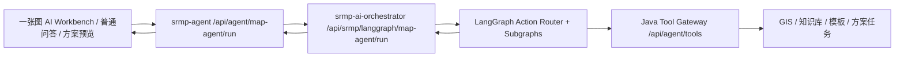

# Phase50.18 LangGraph-first 一张图智能体重构设计

日期：2026-05-07
状态：待用户评审

## 背景

Phase50.17 已验收通过，前端已经可以在普通问答、一张图对象/路线/区域分析、方案预览和 Ops 页面查看统一的 `AI 执行过程`。下一阶段用户明确要求：**native 可以去掉，不再考虑兼容**。

这意味着后续设计不再以“LangGraph 对齐 native 能力”为目标，而是以 LangGraph 为唯一编排核心，重新梳理一张图 AI 的前后端边界。

当前主要问题：

- Java `AgentOrchestratorRouter` 仍然维护 `native/langgraph` provider 选择和 fallback。
- Java `NativeMapAgentOrchestrator`、`MapAiToolPlannerImpl`、回答增强器还承担一套原生工具规划和回答生成逻辑。
- 前端同时存在普通 chat、map-agent chat、对象方案、区域方案等多套 AI 调用路径。
- LangGraph Runtime 当前仍偏线性链路：归一化、意图、工具规划、执行、证据融合、回答生成。它还没有充分承担“对象分析 → 方案生成 → 模板匹配 → 保存草稿”这类连续地图业务工作流。
- `solution.generateDraft`、`solution.saveTask` 工具目前更像能力提示，不是真正的一张图方案工作流执行单元。

Phase50.18 的目标是把一张图 AI 重构成 **LangGraph-first 地图业务智能体**。

## 总目标

1. LangGraph 成为一张图 AI 的唯一编排入口，不再有 Java native 回答链路。
2. Java 后端退回到三类职责：API 代理、Tool Gateway、业务数据/模板/任务持久化。
3. 前端 AI 调用收敛为统一 `run` 合约，由 action 驱动对象分析、区域分析、路线分析、方案生成、保存草稿。
4. LangGraph 从线性链路升级为按场景分支的图工作流。
5. Phase50.17 的 Trace/执行过程继续作为所有工作流的可解释层。

## 非目标

- 不让 Python Runtime 直接访问业务库。所有 GIS、模板、知识库、任务保存仍通过 Java Tool Gateway 或 Java API。
- 不在本阶段重做模板引擎和方案任务表结构。
- 不默认开放自动写入。保存草稿仍需要前端确认，写工具必须有确认标记。
- 不重构非一张图的后台管理页面，除非它们依赖旧 AI 调用入口。
- 不为了兼容 native 保留 provider 选择、fallback 或 parity 脚本。

## 推荐方案

### 方案 A（未采用）：渐进增强当前 `/chat`

继续使用 `/api/agent/map-agent/chat`，在请求中塞更多 options 和上下文。优点是改动小，缺点是 action 语义不清，方案生成/保存仍容易变成散落分支。

### 方案 B（未采用）：新增统一 `/run`，旧入口短期适配到 `/run`

新增 `POST /api/agent/map-agent/run`，请求中明确 `action` 和 `mapContext`。旧 `chat`、对象方案、区域方案入口只作为短期适配器调用 `run`。优点是边界清晰，前端可逐步迁移，风险可控。

### 方案 C（采用）：一次性删除旧入口，前端全量重写

最终状态最干净，能一次性去掉旧接口、旧 helper、旧 native 语义和双轨心智。代价是单个 PR 影响面更大，需要更严格的验收脚本和页面验收。

采用 **方案 C**：`/run` 是唯一一张图 AI 主入口；旧 `chat`、对象方案、区域方案 AI 入口直接删除，不做 adapter，不保留过渡兼容。

## 目标架构



职责划分：

- `srmp-web-ui`：负责构建地图上下文、选择 action、展示回答、执行结果、建议动作和 Trace。
- `srmp-agent`：负责统一代理到 LangGraph、暴露 Tool Gateway、执行 Java 业务能力、保存任务。
- `srmp-ai-orchestrator`：负责 action 路由、LangGraph 状态机、工具规划/执行、证据融合、LLM 生成、质量保护、Trace、回放。

## 统一 Run 合约

### 请求

新增前端与 Java 入口：

`POST /api/agent/map-agent/run`

Java 代理到：

`POST /api/srmp/langgraph/map-agent/run`

请求结构：

```json
{
  "message": "分析当前框选区域并生成养护建议",
  "action": "GENERATE_REGION_SOLUTION",
  "mapContext": {
    "tenantId": "default",
    "mode": "REGION",
    "routeCode": "G210",
    "year": 2026,
    "mapObject": {},
    "geometry": {},
    "regionSummary": {},
    "selectedLayers": ["ROAD_SECTION", "DISEASE", "ASSESSMENT_RESULT"],
    "viewport": {},
    "extra": {}
  },
  "actionInput": {
    "solutionType": "REGION_MAINTENANCE_SUGGESTION",
    "draftTaskId": null
  },
  "options": {
    "topK": 5,
    "useKnowledge": true,
    "useBusinessData": true,
    "requireConfirmation": true,
    "confirmed": false,
    "traceId": "..."
  }
}
```

Action 枚举：

- `CHAT`
- `ANALYZE_OBJECT`
- `ANALYZE_ROUTE`
- `ANALYZE_REGION`
- `GENERATE_OBJECT_SOLUTION`
- `GENERATE_REGION_SOLUTION`
- `GENERATE_ROUTE_REPORT`
- `SAVE_SOLUTION_DRAFT`
- `PLAN_ONLY`

### 响应

```json
{
  "answer": "本次分析建议...",
  "mode": "LANGGRAPH_MAP_AGENT",
  "action": "GENERATE_REGION_SOLUTION",
  "intent": "REGION_ANALYSIS",
  "mapContext": {},
  "actionResult": {
    "type": "SOLUTION_PREVIEW",
    "status": "SUCCESS",
    "title": "G210 框选区域养护建议",
    "markdown": "...",
    "regionSummary": {},
    "objectSummary": {},
    "templateMeta": {},
    "qualityCheck": {},
    "draftTask": null
  },
  "suggestedActions": [
    {
      "action": "SAVE_SOLUTION_DRAFT",
      "label": "保存为方案任务",
      "requiresConfirmation": true
    }
  ],
  "toolResults": [],
  "sources": [],
  "answerMeta": {},
  "trace": {},
  "data": {
    "orchestratorProvider": "langgraph",
    "graphName": "region_solution_graph",
    "writeBlocked": false
  }
}
```

前端只依赖这个响应模型：

- `answer` 用于对话展示。
- `actionResult` 驱动区域摘要、方案预览、保存结果。
- `suggestedActions` 驱动按钮。
- `trace/answerMeta/toolResults/sources` 继续交给 Phase50.17 的执行过程抽屉。

## LangGraph 工作流设计

### 顶层图

顶层图命名：`map_agent_router_graph`

节点：

1. `request_validate`
2. `context_normalize`
3. `action_route`
4. `subgraph_execute`
5. `suggested_actions`
6. `response_assemble`
7. `quality_guard`

`action_route` 按 action 或意图进入子图。

### 子图

#### `chat_graph`

用于普通问答和轻量地图问答：

- `intent_recognize`
- `knowledge_plan`
- `tool_execute`
- `evidence_fuse`
- `llm_answer`
- `quality_guard`

#### `object_analysis_graph`

用于选中病害、评定单元、路段、路线后的分析：

- `object_context_parse`
- `object_detail_query`
- `object_related_query`
- `knowledge_retrieve`
- `business_analysis`
- `llm_answer`
- `suggest_solution_actions`

#### `region_analysis_graph`

用于框选矩形/多边形区域：

- `region_geometry_parse`
- `region_spatial_query`
- `region_statistics`
- `region_hotspot_detect`
- `region_business_analysis`
- `region_knowledge_retrieve`
- `llm_answer`
- `suggest_region_actions`

#### `solution_generation_graph`

用于对象/区域/路线方案生成：

- `solution_context_collect`
- `template_match`
- `source_snapshot_build`
- `solution_prompt_build`
- `llm_solution_generate`
- `template_render_merge`
- `solution_quality_check`
- `solution_preview_assemble`

#### `draft_save_graph`

用于保存草稿：

- `write_confirmation_check`
- `draft_payload_build`
- `solution_save_task`
- `version_snapshot`
- `save_result_assemble`

该子图必须满足：

- `options.confirmed=true`
- `actionInput.markdown` 或上一步 `actionResult.markdown` 存在
- Tool Gateway 允许写工具

否则返回 `NEEDS_CONFIRMATION`，前端显示确认按钮，不执行写入。

#### `route_report_graph`

用于路线级报告：

- `route_context_parse`
- `route_assessment_query`
- `route_disease_query`
- `route_statistics`
- `knowledge_retrieve`
- `template_match`
- `llm_report_generate`
- `quality_check`

## Java 后端重构

### 删除 native 编排行为

以下类不再作为运行链路：

- `NativeMapAgentOrchestrator`
- `MapAiToolPlanner`
- `MapAiToolPlannerImpl`
- `MapAiAnswerEnhancerRegistry`
- Java native 专用 `MapAiAnswerEnhancer`
- Java native 专用回答增强实现
- `MapAiAnswerPolisher`

处理方式：

- 第一阶段可以先从 Spring Bean 中移除或标记停用。
- 第二阶段删除文件和相关测试。

### 简化 Orchestrator Router

`AgentOrchestratorRouter` 不再选择 provider：

- 默认只调用 `RemoteLangGraphOrchestrator`。
- `provider` 配置默认值改为 `langgraph`。
- `fallbackToNative` 配置删除或不再生效。
- LangGraph 不可用时返回明确错误，不生成 native 答案。

错误响应必须包含：

- `orchestratorProvider=langgraph`
- `orchestratorFallback=false`
- `answerMeta.answerSource=ERROR`
- `trace` 中有 `remote_langgraph_call` FAILED 步骤

### 新增 Java Run Controller

`MapAiAgentController` 增加：

- `POST /api/agent/map-agent/run`

旧入口删除：

- 删除 `/api/agent/map-agent/chat`，普通问答也通过 `/run?action=CHAT`。
- 删除 `/api/agent/map-object/solution`，对象方案通过 `/run?action=GENERATE_OBJECT_SOLUTION`。
- 删除 `/api/gis/map-region/solution`，区域方案通过 `/run?action=GENERATE_REGION_SOLUTION`。

如需要给外部调用方明确提示，可以在 API 网关层短期返回 410，但代码主干不实现旧接口 adapter。

### Tool Gateway 强化

保留现有工具：

- `gis.queryNearbyObjects`
- `gis.queryRegionSummary`
- `gis.queryAssessmentResults`
- `gis.queryDiseases`
- `gis.queryDiseasesByStakeRange`
- `knowledge.retrieve`
- `template.match`

升级工具：

- `solution.generateDraft`：从提示工具升级为真实方案预览生成工具，调用 Java 模板管线。
- `solution.saveTask`：从提示工具升级为真实草稿保存工具，但必须校验确认状态。

建议新增工具：

- `gis.queryMapObjectDetail`
- `gis.queryRouteSummary`
- `gis.queryRegionObjects`
- `solution.qualityCheck`

这些工具继续由 Java 实现，LangGraph 只负责调用和编排。

## srmp-ai-orchestrator 重构

### Schema

新增：

- `MapAgentRunRequest`
- `MapAgentRunResponse`
- `MapAgentAction`
- `ActionResult`
- `SuggestedAction`
- `GraphExecutionState`

删除旧 `MapAiAgentRequest/Response` 的运行依赖，新主干只使用 Run schema。若个别非运行代码仍引用旧 DTO，随实现一并清理或改名为内部只读类型。

### Planner

当前 `planner.py` 按 intent 简单列工具。Phase50.18 需要拆成 action planner：

- `plan_chat_tools`
- `plan_object_analysis_tools`
- `plan_region_analysis_tools`
- `plan_solution_generation_tools`
- `plan_draft_save_tools`
- `plan_route_report_tools`

每个 planner 只服务对应子图，避免一个 planner 继续承载所有场景。

### Trace

Trace 必须新增：

- `graphName`
- `action`
- `actionResultType`
- `suggestedActionCount`
- `writeConfirmation`
- `subgraph`

Phase50.17 的 `AiTraceDrawer` 应继续能展示这些字段。

### Observability

Ops 页面增加：

- action buckets
- graph buckets
- write blocked count
- needs confirmation count
- solution generation success rate

删除 native parity 指标，保留 LangGraph LLM、Tool Gateway、Runtime audit、Replay。

## 前端重构

### API 收敛

新增：

- `mapAgentRun(request)`

旧 helper 直接删除：

- 删除 `chat()`。
- 删除 `mapAgentChat()`。
- 删除 `generateMapObjectSolution()`。
- 删除 `generateMapRegionSolution()`。

最终组件只直接调用 `mapAgentRun`，不保留 wrapper。

### 一张图 AI Workbench

当前 `AgentChatFloat` 已经承担较多职责。Phase50.18 建议拆为：

- `MapAiWorkbench.vue`：整体工作台容器。
- `MapAiContextPanel.vue`：显示当前路线/对象/区域上下文。
- `MapAiConversation.vue`：对话流。
- `MapAiSuggestedActions.vue`：渲染 `suggestedActions`。
- `MapAiActionResultPanel.vue`：渲染区域摘要、对象摘要、方案预览、保存结果。

`OneMap.vue` 只负责地图状态和上下文构建，不再直接管理所有 AI 业务分支。

### 交互流程

对象：

1. 用户选中对象。
2. Workbench 显示对象上下文。
3. 点击 `分析此对象`。
4. 前端调用 `mapAgentRun(action=ANALYZE_OBJECT)`。
5. 返回回答、对象摘要、建议动作。
6. 点击 `生成方案`。
7. 调用 `mapAgentRun(action=GENERATE_OBJECT_SOLUTION)`。
8. 展示方案预览。
9. 点击 `保存草稿`。
10. 二次确认后调用 `mapAgentRun(action=SAVE_SOLUTION_DRAFT, confirmed=true)`。

区域：

1. 绘制矩形或多边形。
2. Workbench 显示区域上下文。
3. 点击 `分析区域` 或 `生成区域养护建议`。
4. LangGraph 执行区域子图。
5. 返回区域摘要、热点、建议和方案预览。

路线：

1. 选择路线和年度。
2. 点击 `路线分析` 或输入自然语言。
3. LangGraph 执行路线子图。
4. 返回路线级分析和报告草稿建议动作。

## 一次性切换顺序

1. 新增 `/run` 合约和 LangGraph Run endpoint。
2. Java `/run` 只代理 LangGraph。
3. 前端统一改为 `mapAgentRun`，删除旧 `chat`、对象方案、区域方案 AI helper。
4. 删除旧 Java AI endpoint：`/chat`、对象方案、区域方案。
5. Tool Gateway 升级 `solution.generateDraft` 和 `solution.saveTask`。
6. 删除 provider fallback 行为和 native config。
7. 删除 native Java 编排类、planner、enhancer。
8. 删除 native parity 脚本，新增 LangGraph-first 回归脚本。
9. 更新 Docker/env：默认 `SRMP_AI_ORCHESTRATOR_PROVIDER=langgraph`，不再配置 fallback。

## 错误处理

- LangGraph 不可用：Java 返回 503 或业务错误，前端显示“LangGraph Runtime 不可用”，不生成 native 兜底回答。
- Tool Gateway 失败：Trace 标红对应工具，回答可基于已有证据生成，但 `answerMeta` 必须标记证据不足。
- LLM 失败：允许业务证据兜底，但来源必须标记 `FALLBACK`，并在执行过程展示。
- 写工具未确认：返回 `actionResult.status=NEEDS_CONFIRMATION`，前端显示确认按钮。
- 写工具未开放：返回 `WRITE_BLOCKED`，不尝试保存。
- 模板缺失：返回可读的模板匹配失败原因和系统 fallback 模板来源。

## 测试计划

新增脚本：

- `scripts/check-phase50-18-langgraph-first-map-agent.sh`

覆盖：

- Java 不再注册 native provider。
- Java run endpoint 存在。
- `fallbackToNative` 不再参与运行逻辑。
- LangGraph Runtime 有 `/map-agent/run`。
- Python schema 包含 action/actionResult/suggestedActions。
- 前端存在 `mapAgentRun`，一张图入口不再直接调用多套 AI 生成接口。
- Phase50.17 执行过程组件仍可接收新字段。
- 旧 AI helper 和旧 AI endpoint 不再存在。

保留回归：

- Tool Gateway contract check。
- LangGraph LLM live check。
- Frontend build。
- Python compile。
- Java module tests。

删除或重命名：

- native parity 脚本不再作为验收项。

## 验收标准

- `/api/agent/map-agent/run` 是一张图 AI 的主入口。
- 关闭或删除 native 后，一张图问答、对象分析、区域分析、路线分析、方案生成、保存草稿仍可工作。
- 前端对象/区域/路线流程都由 `suggestedActions` 驱动后续动作。
- 所有动作都能打开 `AI 执行过程`。
- Ops 页面能按 action/graph 查看运行记录和回放。
- LangGraph 失败时不回退 native，而是明确暴露失败原因。
- Java Tool Gateway 仍是唯一业务数据和写入边界。
- 旧 `chat`、对象方案、区域方案 AI 入口已从前后端删除。

## 风险与控制

- 风险：一次性删除 native 导致回滚困难。
  - 控制：在同一 PR 内增加 LangGraph-first 回归脚本、页面验收清单和接口清单；如需回滚，回滚整个 PR，不维护半兼容状态。
- 风险：写工具通过 LangGraph 自动执行带来误保存。
  - 控制：`SAVE_SOLUTION_DRAFT` 必须二次确认，Tool Gateway 继续默认屏蔽写工具。
- 风险：前端 Workbench 拆分影响地图交互。
  - 控制：同一 PR 内按提交顺序先统一 API，再替换调用点，再拆组件；每步跑前端构建和静态验收。
- 风险：LangGraph 子图膨胀。
  - 控制：每个子图有独立 planner、prompt、质量检查和测试脚本。

## 下一步实施建议

Phase50.18 按方案 C 做一个破坏性重构 PR，但内部按提交分层，避免混成一团：

1. **Run 主干提交**
   - 新增 `/run` schema 和 endpoint。
   - Java 只代理 LangGraph。
   - 删除 provider fallback 行为。

2. **前端切换提交**
   - 前端统一 `mapAgentRun`。
   - 一张图 Workbench action 化。

3. **工具与清理提交**
   - solution 工具升级。
   - 删除旧 AI endpoint、native 类和 parity 脚本。
   - 新增 LangGraph-first 验收脚本。

最终 PR 不保留旧 AI 入口和 native 兼容分支。
