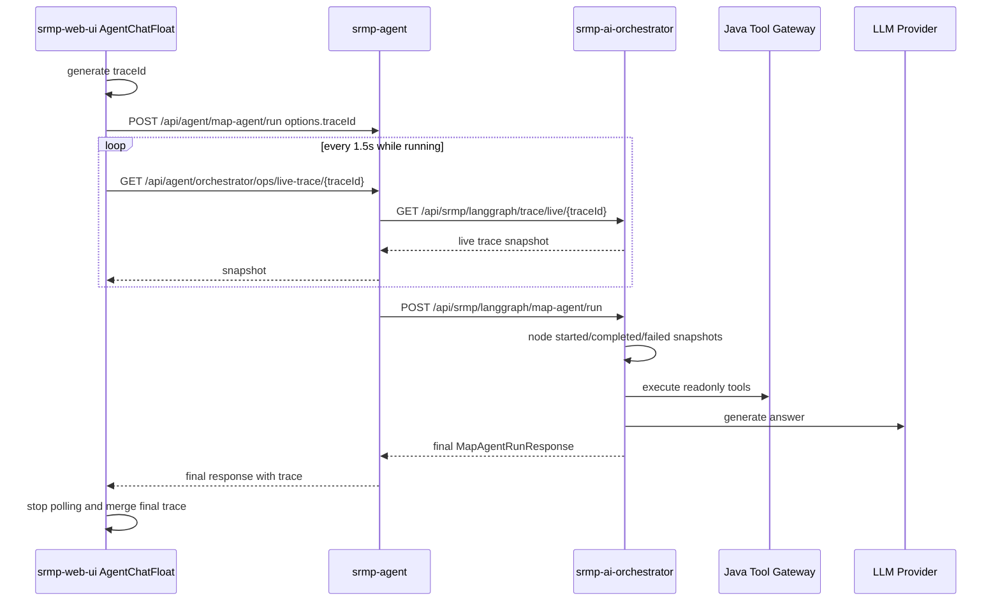

# Phase50.20 LangGraph Live Trace Design

## 背景

Phase50.18 已把一张图 AI 主入口统一到 `POST /api/agent/map-agent/run`，由 Java 代理到 `srmp-ai-orchestrator` 的 `/api/srmp/langgraph/map-agent/run`。Phase50.19 补充了前端等待反馈和非 LLM 状态诊断，但用户在长耗时生成期间仍只能看到“等待中”，无法知道 LangGraph 当前卡在工具查询、知识检索、LLM 生成还是质量保护。

现有 LangGraph Runtime 已有节点流：

```text
request_normalize -> context_build -> intent_recognize -> context_enrich -> tool_planning -> tool_execute -> evidence_fuse -> answer_generate -> quality_guard
```

现有 `AiTraceDrawer` 也已经能展示已完成响应中的 `trace.steps`、工具、来源、answerMeta 和质量信息。因此本阶段不新建第二套 Trace UI，而是在运行中补齐可查询的进度快照，让普通问答、单对象、路线、区域和方案生成都能使用统一的 AI 执行过程。

## 目标

- 前端发起一张图 AI 请求时生成稳定 `traceId`，并在请求运行中轮询该 `traceId` 的执行进度。
- `srmp-ai-orchestrator` 在节点开始、完成、失败时写入运行中 Trace 快照。
- Java 后端继续作为唯一前端入口，新增或复用 ops 代理接口查询 Runtime Trace 快照。
- 前端等待区从单纯耗时提示升级为“当前步骤 + 已完成步骤 + 工具/知识命中摘要”。
- 已完成后仍复用现有 `AiTraceDrawer` 展示最终 Trace，不拆出第二套页面或抽屉。

## 非目标

- 不实现 token 级流式输出。
- 不改变 `/api/agent/map-agent/run` 的最终响应结构。
- 不引入 WebSocket 或 SSE；第一版使用轮询，降低前后端和部署复杂度。
- 不替换现有 `/agent/langgraph-ops` 运维页，只补充一张图 AI 使用中的实时可解释性。
- 不让前端直接访问 Python Runtime；仍通过 Java `/api/agent/orchestrator/ops/*` 代理。

## 总体方案

采用“前端生成 traceId + Runtime 内存进度快照 + Java 代理查询 + 前端轮询”的方案。



## 后端设计

### Runtime 进度存储

在 `srmp-ai-orchestrator` 新增轻量级 `LiveTraceStore`，职责只保存运行中和短期完成后的 Trace 快照。

快照字段：

```json
{
  "traceId": "java-lg-xxx",
  "status": "RUNNING",
  "action": "ANALYZE_REGION",
  "graphName": "region_analysis_graph",
  "currentStep": {
    "name": "tool_execute",
    "label": "执行只读工具",
    "status": "RUNNING",
    "startedAtMs": 1710000000000,
    "elapsedMs": 1200
  },
  "steps": [
    {
      "name": "intent_recognize",
      "label": "识别用户意图",
      "status": "SUCCESS",
      "elapsedMs": 35,
      "count": 1,
      "data": {}
    }
  ],
  "toolSummary": {
    "planned": 3,
    "completed": 2,
    "success": 2,
    "failed": 0
  },
  "sourceSummary": {
    "business": 12,
    "knowledge": 4,
    "outline": 0
  },
  "answerMeta": {},
  "error": "",
  "startedAtMs": 1710000000000,
  "updatedAtMs": 1710000001200,
  "costMs": 1200
}
```

状态枚举：

- `RUNNING`
- `SUCCESS`
- `FAILED`
- `TIMEOUT`
- `NOT_FOUND`

存储策略：

- 内存保存，默认最多 200 条。
- 完成后保留最近记录，跟现有 `runtime_audit_store` 一样用于短期诊断。
- 查询不到时返回 `404` 或 `{status:"NOT_FOUND"}`，Java 代理统一包装为成功响应中的业务状态，避免前端把轮询失败误判为 AI 请求失败。

### 节点事件写入

`LangGraphWorkflow` 增强 `_step()` 机制：

- 节点开始时写入 `RUNNING` currentStep。
- 节点成功时追加 `SUCCESS` step。
- 节点异常时追加 `FAILED` step，并把整体状态置为 `FAILED`。
- `answer_generate` 期间显示 `llm_answer` 或 `answer_generate` 为当前步骤。
- 工具并行执行时不拆成独立 UI 流式事件，第一版在 `tool_execute` step.data 中记录工具计划和完成摘要。

现有最终响应中的 `trace.steps` 仍保留，不因 live trace 改名或变形。

### 新增 Runtime 接口

`srmp-ai-orchestrator`：

```text
GET /api/srmp/langgraph/trace/live/{traceId}
```

返回当前 Trace 快照。完成后返回最终快照。

`srmp-agent`：

```text
GET /api/agent/orchestrator/ops/live-trace/{traceId}
```

只代理到 Python Runtime，不访问业务数据库。

## 前端设计

### 请求 traceId

`AgentChatFloat` 在以下操作发起前生成 `traceId` 并放入 `options.traceId`：

- 普通问答 `CHAT`
- 单对象分析 `ANALYZE_OBJECT`
- 路线分析 `ANALYZE_ROUTE`
- 区域分析 `ANALYZE_REGION`
- 对象/区域/路线方案生成
- 保存方案任务可继续只展示最终 Trace，第一版不强制 live trace

traceId 格式：

```text
web-lg-${Date.now()}-${random}
```

### 等待区展示

Phase50.19 的 `ai-wait-panel` 保留，增加 live trace 内容：

- 当前步骤：展示 label、状态、已耗时。
- 已完成节点：最多展示最近 4 个。
- 工具摘要：规划数量、完成数量、成功/失败。
- 来源摘要：业务命中、知识库命中。
- 错误信息：如果 live trace status 为 `FAILED`，显示失败步骤和错误。
- 操作：提供“查看 Trace”按钮，打开现有 `AiTraceDrawer`，数据来自 live snapshot；最终响应回来后切换为最终 trace。

不在一张图页面新增大面积侧边栏，避免和地图、图层抽屉、对象详情争抢空间。运行中信息放在 AI 浮窗内部，保持与现有功能统一。

### 轮询策略

- 请求开始后 500ms 开始轮询。
- 运行中每 1500ms 查询一次。
- 请求结束、组件卸载、用户关闭浮窗时停止轮询。
- 连续 3 次轮询失败后暂停轮询，但不取消主 AI 请求，只在等待区显示“实时过程暂不可用，最终结果仍在等待”。
- 主请求完成后再查询一次 live trace，用于补齐最后节点。

## 统一 Trace 展示

`AiTraceDrawer` 继续作为唯一 Trace 抽屉。需要增强 `toAiExecutionSnapshot()` 对 live snapshot 的兼容：

- 支持 `currentStep`。
- 支持 `steps[].elapsedMs`、`steps[].costMs`、`steps[].startedAtMs`。
- 支持 `toolSummary` 和 `sourceSummary`。
- 支持 `status=RUNNING`。

普通问答、单对象、路线、区域和方案生成最终都通过同一结构打开 Trace。

## 错误处理

- Runtime 调用失败：主请求返回错误，live trace 标记 `FAILED`，前端展示失败步骤。
- live trace 查询失败：只影响过程展示，不影响主 AI 请求。
- traceId 缺失：后端继续生成 traceId，前端不做 live trace；最终响应仍可查看 Trace。
- LLM 超时：`answer_generate` 或 `llm_answer` 标记 `TIMEOUT` 或 `FAILED`，answerMeta 保持现有 `llmStatus/fallbackReason`。
- 工具失败但有降级回答：`tool_execute` 可为 `FAILED` 或部分成功，整体 response 可为 `SUCCESS`，Trace 中明确工具失败数。

## 测试计划

后端：

- `LiveTraceStore` 单元测试：写入、更新、完成、失败、容量裁剪、traceId 查询。
- `LangGraphWorkflow` 测试：运行 plan 或 fake workflow 后 live trace 包含节点状态。
- Java ops 代理测试：`/live-trace/{traceId}` 路径和包装结果正确。

前端：

- `aiExecution` 或新 utility 单元测试：live snapshot 能归一化为抽屉 snapshot。
- `AgentChatFloat` 轮询工具测试：请求结束停止轮询，轮询失败不影响主请求。
- `npm run build`。
- 浏览器验收：`/gis/one-map` 发起 AI 分析时，等待区能显示当前步骤，完成后 Trace 抽屉能打开最终过程。

## 验收标准

- 切换 LangGraph 后，一张图 AI 长耗时请求期间能看到当前执行步骤。
- 普通问答、对象分析、路线分析、区域分析至少共享同一 live trace 展示能力。
- 最终响应结构保持兼容，既有 `AiTraceDrawer` 入口可用。
- live trace 不可用时不阻塞 AI 主请求。
- 不新增 native 兼容分支，不恢复 native 逻辑。

## 自审结论

- 无未决字段：请求 traceId、查询接口、快照字段和状态枚举已明确。
- 无第二套 Trace UI：运行中和完成后都复用 `AiTraceDrawer`。
- 范围可控：第一版使用轮询，不引入 SSE/WebSocket 或 token streaming。
- 与 Phase50.19 衔接清晰：等待区继续保留耗时提示，并叠加 live trace。
