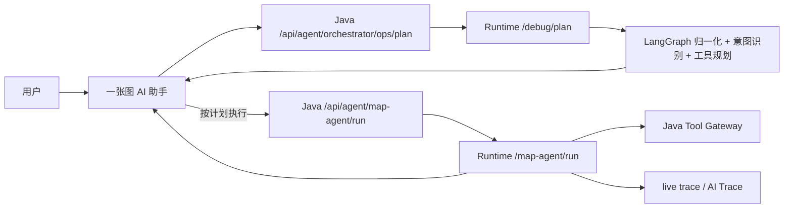

# Phase50.21 一张图 AI 执行计划预览与证据解释设计

## 背景

Phase50.18 到 Phase50.20 已经把一张图 AI 主链路切到 LangGraph-first，并补齐了 `/api/agent/map-agent/run`、Tool Gateway、运行 Trace、live trace 等能力。当前用户已经能在一张图里触发普通问答、对象分析、区域分析、区域养护建议生成，并在长耗时请求中看到执行进度。

但 LangGraph 的优势还没有充分呈现在业务页面上。现有交互仍然是“点按钮后等待结果”，用户只有执行中和执行后的 Trace，缺少执行前的可解释计划：

- 当前请求会被识别成什么地图业务意图；
- 系统理解到的对象、区域、路线、年份、图层是否正确；
- 即将调用哪些工具；
- 为什么调用这些工具；
- 预计会使用哪些业务数据、模板和知识库来源；
- 哪些步骤是只读分析，哪些步骤可能生成方案或保存草稿。

Phase50.21 的目标是把 LangGraph 的“先规划、再执行、可解释、可回放”能力直接放进一张图 AI 页面。

## 目标

1. 在一张图 AI 助手中增加执行计划预览入口。
2. 执行计划只做归一化、意图识别、上下文摘要和工具规划，不调用业务工具、不调 LLM、不写数据。
3. 用户可以在执行前确认地图上下文、计划工具、数据来源和风险提示。
4. 用户确认后沿用现有 `/api/agent/map-agent/run` 执行，执行结果继续进入 live trace 和 AI Trace。
5. 普通问答、单对象分析、路线分析、区域分析、对象方案、区域方案都使用同一套计划展示模型。
6. 保持 LangGraph-first，不再考虑 native 兼容或 native parity。

## 非目标

- 不处理一键启动、Docker 初始化、样例数据初始化。
- 不重写 LangGraph Runtime 的完整图结构。
- 不新增自动写入行为；保存方案草稿仍需要用户确认。
- 不在本阶段实现复杂的多轮工具循环和自动反思重试。
- 不把 ops 页面能力复制成第二套业务入口；ops 页面继续服务运维诊断，一张图页面只呈现业务可理解的计划。

## 当前基础

后端已经具备这些基础能力：

- `POST /api/agent/map-agent/run`：一张图 AI 主入口。
- `POST /api/srmp/langgraph/map-agent/run`：LangGraph Runtime 主入口。
- `POST /api/agent/orchestrator/ops/plan`：Java 代理的 Plan Debug，只规划不执行。
- `POST /api/srmp/langgraph/debug/plan`：Runtime 计划接口。
- `GET /api/agent/orchestrator/ops/live-trace/{traceId}`：Java 代理 live trace。
- `GET /api/srmp/langgraph/trace/live/{traceId}`：Runtime live trace。

前端已经具备这些基础能力：

- `srmp-web-ui/src/api/agent.ts` 中的 `mapAgentRun`。
- `srmp-web-ui/src/api/orchestrator.ts` 中的 `runOrchestratorPlan`。
- `AgentChatFloat.vue` 中的问答、建议动作、live trace 等状态。
- `OneMap.vue` 中的区域绘制、区域摘要和区域方案生成。
- `utils/liveTrace.ts` 与 `utils/aiRunFeedback` 已经能归一化执行中状态。

## 方案对比

### 方案 A：在一张图 AI 助手中加入执行计划预览

在 `AgentChatFloat` 和区域方案入口中增加“执行计划”按钮，复用已有 Plan Debug API，展示业务化的计划摘要。用户确认后再执行现有 run 请求。

优点：

- 改动面可控，最大化复用现有 LangGraph plan、run、trace 能力。
- 用户能立刻看到 LangGraph 与普通接口调用的差异。
- 对调试前端上下文传递、工具规划、模板使用很有帮助。

缺点：

- 需要整理一套前端计划归一化模型。
- 如果 Runtime plan 返回字段不稳定，前端需要容错展示。

### 方案 B：先拆分一张图 AI 前端组件

先把 `AgentChatFloat.vue` 和 `OneMap.vue` 中的 AI 逻辑拆成 Workbench、ContextPanel、Conversation、ActionResultPanel 等组件，再增加计划预览。

优点：

- 长期维护性更好。
- 后续加计划、Trace、证据面板更干净。

缺点：

- 用户可见价值延后。
- 拆分期间容易引入交互回归。

### 方案 C：优先增强 LangGraph 条件分支和工具循环

让 Runtime 根据工具结果继续追加工具调用、重排计划、自动二次检索。

优点：

- 更充分体现 LangGraph 的技术能力。

缺点：

- 需要后端图结构和测试体系大改。
- 前端还没有把现有计划和证据展示清楚，用户不容易理解为什么结果变好或变慢。

### 选型

本阶段选择方案 A。它能最快把 LangGraph 的计划能力放到一张图业务页面，同时为后续 B 的组件拆分和 C 的工具循环建立统一展示模型。

## 交互设计

### 入口

一张图 AI 助手增加两个计划入口：

- 对话输入区附近增加“执行计划”按钮。根据当前上下文和输入内容调用 plan。
- 建议动作区域中，对 `GENERATE_OBJECT_SOLUTION`、`GENERATE_REGION_SOLUTION`、`GENERATE_ROUTE_REPORT` 这类重操作，增加“预览计划”入口。

区域选择场景中，`OneMap.vue` 的“生成区域养护建议”可以保留直接执行按钮，同时在 AI 助手侧提供计划预览。后续组件拆分时再把区域按钮收敛到 Workbench。

### 计划面板

计划面板建议作为 AI 助手内部抽屉或折叠面板，不新开全屏页面。展示内容：

- 意图：例如 `ANALYZE_OBJECT`、`ANALYZE_REGION`、`GENERATE_REGION_SOLUTION`。
- 当前上下文：对象、路线、年份、区域面积、图层、指标。
- 计划步骤：每个步骤展示名称、原因、是否只读、预计命中对象类型。
- 工具计划：工具名、用途、参数摘要、是否会写数据。
- 来源预估：业务数据、模板、知识库、地图对象、区域统计。
- 风险提示：上下文缺失、未选对象、未选区域、Tool Gateway 不可用、计划中包含写工具等。

面板底部提供：

- “按计划执行”：调用当前 run 链路。
- “刷新计划”：重新调用 plan。
- “关闭”：不执行。

### Trace 关系

计划预览不是执行 Trace，也不进入最终 AI Trace 历史。执行后仍展示 run 返回的 `trace` 和 live trace。

计划面板可显示本次 plan 的 `traceId` 或 `planTraceId`，用于 ops 页面排查，但前端不把它混成业务执行 trace。

## API 设计

本阶段优先复用现有接口：

`POST /api/agent/orchestrator/ops/plan`

请求体与 run 请求尽量一致：

```json
{
  "action": "GENERATE_REGION_SOLUTION",
  "message": "生成框选区域养护建议",
  "mapContext": {
    "tenantId": "default",
    "mode": "REGION",
    "routeCode": "G210",
    "year": 2026,
    "geometry": {},
    "regionSummary": {},
    "selectedLayers": ["ROAD_SECTION", "DISEASE", "ASSESSMENT_RESULT"]
  },
  "actionInput": {
    "solutionType": "REGION_MAINTENANCE_SUGGESTION"
  },
  "options": {
    "useBusinessData": true,
    "useKnowledge": true,
    "topK": 5,
    "traceId": "web-plan-..."
  }
}
```

前端接受 Runtime 现有 plan 返回，并归一化为：

```ts
interface MapAiPlanPreview {
  status: 'SUCCESS' | 'FAILED'
  intent?: string
  action?: string
  contextSummary?: Record<string, any>
  toolPlan: MapAiPlannedTool[]
  steps: MapAiPlanStep[]
  warnings: string[]
  sourceHints: MapAiSourceHint[]
  raw?: Record<string, any>
}
```

工具计划模型：

```ts
interface MapAiPlannedTool {
  name: string
  label?: string
  reason?: string
  readOnly?: boolean
  writeRisk?: boolean
  argsSummary?: Record<string, any>
}
```

如果 Runtime plan 缺少 `action` 或 `sourceHints`，前端通过 `intent`、`toolPlan`、`contextSummary` 做保守推断，并在面板中标注“来源由前端根据工具计划推断”。

## 前端设计

### 新增工具函数

新增 `srmp-web-ui/src/utils/mapAiPlanPreview.ts`：

- `normalizeMapAiPlanResponse(payload)`：归一化 Java/Runtme 包装差异。
- `summarizePlanContext(plan)`：生成上下文摘要。
- `summarizePlannedTool(tool)`：生成工具用途和参数摘要。
- `deriveSourceHints(plan)`：从工具计划推断业务数据、模板、知识库等来源。
- `buildPlanWarnings(plan, request)`：生成缺失上下文和写工具风险提示。

### 新增组件

新增 `srmp-web-ui/src/views/gis/components/MapAiPlanPreviewDrawer.vue`：

- 接收 `visible`、`loading`、`plan`、`error`、`requestSummary`。
- 事件：`execute`、`refresh`、`close`。
- 采用 Element Plus 抽屉或轻量侧栏，与现有 AI 助手视觉风格保持一致。
- 不使用大段说明文字，用标签、表格、步骤列表展示计划。

### 改造 AgentChatFloat

`AgentChatFloat.vue` 增加：

- `planLoading`、`planPreview`、`planError`、`planRequestSnapshot`。
- `previewCurrentPlan()`：根据当前输入、上下文、建议动作构造 plan 请求。
- `executePlanPreview()`：复用 plan 请求快照，调用当前 run 流程。
- 对重操作建议动作支持先预览计划。

普通问答场景：

- 用户输入问题后可直接发送，也可点“执行计划”。
- 如果没有输入内容但当前有对象或区域上下文，计划请求使用默认 message，例如“分析当前对象”或“分析当前区域”。

### 改造 OneMap 区域方案入口

区域方案直接执行链路保留。为避免重复实现，区域方案计划预览优先放在 AI 助手中：

- `OneMap.vue` 继续负责区域几何、区域摘要和直接生成。
- `AgentChatFloat` 根据 `regionContext` 构造 `GENERATE_REGION_SOLUTION` plan 请求。
- 后续 Phase50.22 拆分 Workbench 时再把区域方案按钮统一迁入 AI 工作台。

## 后端设计

本阶段后端尽量不新增业务接口，但需要确认和补强 plan 返回字段：

- Java `AgentOrchestratorOpsController.plan` 允许透传 `action`、`mapContext`、`actionInput`、`options`。
- Python `/api/srmp/langgraph/debug/plan` 在响应中稳定返回：
  - `intent`
  - `contextSummary`
  - `toolPlan`
  - `steps`
  - `warnings`
- Runtime 不执行 Java 工具，不调用 LLM，不写审计以外的业务数据。

如果当前 Runtime plan 已经返回 `toolPlan` 和 `steps`，本阶段只补测试，不做结构性改造。若缺字段，优先在 Python plan endpoint 中补齐，不让前端直接依赖内部 workflow 状态。

## 数据流



## 错误处理

- Plan API 失败：计划面板展示错误，不影响用户直接执行。
- Runtime 不可用：展示 LangGraph Runtime 不可用，并提供“重试计划”；不回退 native。
- Tool Gateway 契约异常：计划面板显示风险提示，执行时仍由 run 链路返回真实失败。
- 上下文缺失：计划面板显示缺失项，例如未选对象、未画区域、缺少路线年份。
- 计划包含写工具：默认展示确认提示；保存草稿仍沿用现有二次确认。

## 测试策略

### 前端单元测试

新增 `srmp-web-ui/tests/mapAiPlanPreview.test.mjs`：

- 能归一化 Java `R.ok(data)` 包装。
- 能归一化 Runtime 直接返回。
- 能从区域计划推断业务数据、知识库、模板来源。
- 能识别写工具风险。
- 缺少对象或区域时产生 warning。

### 前端构建测试

运行：

```bash
npm run build
```

### 后端测试

如果补后端字段，新增或扩展 Python 测试：

```bash
python -m unittest discover -s tests -p 'test_*plan*.py'
```

Java 代理如无行为变化，仅保留现有 ops controller 测试；如调整透传字段，补充 controller 测试。

### 手工验收

1. 打开 `/gis/one-map`。
2. 不选择对象，点“执行计划”，应提示缺少上下文或按普通问答规划。
3. 选择单对象，点“执行计划”，应展示对象分析工具计划。
4. 绘制区域，点“执行计划”，应展示区域统计、热点、知识库、方案生成相关计划。
5. 在计划面板点“按计划执行”，应触发现有 run 请求。
6. 执行中能看到 live trace。
7. 执行完成后能查看 AI Trace、工具结果、来源和方案预览。

## 验收标准

- 一张图 AI 页面能在执行前展示业务化计划。
- 计划预览不调用业务工具、不调 LLM、不写方案草稿。
- 对象、区域、路线、普通问答共用同一套计划展示组件和归一化函数。
- plan 失败不阻塞直接执行。
- run 执行仍使用 LangGraph-first，不出现 native fallback。
- 前端单测和构建通过。

## 风险与控制

- 风险：Plan Debug 是 ops 接口，直接暴露到业务页面可能让语义偏技术化。
  - 控制：前端做业务化归一化，只展示用户能理解的字段，raw 信息放在折叠区。
- 风险：Runtime 返回字段不稳定导致前端展示空。
  - 控制：新增归一化测试，并用保守推断生成 source hints 和 warnings。
- 风险：计划与实际执行不一致。
  - 控制：计划面板标注“预计计划”，实际执行以后以 Trace 为准；执行请求复用 plan request snapshot，减少上下文漂移。
- 风险：AgentChatFloat 继续变大。
  - 控制：本阶段把新增展示抽成独立组件和 utils；Phase50.22 再做 Workbench 拆分。

## 后续阶段

Phase50.22 建议做一张图 AI Workbench 拆分：

- `MapAiWorkbench.vue`
- `MapAiContextPanel.vue`
- `MapAiConversation.vue`
- `MapAiSuggestedActions.vue`
- `MapAiActionResultPanel.vue`

Phase50.23 再做 LangGraph 条件分支和多轮工具循环，让 Runtime 根据工具结果动态追加检索、复核和质量检查。
