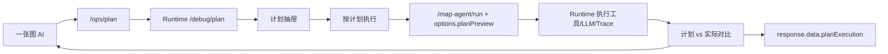

# Phase50.22 计划到执行一致性闭环设计

## 背景

Phase50.21 已经在一张图 AI 中加入“执行计划”入口。用户可以在执行前看到 LangGraph 对当前地图上下文的意图识别、计划工具、预计来源和风险提示。

当前缺口是：计划和执行仍然是两段松散流程。

- 前端点击“按计划执行”后，会把计划中的 message 写回输入框，再调用现有 `send()`。
- run 请求没有携带 `planTraceId`、计划工具、计划来源和计划上下文摘要。
- Runtime 执行后只能看到实际 Trace，不能回答“实际执行是否符合计划”。
- 用户看到了执行前计划，但执行完成后不知道哪些工具真的被调用、哪些来源真的命中、是否发生偏差。

Phase50.22 的目标是把“计划预览”升级为“计划到执行的一致性闭环”。

## 目标

1. “按计划执行”时复用 plan snapshot，不重新组装上下文。
2. run 请求携带计划元数据：`planTraceId`、`plannedAction`、`plannedIntent`、`plannedToolNames`、`plannedSourceTypes`。
3. Runtime 执行后计算计划与实际执行差异。
4. 前端展示计划与实际对比：工具是否一致、来源是否命中、是否发生 action/intent 偏差。
5. 对普通问答、对象分析、区域分析、路线分析共用同一套对比结构。
6. 保持 LangGraph-first，不恢复 native 兼容逻辑。

## 非目标

- 不做多轮工具循环和自动重规划。
- 不把计划结果持久化到数据库。
- 不改变方案保存草稿的确认流程。
- 不把 ops 页面的所有诊断信息搬到业务页面。
- 不在本阶段大规模拆分 `AgentChatFloat.vue`。

## 方案对比

### 方案 A：前端本地对比

前端保存 plan snapshot，run 完成后用 response.toolResults 自己对比计划工具。

优点：

- 改动最小。
- 不需要后端契约变化。

缺点：

- Trace 和 Runtime 审计里看不到计划差异。
- Java/ops/API 调用无法复用这个一致性结果。
- 只适合 UI 展示，不适合作为 LangGraph 观测能力。

### 方案 B：run 请求携带计划元数据，Runtime 计算对比

前端在 run 请求 `options.planPreview` 中携带精简计划，Runtime 在执行结束时对比计划工具和实际工具，把结果写入 response `planExecution`、`answerMeta` 和 trace/data。

优点：

- 计划差异成为后端统一契约，前端、ops、回放都能使用。
- 不依赖浏览器本地状态。
- 最能体现 LangGraph 的可解释执行能力。

缺点：

- 需要补 Runtime schema/工具函数和测试。
- 前端需要传递 plan snapshot 并展示新结构。

### 方案 C：新增计划确认任务实体

把 plan 作为单独任务保存，run 时引用计划 id，再持久化对比结果。

优点：

- 可审计性最强。
- 适合长周期审批和多用户协作。

缺点：

- 数据库和业务流程改动大。
- 对当前一张图 AI 快速交互过重。

### 选型

本阶段选择方案 B。它能形成真正的计划执行闭环，同时保持实现规模可控。方案 C 可在后续需要审批、审计或多人协作时再做。

## 后端设计

### 请求契约

前端 run 请求在 `options.planPreview` 中携带精简计划：

```json
{
  "options": {
    "traceId": "web-lg-run-...",
    "planPreview": {
      "planTraceId": "web-lg-plan-...",
      "action": "ANALYZE_REGION",
      "intent": "REGION_ANALYSIS",
      "toolNames": ["gis.queryRegionSummary", "knowledge.retrieve"],
      "sourceTypes": ["MAP_REGION", "BUSINESS_DATA", "KNOWLEDGE"],
      "contextChips": ["区域模式", "路线 G210", "年度 2026"],
      "warningCodes": []
    }
  }
}
```

只传精简字段，不传完整 raw plan，避免请求过大和泄漏无关调试信息。

### 响应契约

Runtime run response 增加：

```json
{
  "planExecution": {
    "available": true,
    "status": "MATCHED",
    "planTraceId": "web-lg-plan-...",
    "runTraceId": "web-lg-run-...",
    "plannedAction": "ANALYZE_REGION",
    "actualAction": "ANALYZE_REGION",
    "plannedIntent": "REGION_ANALYSIS",
    "actualIntent": "REGION_ANALYSIS",
    "plannedToolNames": ["gis.queryRegionSummary", "knowledge.retrieve"],
    "actualToolNames": ["gis.queryRegionSummary", "knowledge.retrieve"],
    "missingToolNames": [],
    "extraToolNames": [],
    "plannedSourceTypes": ["MAP_REGION", "BUSINESS_DATA", "KNOWLEDGE"],
    "actualSourceTypes": ["BUSINESS_DATA", "KNOWLEDGE"],
    "missingSourceTypes": ["MAP_REGION"],
    "warnings": []
  }
}
```

`status` 取值：

- `MATCHED`：action、intent、工具都符合计划。
- `PARTIAL`：有少量工具或来源差异，但执行成功。
- `DIVERGED`：action/intent 不一致，或关键计划工具缺失。
- `NO_PLAN`：run 请求没有携带 plan preview。

### Runtime 实现

新增 `srmp-ai-orchestrator/app/plan_execution.py`：

- `normalize_plan_preview(value)`：从 request options 中读取精简计划。
- `build_plan_execution(plan, response_state)`：计算计划与实际差异。
- `derive_actual_source_types(tool_results, sources, evidence)`：从实际工具和来源推断来源类型。

`LangGraphWorkflow._to_response()` 或 MapAgent run 转换层把 `planExecution` 写入：

- top-level response `planExecution`
- `data.planExecution`
- `answerMeta.planExecutionStatus`
- trace/data 中的 `planExecution`

如果实现上 top-level schema 暂不方便扩展，则至少写入 `data.planExecution`，前端先从 `response.planExecution || response.data.planExecution` 读取。

## 前端设计

### 复用 plan snapshot

`AgentChatFloat.vue` 当前 `executePlanPreview()` 会：

1. 关闭抽屉；
2. 写入 `input.value = snapshot.message`；
3. 调用 `send()`。

Phase50.22 改为：

1. 保留 `planExecutionSnapshot.request`；
2. 构造 run 请求时复用 snapshot.request 的 `action`、`message`、`mapContext`、`actionInput`；
3. 替换 `traceId` 为新的 run trace；
4. 在 `options.planPreview` 中放入 `buildPlanPreviewMeta(planPreview.value)`；
5. 调用统一 `runMapAgentRequest(request, displayMessage)`。

为避免继续膨胀 `send()`，新增本地 helper：

- `buildChatRunRequest(message, traceId)`
- `runMapAgentRequest(request, userMessage)`
- `buildPlanPreviewMeta(plan)`

`send()` 和 `executePlanPreview()` 都调用 `runMapAgentRequest()`。

### 展示计划与实际对比

`MapAiPlanPreviewDrawer.vue` 增加可选 prop：

```ts
planExecution?: MapAiPlanExecution | null
```

展示内容：

- 状态：`MATCHED / PARTIAL / DIVERGED / NO_PLAN`
- 工具对比：计划数量、实际数量、缺失、额外。
- 来源对比：计划来源、实际来源、未命中来源。
- Action/Intent 对比。

一张图助手执行完成后：

- 最新 assistant message 的 meta 中显示 `计划 MATCHED/PARTIAL/DIVERGED`。
- 计划抽屉保留最近一次 `planExecution`，用户可回看。
- Trace drawer 后续可读取 `execution.data.planExecution`，本阶段不强制改 Trace drawer UI。

## 数据流



## 错误处理

- 没有计划直接执行：返回 `NO_PLAN`，不影响现有流程。
- plan preview 结构不完整：忽略缺失字段，按可用字段对比。
- action/intent 偏差：标记 `DIVERGED`，但不自动失败。
- 工具差异：标记 `PARTIAL` 或 `DIVERGED`，执行结果仍按实际 run 成败展示。
- 来源差异：只作为解释信息，不阻断回答。

## 测试策略

### 后端

新增 `srmp-ai-orchestrator/tests/test_plan_execution.py`：

- 无计划时返回 `NO_PLAN`。
- 计划工具与实际工具一致时返回 `MATCHED`。
- 少工具时返回 `DIVERGED` 或 `PARTIAL`。
- 实际多工具时返回 `PARTIAL`。
- 来源类型能从 GIS/knowledge/template 工具推断。

扩展 run workflow 测试或新增小型 fake state 测试，不依赖真实 Java Gateway。

### 前端

新增或扩展 `srmp-web-ui/tests/mapAiPlanPreview.test.mjs`：

- `buildPlanPreviewMeta()` 只输出精简字段。
- `normalizePlanExecution()` 兼容 top-level 和 `data.planExecution`。
- 工具差异显示摘要正确。

### 构建与 smoke

运行：

```bash
cd srmp-ai-orchestrator
.venv/bin/python -m unittest tests.test_plan_execution tests.test_debug_plan_preview
.venv/bin/python -m unittest discover -s tests -p 'test_live_trace*.py'

cd srmp-web-ui
node --no-warnings --test tests/mapAiPlanPreview.test.mjs tests/liveTrace.test.mjs tests/aiRunFeedback.test.mjs tests/latestRequestGuard.test.mjs
npm run build
```

手工验收：

1. 打开 `/gis/one-map`。
2. 点击“执行计划”。
3. 点击“按计划执行”。
4. 执行完成后看到计划状态标签。
5. 打开计划抽屉，看到计划工具与实际工具对比。

## 验收标准

- “按计划执行”复用 plan snapshot 的请求上下文。
- run response 包含 `planExecution` 或 `data.planExecution`。
- 前端能展示 `MATCHED / PARTIAL / DIVERGED / NO_PLAN`。
- 直接发送不受影响。
- 现有 live trace、AI Trace、方案预览不回退。
- 后端和前端测试通过。

## 后续阶段

Phase50.23 建议做一张图 AI Workbench 拆分，把 `AgentChatFloat.vue` 拆成：

- `MapAiWorkbench.vue`
- `MapAiConversation.vue`
- `MapAiPlanPanel.vue`
- `MapAiActionResultPanel.vue`
- `MapAiTracePanel.vue`

Phase50.24 再做 LangGraph 条件分支、多轮工具循环和自动重规划。
