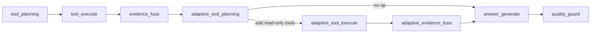

# Phase50.24 自适应工具规划设计

## 背景

Phase50.21 到 Phase50.23 已经把一张图 AI 的 LangGraph-first 链路推进到三个关键能力：

- 执行前可以预览计划、上下文、工具和来源。
- 执行时会复用计划快照，并在返回中对比计划与实际执行。
- 前端工作台已经从 `AgentChatFloat.vue` 中拆出上下文、对话、结果和建议动作组件。

当前 Runtime 仍然是固定线性链路：

```text
request_normalize -> context_build -> intent_recognize -> context_enrich
-> tool_planning -> tool_execute -> evidence_fuse -> answer_generate -> quality_guard
```

这让计划与执行变得可解释，但还不具备 LangGraph 更有价值的“根据中间结果改变下一步”的能力。例如：

- 第一轮业务工具没有命中数据时，Runtime 不会自动补一次知识检索。
- 业务工具返回命中但证据不足时，Runtime 不会追加更窄的补充工具。
- 工具失败后，回答只能基于失败结果降级，不能做一次有边界的补救规划。
- Trace 中看不到“为什么需要第二轮工具”的解释。

Phase50.24 的目标是在不重写主链路、不引入无限 Agent 循环的前提下，加入一个可观测、可测试、只读的自适应工具规划分支。

## 目标

1. 在第一轮 `tool_execute + evidence_fuse` 后判断证据是否足够。
2. 当证据不足且仍有安全余量时，最多追加一轮只读工具规划和执行。
3. 第二轮工具只允许使用现有只读白名单工具，不触发方案保存、派单或数据库写入。
4. 回答、Trace、`answerMeta` 和 `data` 中暴露自适应规划状态。
5. 计划执行一致性对比能看见追加工具，并标记为可解释的额外执行，而不是隐藏偏差。
6. Runtime 在 LangGraph 可用与不可用的顺序执行 fallback 下表现一致。

## 非目标

- 不做无限多轮 ReAct 循环。
- 不把用户对话历史改造成长期记忆。
- 不新增写工具或自动保存方案。
- 不改变 Java Tool Gateway 的工具契约。
- 不重构前端工作台 UI，只复用已有 Trace、执行对比和消息 meta 展示入口。
- 不把 Phase50.24 做成 ops 页面专属功能；它属于一张图 AI 主链路能力。

## 方案对比

### 方案 A：重写 LangGraph 条件边

在 `StateGraph` 中引入条件边：`evidence_fuse` 后根据证据结果跳到 `tool_planning` 或 `answer_generate`，并用循环计数控制最多两轮。

优点：

- 最符合 LangGraph 条件分支模型。
- 图结构表达清晰，后续扩展多轮循环更自然。

缺点：

- 当前项目已有顺序执行 fallback，条件图和 fallback 容易出现行为差异。
- 需要重排现有 live trace 节点命名和测试。
- 对 Phase50.24 来说改动偏大，容易影响已经稳定的 plan/run 契约。

### 方案 B：在线性流程中加入自适应节点

把主流程调整为：

```text
... -> tool_execute -> evidence_fuse
-> adaptive_tool_planning -> adaptive_tool_execute -> adaptive_evidence_fuse
-> answer_generate -> quality_guard
```

`adaptive_tool_planning` 根据第一轮 evidence 决定是否追加工具；没有必要追加时后两个节点 no-op。LangGraph 和顺序执行 fallback 都执行同一组节点，因此行为一致。

优点：

- 改动面可控，不需要重写整张图。
- 自适应行为有独立节点和 Trace，可观测性好。
- fallback 与 LangGraph 主路径一致，测试简单。
- 能与 Phase50.22 的计划执行对比自然衔接：追加工具就是实际额外工具，并有原因说明。

缺点：

- 图结构不是纯条件边，而是“条件 no-op 节点”。
- 只能覆盖一轮补救，不适合复杂长任务。

### 方案 C：后处理阶段重跑工具并重新生成回答

保持现有图不变，`quality_guard` 后如果证据不足，再额外执行补充工具、融合证据并重新生成回答。

优点：

- 对现有流程侵入最小。
- 可以作为包装层快速落地。

缺点：

- 第一版回答已经生成后再重算，Trace 和耗时解释不自然。
- 容易让质量守卫、计划执行对比和 live trace 顺序混乱。
- 用户看到的“执行中”状态无法准确表达补救规划发生的位置。

### 选型

选择方案 B。它用独立节点表达自适应分支，在当前架构中最稳：既让 Runtime 具备条件行为，又避免大规模图结构重写。方案 A 可作为后续真正多轮 Agent 化时的升级方向；方案 C 不采用，因为它会让执行顺序和可解释性变差。

## 后端设计

### 新增自适应规划模块

新增 `srmp-ai-orchestrator/app/adaptive_planner.py`，只负责纯决策和计划合并，不直接调用工具。

核心数据结构：

```python
@dataclass
class AdaptivePlanningDecision:
    enabled: bool
    should_replan: bool
    reason: str
    added_calls: List[ToolCall]
    skipped_tool_names: List[str]
    iteration: int = 1
    max_iterations: int = 1
```

核心函数：

- `should_replan(evidence, tool_results, planned_calls, executed_tool_names, options)`：判断是否需要第二轮。
- `build_adaptive_tool_calls(request, intent, intent_detail, evidence, executed_tool_names)`：生成候选补充工具。
- `merge_tool_calls(existing_calls, added_calls, max_tool_calls)`：去重并遵守 `settings.max_tool_calls`。
- `summarize_adaptive_planning(decision, executed_results)`：生成可写入 response 的精简状态。

### 触发规则

第二轮规划满足全部条件才会执行：

- `options.disableAdaptivePlanning` 不为 `true`。
- 第一轮 evidence 不足，或所有业务工具失败。
- 当前轮次小于 `maxAdaptiveIterations`，默认 1。
- 仍未超过 `settings.max_tool_calls`。
- 候选工具不在第一轮已执行工具集合中。
- 候选工具属于只读工具白名单。

默认候选策略：

- 第一轮没有调用 `knowledge.retrieve` 且业务命中为 0：追加 `knowledge.retrieve`。
- 第一轮有业务命中但 knowledge 命中为 0，且问题涉及养护建议、病害解释或评价指标：追加 `knowledge.retrieve`，query 使用原问题加上路线、年份、对象类型。
- 区域/路线请求缺少关键业务统计时：在已知 `routeCode`、`year`、`geometry` 或 `selectedObject` 的范围内追加一个未执行过的 GIS 只读摘要工具。
- 所有候选都已经执行过或超过工具上限：不追加，返回 `should_replan=false` 和明确原因。

### Workflow 节点

`NODE_FLOW` 增加三个节点：

```text
adaptive_tool_planning
adaptive_tool_execute
adaptive_evidence_fuse
```

节点职责：

- `adaptive_tool_planning`：读取第一轮 evidence，生成 `state["adaptiveToolPlan"]` 和 `state["adaptivePlanning"]`。
- `adaptive_tool_execute`：仅当有追加工具时调用 Java Tool Gateway，并把结果追加到 `state["toolResults"]`。
- `adaptive_evidence_fuse`：仅当有追加结果时重新融合 evidence；否则沿用第一轮 evidence。

这些节点都必须支持 no-op，并在 live trace 中写出清晰状态：

- `ADAPTIVE_SKIPPED`：证据足够或没有安全候选工具。
- `ADAPTIVE_PLANNED`：已规划第二轮工具。
- `ADAPTIVE_EXECUTED`：第二轮工具执行完成。
- `ADAPTIVE_FUSED`：已把第二轮结果并入证据。

### 响应契约

Runtime run response 增加：

```json
{
  "answerMeta": {
    "adaptivePlanningStatus": "EXECUTED"
  },
  "data": {
    "adaptivePlanning": {
      "enabled": true,
      "status": "EXECUTED",
      "iterations": 1,
      "maxIterations": 1,
      "reason": "业务工具未命中，追加知识检索补充解释依据",
      "addedToolNames": ["knowledge.retrieve"],
      "skippedToolNames": [],
      "evidenceSufficientBefore": false,
      "evidenceSufficientAfter": true
    }
  },
  "trace": {
    "adaptivePlanning": {
      "status": "EXECUTED",
      "addedToolNames": ["knowledge.retrieve"]
    }
  }
}
```

`status` 取值：

- `DISABLED`：请求显式关闭自适应规划。
- `SKIPPED_SUFFICIENT`：第一轮证据已足够。
- `SKIPPED_NO_CANDIDATE`：证据不足但没有安全候选工具。
- `SKIPPED_LIMIT`：达到工具数或轮次上限。
- `PLANNED`：已生成第二轮工具，但尚未执行。
- `EXECUTED`：第二轮工具执行并融合完成。
- `FAILED`：第二轮工具执行失败，但主流程继续降级回答。

### 与计划执行一致性对比的关系

Phase50.22 的 `planExecution.actualToolNames` 应包含第二轮追加工具。为了避免用户误以为系统无原因偏离计划，`planExecution` 增加可选字段：

```json
{
  "adaptiveExtraToolNames": ["knowledge.retrieve"],
  "adaptiveReason": "业务工具未命中，追加知识检索补充解释依据"
}
```

当计划与实际工具不完全一致但额外工具全部来自自适应规划时，`status` 保持 `PARTIAL`，并在 warnings 中说明“追加工具来自自适应规划”。如果缺失计划关键工具，仍按原规则标记 `DIVERGED`。

### 配置

新增环境变量：

- `SRMP_ADAPTIVE_PLANNING_ENABLED`，默认 `true`。
- `SRMP_MAX_ADAPTIVE_ITERATIONS`，默认 `1`，本阶段最大允许值为 `1`。

请求级 options：

- `disableAdaptivePlanning: true`：关闭本次自适应规划。
- `maxAdaptiveIterations: 0 | 1`：本次最大追加轮次，超过服务端上限时按服务端上限截断。

`strategy_metadata()` 返回：

```json
{
  "adaptivePlanning": true,
  "maxAdaptiveIterations": 1
}
```

## 前端设计

前端不新增页面和大组件，只读取后端返回的 `adaptivePlanning`：

- Assistant message meta 中可以显示“已追加 1 个工具”或“证据足够，未追加工具”。
- 计划执行对比面板展示 `adaptiveExtraToolNames` 和 `adaptiveReason`。
- Trace drawer 继续使用现有步骤列表；如果 Runtime 返回 adaptive 节点，按普通步骤展示。

本阶段不新增手动开关 UI。需要关闭时由请求 options 或 ops 调试入口传入。

## 数据流



## 错误处理

- 自适应规划模块异常：标记 `FAILED`，保留第一轮 evidence，继续生成回答。
- 第二轮工具部分失败：失败结果进入 `failedTools`，可用结果继续融合。
- 第二轮没有任何结果：状态为 `SKIPPED_NO_CANDIDATE` 或 `FAILED`，按第一轮信息回答。
- 工具上限不足：状态为 `SKIPPED_LIMIT`，不强行覆盖 `settings.max_tool_calls`。
- 请求关闭自适应规划：状态为 `DISABLED`，不影响原有线性链路。

## 测试策略

### 后端单元测试

新增 `srmp-ai-orchestrator/tests/test_adaptive_planner.py`：

- 证据足够时返回 `SKIPPED_SUFFICIENT`。
- 业务工具 0 命中且未调用知识检索时追加 `knowledge.retrieve`。
- 已调用过的工具不会重复追加。
- 达到 `max_tool_calls` 时返回 `SKIPPED_LIMIT`。
- 请求 `disableAdaptivePlanning=true` 时返回 `DISABLED`。

### Workflow 测试

扩展或新增 Runtime workflow 测试：

- 第一轮业务工具 0 命中时，执行第二轮知识检索并重新融合 evidence。
- 第二轮工具失败时主流程仍返回回答，`adaptivePlanning.status=FAILED`。
- 顺序执行 fallback 与 LangGraph 可用路径返回同样的 `adaptivePlanning` 结构。
- `strategy_metadata()` 暴露自适应规划能力和轮次上限。

### 计划执行对比测试

扩展 `test_plan_execution.py`：

- 实际工具比计划多一个自适应工具时，返回 `PARTIAL`。
- `adaptiveExtraToolNames` 和 `adaptiveReason` 写入 plan execution。
- 缺失计划关键工具时仍返回 `DIVERGED`，不会被自适应追加掩盖。

### 前端测试

扩展 `srmp-web-ui/tests/mapAiPlanPreview.test.mjs` 或新增轻量测试：

- `normalizePlanExecution` 能读取 `adaptiveExtraToolNames`。
- 计划对比文案能区分“计划外偏差”和“自适应追加”。
- 缺少 `adaptivePlanning` 字段时保持兼容。

## 验收标准

1. 默认请求在第一轮证据足够时不多调用工具。
2. 第一轮证据不足且存在安全候选时，最多追加一轮只读工具。
3. Response、Trace、`answerMeta` 和 `data` 中能看到自适应规划状态。
4. 计划执行对比能解释自适应追加工具。
5. 后端单元测试、workflow 测试和相关前端测试通过。
6. `npm run build` 和 orchestrator pytest 相关用例通过。

## 后续延展

- 当 Phase50.24 稳定后，再考虑把条件 no-op 节点升级为真正 LangGraph conditional edge。
- 如果业务需要长任务，可以引入多轮上限、预算和用户中断机制。
- 如果前端用户需要控制成本，可在 ops 或高级设置里加入“允许自适应补充检索”开关。
