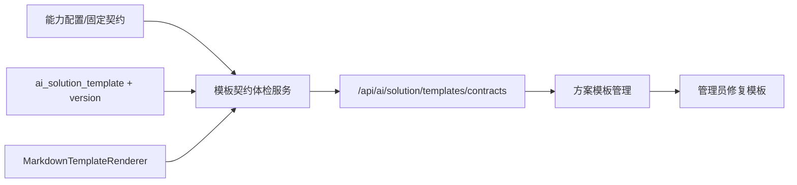

# 方案模板契约治理设计

## 背景

一张图 AI 助手已经把“分析”和“生成成果”拆成了更清晰的操作模型，生成侧也拆出了路线报告、路段计划、病害处置、病害复核、评定建议、区域建议等子能力。现在反复暴露的问题集中在模板契约：

- 能力配置、前端按钮、Java 默认方案类型和数据库模板之间没有一张可校验的契约表。
- 部分能力只声明 `solutionType`，没有固定 `templateCode`，容易退回系统兜底模板。
- 模板变量依赖散落在模板内容和 Java 变量归一化逻辑里，缺变量只能在用户点击生成后才暴露。
- 管理员能管理模板，但不能一眼看到“哪个能力缺模板、哪个模板变量不可满足、当前默认模板是否符合能力期望”。

## 目标

1. 建立六类生成成果的强契约：能力 ID、业务名称、action、context、objectType、solutionType、templateCode、必备变量、前端动作文案。
2. 提供后端只读契约体检接口，聚合能力配置、数据库启用模板、默认模板、模板变量和样例变量渲染结果。
3. 在方案模板管理页展示契约体检结果，管理员可快速定位缺模板、变量缺失、编码不一致和禁用模板。
4. 保持生成链路明确：不兼容旧模板别名，不再依赖“找不到就泛化兜底”作为正常路径。
5. 保留系统兜底模板作为异常兜底，但体检必须把兜底风险标红。

## 非目标

- 不重写方案生成、LLM 调用或 GIS 工具链。
- 不在第一步做发布拦截；先做体检和可视化，确认稳定后再加发布/保存拦截。
- 不引入新的模板表结构；继续复用 `ai_solution_template` 和 `ai_solution_template_version`。
- 不新增复杂父子能力继承模型；继续沿用现有 `family: solution.generate` 分组。

## 方案选择

### 方案 A：只在前端维护契约表

优点是实现快。缺点是前端无法可靠判断数据库模板、默认模板和真实变量渲染结果，管理员看到的是静态配置，不适合排障。

### 方案 B：后端只读契约体检，前端展示

后端定义契约和校验逻辑，查询数据库模板并用现有渲染器做样例变量检查；前端只负责展示状态和跳转到模板编辑。这个方案最稳，和现有模板服务边界一致。

### 方案 C：后端强契约加发布拦截

最严格，但风险较高。当前模板数据可能还有历史不一致，直接拦截会影响管理员修复模板的过程。适合在体检稳定后作为第二阶段。

本阶段采用方案 B。

## 契约清单

| 能力 ID | 前端动作 | action | context | objectType | solutionType | templateCode |
| --- | --- | --- | --- | --- | --- | --- |
| `solution.route_report` | 生成路线养护报告 | `GENERATE_ROUTE_REPORT` | `ROUTE` | `ROAD_ROUTE` | `ROUTE_REPORT` | `route_report_default` |
| `solution.section_plan` | 生成路段养护计划 | `GENERATE_OBJECT_SOLUTION` | `OBJECT` | `ROAD_SECTION` | `SECTION_PLAN` | `map_object_section_plan_default` |
| `solution.disease_treatment` | 生成病害处置建议 | `GENERATE_OBJECT_SOLUTION` | `OBJECT` | `DISEASE` | `DISEASE_TREATMENT` | `map_object_disease_treatment_default` |
| `solution.disease_review` | 生成病害复核意见 | `GENERATE_OBJECT_SOLUTION` | `OBJECT` | `DISEASE` | `DISEASE_REVIEW` | `map_object_disease_review_default` |
| `solution.assessment_advice` | 生成评定养护建议 | `GENERATE_OBJECT_SOLUTION` | `OBJECT` | `ASSESSMENT_RESULT` | `EVALUATION_UNIT_ADVICE` | `map_object_evaluation_unit_advice_default` |
| `solution.region_advice` | 生成区域养护建议 | `GENERATE_REGION_SOLUTION` | `REGION` | `MAP_REGION` | `REGION_MAINTENANCE_SUGGESTION` | `map_region_maintenance_advice_default` |

说明：

- `LOW_SCORE_TREATMENT` 保留为评定对象的细分结果类型，但它不再作为前端一律显示的默认动作。低分场景可由后端根据评定指标自动选择，或在模板体检中作为评定建议的扩展模板检查。
- 不再用 “未提供 templateCode，仅按 solutionType 找模板” 作为标准契约。

## 后端设计

新增 `SolutionTemplateContractService`，职责：

- 返回固定契约清单。
- 按租户查询每个契约对应的启用模板和默认模板。
- 校验 `templateCode + originType + objectType + solutionType` 是否命中唯一启用模板。
- 读取当前版本变量列表，并用样例变量调用 `MarkdownTemplateRenderer.renderWithCheck`。
- 输出每个契约的状态：`OK`、`WARN`、`ERROR`。

新增接口：

```text
GET /api/ai/solution/templates/contracts
```

返回结构：

```json
{
  "summary": {
    "total": 6,
    "ok": 4,
    "warn": 1,
    "error": 1
  },
  "contracts": [
    {
      "capabilityId": "solution.route_report",
      "label": "生成路线养护报告",
      "action": "GENERATE_ROUTE_REPORT",
      "contextScope": "ROUTE",
      "originType": "MAP_OBJECT",
      "objectType": "ROAD_ROUTE",
      "solutionType": "ROUTE_REPORT",
      "templateCode": "route_report_default",
      "status": "OK",
      "checks": [
        {"code": "TEMPLATE_EXISTS", "status": "PASS", "message": "已命中启用模板"},
        {"code": "VARIABLES_RENDER", "status": "PASS", "message": "样例变量渲染无缺失"}
      ],
      "template": {
        "id": "template-id",
        "templateName": "路线技术状况报告默认模板",
        "currentVersion": "v1",
        "isDefault": true,
        "status": "ENABLED"
      },
      "variables": ["routeCode", "routeSummary", "assessmentSummary"]
    }
  ]
}
```

校验规则：

- `TEMPLATE_CODE_DECLARED`：契约必须有 `templateCode`。
- `TEMPLATE_EXISTS`：存在启用模板。
- `TEMPLATE_SCOPE_MATCH`：模板的 `origin_type`、`object_type`、`solution_type` 和契约一致。
- `TEMPLATE_DEFAULT`：模板是当前场景默认模板；非默认为 `WARN`，不存在启用模板为 `ERROR`。
- `VARIABLES_RENDER`：样例变量渲染后没有 `missingVariables`。
- `LEGACY_ALIAS`：发现旧 solutionType 或旧 templateCode 时返回 `WARN`，但本阶段不自动兼容。

## 前端设计

在 `方案模板管理` 页面顶部新增“契约体检”区：

- 总览卡：正常、警告、错误数量。
- 契约表：能力、动作、对象类型、方案类型、期望模板、当前模板、状态。
- 错误详情：缺模板、变量缺失、非默认模板、禁用模板。
- 操作：刷新、按契约筛选模板、复制契约信息。

前端不重复维护契约，只消费后端 `/contracts` 结果。

## 数据流



## 测试策略

后端：

- 单测契约清单包含六类成果，且每类都有 `templateCode`。
- 单测模板缺失时状态为 `ERROR`。
- 单测模板存在但变量缺失时状态为 `ERROR`。
- 单测非默认但启用模板状态为 `WARN`。

前端：

- `npm run build` 覆盖类型和组件集成。
- 页面手工验收：打开方案模板管理页，能看到体检总览和每个契约状态。

## 验收标准

1. 管理员打开方案模板管理页，可以看到六类生成成果契约状态。
2. `DISEASE_TREATMENT` 必须有明确 `map_object_disease_treatment_default`，不再只按 `solutionType` 模糊匹配。
3. 任意契约缺启用模板时，体检结果显示 `ERROR` 并给出期望模板编码。
4. 任意模板缺变量时，体检结果显示缺失变量名。
5. 现有一张图生成链路不因体检接口改变行为。
6. 后端单测和前端构建通过。

## 后续阶段

体检稳定后再做方案 C：

- 新建模板或发布版本时，若模板对应契约且变量缺失，阻止设为默认。
- 生成链路在契约模板缺失时返回明确错误，而不是静默使用系统兜底模板。
- AI 治理台把能力-模板契约和能力-工具矩阵放在同一治理视图中。
