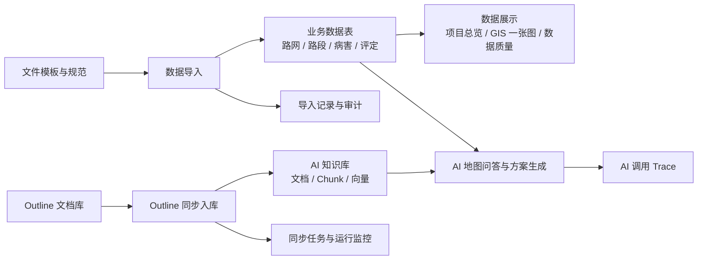
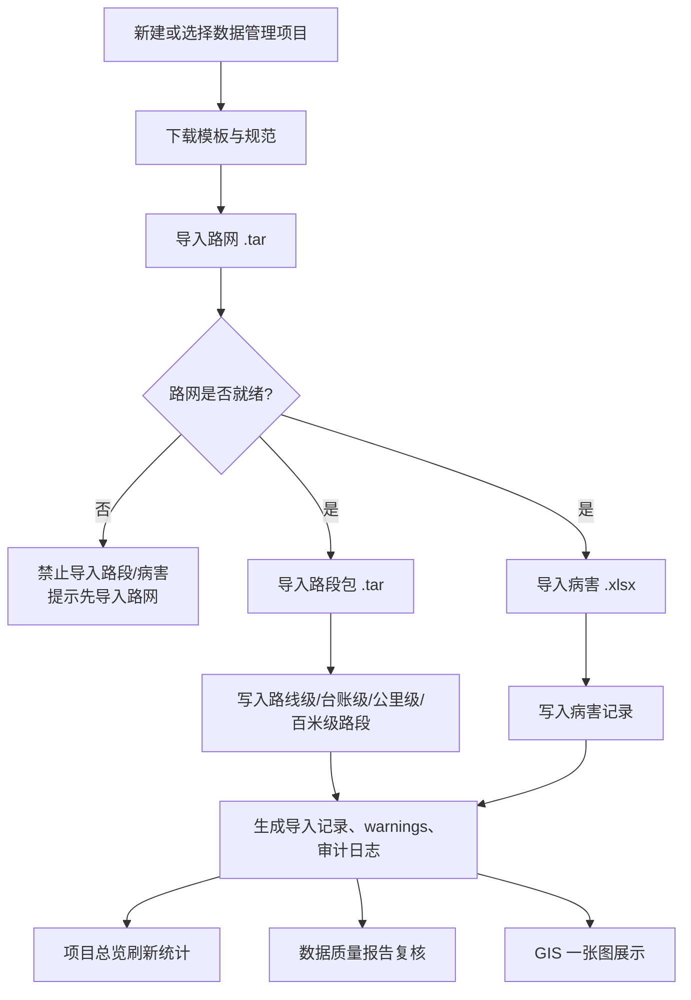
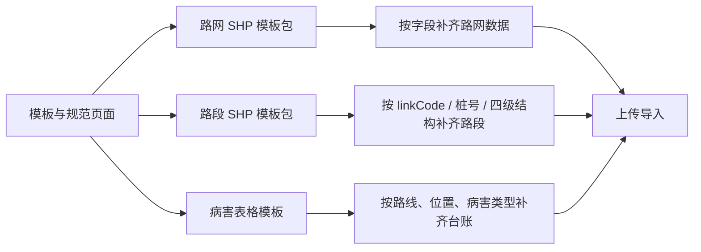
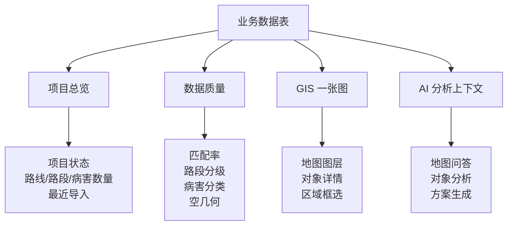
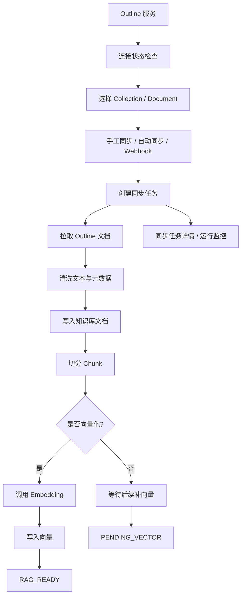
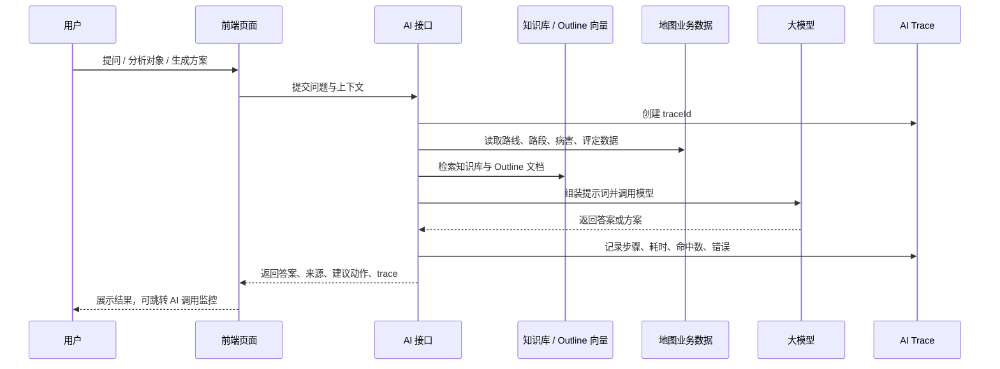
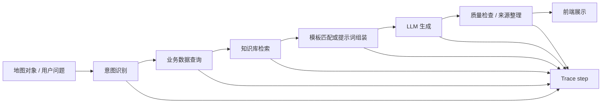
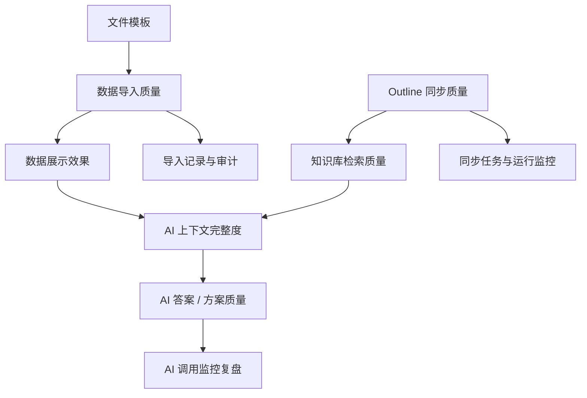
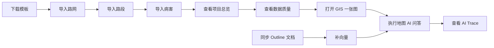

# 系统功能流程说明：Outline 同步、数据导入、数据展示、文件模板、AI 调用

本文面向产品、实施、运维和研发，用一份图文说明串起系统中几个关键能力：Outline 同步、数据导入、数据展示、文件模板、AI 调用监控。目标是让读者先看懂“数据从哪里来、进入哪里、被谁消费、结果在哪里看”，再进一步定位页面和接口。

## 1. 功能总览

核心理解：

- 文件模板决定导入文件应该长什么样。
- 数据导入把路网、路段、病害写入业务库，并生成导入记录。
- 数据展示读取业务库，服务项目总览、数据质量和 GIS 一张图。
- Outline 同步把外部文档沉淀到 AI 知识库，供 RAG 检索和 AI 方案生成引用。
- AI 调用监控记录每一次 AI 问答、检索、生成、降级和耗时。

## 2. 页面入口

| 功能 | 前端入口 | 主要用途 |
|---|---|---|
| 数据管理-项目总览 | `/admin/data-management/projects` | 查看项目状态、路线/路段/病害总量、进入导入或 GIS |
| 数据管理-项目导入 | `/admin/data-management/import`、`/admin/data-management/{projectId}/import` | 按项目导入路网、路段、病害 |
| 数据管理-导入记录 | `/admin/data-management/import-records` | 查看导入流水、失败信息、warnings |
| 数据管理-数据质量 | `/admin/data-management/quality` | 查看路线匹配率、路段分级数量、病害分类、空几何等质量指标 |
| 数据管理-模板与规范 | `/admin/data-management/templates` | 下载路网、路段、病害模板，查看导入规范 |
| GIS 一张图 | `/gis/one-map` | 地图展示路网、路段、病害、评定结果，并触发地图 AI |
| Outline 连接状态 | `/agent/outline/status` | 检查 Outline 配置和连通性 |
| Outline 文档搜索 | `/agent/outline/search` | 直接搜索 Outline 文档 |
| Outline 同步入库 | `/agent/outline/sync` | 手工同步 Outline 文档到知识库 |
| Outline 同步任务 | `/agent/outline/tasks` | 查看同步任务详情和失败重试 |
| Outline 自动同步 | `/agent/outline/auto-sync` | 配置定时/手动/事件触发同步 |
| Outline 运行监控 | `/agent/outline/runs` | 查看自动同步运行记录 |
| AI 调用监控 | `/agent/ai-traces` | 查看 AI traceId、调用链路、耗时、失败原因 |
| AI 运维总览 | `/agent/ai-ops` | 汇总 LLM、Embedding、知识库、Outline 同步状态 |

## 3. 数据导入流程

### 3.1 导入顺序

1. 路网：项目的基础数据，提供路线编号和空间线形。
2. 路段：依赖路网路线编号；若路线编号未登记，会保留 `route_code`，但 `route_id` 为空，并输出 warning。
3. 病害：依赖路网路线编号；路线未匹配时同样会记录未关联数据，供后续质量检查。

### 3.2 核心接口

| 操作 | 接口 |
|---|---|
| 项目分页 | `POST /api/data-mgmt/projects/page` |
| 项目摘要 | `GET /api/data-mgmt/projects/{id}/summary` |
| 导入路网 | `POST /api/data-mgmt/projects/{id}/imports/road-network` |
| 导入路段包 | `POST /api/data-mgmt/projects/{id}/imports/section-package` |
| 导入病害 Excel | `POST /api/data-mgmt/projects/{id}/imports/disease-excel` |
| 导入记录分页 | `POST /api/data-mgmt/projects/{id}/import-records/page` |
| 全局导入记录 | `POST /api/data-mgmt/import-records/page` |
| 导入记录详情 | `GET /api/data-mgmt/projects/{projectId}/import-records/{recordId}` |

### 3.3 导入结果在哪里看

- 项目总览：看路线、路段、病害是否增长。
- 项目导入工作台：看本项目最近导入结果。
- 导入记录：看文件名、状态、耗时、结果摘要、warnings 和失败明细。
- 数据质量：看未关联路线、空几何、未分类病害等质量问题。
- GIS 一张图：看空间数据是否真正能在地图上渲染。

## 4. 文件模板与规范

### 4.1 支持模板

| 模板 | 支持格式 | 关键要求 |
|---|---|---|
| 路网 | Shapefile 模板包 `.tar` | 必须包含 `.shp/.dbf/.shx/.prj`，路线编号不能为空 |
| 路段 | Shapefile 模板包 `.tar` | 需包含路线级、台账级、公里级、百米级；`linkCode` 必须能关联路网 |
| 病害 | `.xlsx` / `.csv` 表格 | 需包含路线、位置、病害分类、病害类型等字段 |

### 4.2 下载接口

| 模板 | 接口 |
|---|---|
| 路网模板 | `GET /api/data-mgmt/templates/road-network/download` |
| 路段模板 | `GET /api/data-mgmt/templates/section/download` |
| 病害模板 | `GET /api/data-mgmt/templates/disease/download` |

## 5. 数据展示流程

### 5.1 项目总览

项目总览按项目展示：

- 项目状态。
- 路线 / 路段 / 病害数量。
- 最近导入类型、状态、时间。
- 快捷进入 GIS 或项目导入工作台。

### 5.2 数据质量

数据质量报告用于判断“数据能不能被地图和 AI 正常消费”：

- 总量：路线数、路段数、病害数。
- 路段分级：线路级、台账级、公里级、百米级。
- 路线匹配：已关联路线、路段未关联、病害未关联。
- 几何质量：路线空几何、路段空几何、病害空几何。
- 病害质量：未分类病害、病害大类分布、严重程度分布。

### 5.3 GIS 一张图

GIS 一张图是业务展示和 AI 分析的共同入口：

- 展示路网、路段、病害、评定结果等图层。
- 点击地图对象查看详情。
- 框选区域后生成区域上下文。
- 将当前对象、区域、路线、图层状态传给地图 AI。

## 6. Outline 同步流程

### 6.1 同步方式

| 方式 | 入口 | 适用场景 |
|---|---|---|
| 手工同步 | Outline 同步入库 | 首次导入、临时补同步、验证配置 |
| 失败重试 | Outline 同步任务 | 某次任务部分失败后只重试失败项 |
| 自动同步 | Outline 自动同步 | 固定周期同步指定集合或文档 |
| Webhook | Outline 自动同步配置 | Outline 文档变化后触发同步 |
| 补向量 | AI 运维总览 / Outline API | 文档已入库但向量未生成或需强制重建 |

### 6.2 核心接口

| 操作 | 接口 |
|---|---|
| 连接状态 | `GET /api/outline/status` |
| 搜索 Outline | `POST /api/outline/search` |
| 集合列表 | `GET /api/outline/collections` |
| 文档列表 | `POST /api/outline/documents/list` |
| 手工同步 | `POST /api/outline/sync` |
| 同步任务列表 | `GET /api/outline/sync-tasks` |
| 同步任务详情 | `GET /api/outline/sync-tasks/{id}` |
| 失败重试 | `POST /api/outline/sync-tasks/{id}/retry-failed` |
| 知识库统计 | `GET /api/outline/knowledge-stats` |
| 补向量 | `POST /api/outline/vectorize` |
| 自动同步配置 | `GET/POST/PUT/DELETE /api/outline/auto-sync/configs` |
| 立即运行自动同步 | `POST /api/outline/auto-sync/configs/{id}/run` |
| 自动同步运行记录 | `GET /api/outline/auto-sync/runs` |

### 6.3 状态理解

| 状态 | 含义 | 常见处理 |
|---|---|---|
| `NOT_SYNCED` | Outline 文档未进入知识库 | 执行同步 |
| `PENDING_VECTOR` | 文档已入库但向量未完成 | 执行补向量 |
| `RAG_READY` | 文档和向量均可用于 RAG | 可直接被 AI 检索引用 |
| `FAILED` | 同步或向量化失败 | 查看任务详情并重试 |

## 7. AI 调用流程

### 7.1 AI 能力入口

| 能力 | 页面 | 说明 |
|---|---|---|
| AI 问答 | `/agent/chat` | 普通问答和知识库增强问答 |
| 地图 AI | `/gis/one-map` | 结合当前地图对象、区域、路线和图层上下文 |
| 方案生成 | `/agent/solution-generate`、GIS 动作 | 生成路线报告、对象方案、区域方案 |
| 方案任务 | `/agent/solution-tasks` | 查看、保存、闭环方案任务 |
| AI 运维总览 | `/agent/ai-ops` | 看 LLM、Embedding、知识库和 Outline 状态 |
| AI 调用监控 | `/agent/ai-traces` | 查看每次调用的 traceId 和 step 明细 |

### 7.2 Trace 记录什么

AI Trace 用于回答“这次 AI 为什么这么答、慢在哪里、失败在哪里”：

- `traceId`：一次 AI 调用的唯一编号。
- 用户问题或动作类型。
- 总状态：`SUCCESS`、`FAILED`、`TIMEOUT`、`SKIPPED` 等。
- 总耗时和每一步耗时。
- 检索命中数量。
- 是否走降级或兜底逻辑。
- 每一步错误信息。

### 7.3 常见调用链路

## 8. 五类功能之间的依赖关系

关键依赖：

- 模板字段不规范，会直接导致导入失败或 routeId 为空。
- 路网没导入，路段和病害无法可靠关联路线。
- 空几何会影响 GIS 展示、框选分析和地图 AI 上下文。
- Outline 未向量化，AI 仍可能能查业务数据，但知识增强效果会变弱。
- AI Trace 是排查 AI 问答、方案生成、RAG 检索和模型调用问题的第一入口。

## 9. 排查速查

| 现象 | 先看哪里 | 重点检查 |
|---|---|---|
| 路段/病害导入后地图不显示 | 数据质量、导入记录、GIS 图层 | 是否空几何、是否导入到当前项目、图层是否开启 |
| 提示路线编号未登记 | 导入记录 warnings、数据质量 | 路网是否缺少该 route_code，是否需补录路网后关联 |
| 项目总览数量不对 | 项目摘要、导入记录 | 是否导入到正确项目，导入是否成功，是否已清除/归档 |
| Outline 文档搜不到 | Outline 连接状态、同步任务 | token、collection、同步任务状态、是否完成向量化 |
| AI 回答没有引用知识库 | AI Trace、AI 运维总览 | Embedding 是否可用，知识库 chunk/向量数量是否正常 |
| AI 调用慢或失败 | AI 调用监控 | 哪个 step 慢，LLM/Embedding 是否超时，是否有 fallback |
| 文件上传失败 | 模板与规范、导入记录详情 | 文件格式、必填字段、`.prj`、压缩包结构 |

## 10. 建议的验收路径

验收时建议按以下顺序：

1. 在“模板与规范”下载模板，准备最小可用数据。
2. 在“项目导入”按路网、路段、病害顺序导入。
3. 在“导入记录”确认状态、warnings 和失败明细。
4. 在“数据质量”确认路段分级、路线匹配率、空几何、病害分类。
5. 在“GIS 一张图”确认图层可见，点击对象可查看详情。
6. 在“Outline 同步入库”同步一批文档，并在“AI 运维总览”确认向量就绪。
7. 发起一次 AI 问答或地图 AI 分析。
8. 到“AI 调用监控”查看 traceId 和调用链路。

