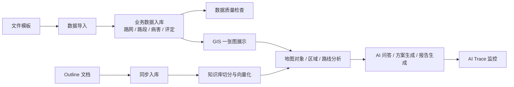
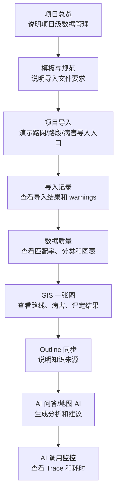

# 智路养护平台介绍文档

本文用于帮助项目成员在汇报、演示、培训或客户交流时介绍智路养护平台。文档分为“短版介绍”“完整介绍”“演示路线”和“常见问答”，可以按场景直接取用。

## 1. 一句话介绍

智路养护平台是一套面向公路养护管理的数据管理、GIS 展示和 AI 辅助分析系统，它把路网、路段、病害、评定结果和知识文档统一接入平台，通过 GIS 一张图和 AI 问答/方案生成，帮助管理人员更快看清路况、定位问题、形成养护建议。

## 2. 30 秒介绍

智路养护平台主要解决公路养护中的三个问题：第一，数据分散，路网、路段、病害、评定结果难以统一管理；第二，数据有空间属性，但传统表格很难直观看到问题在哪里；第三，养护分析依赖经验，形成方案和报告效率不高。

这个系统通过数据导入把业务数据统一入库，通过 GIS 一张图把路线、路段、病害和评定结果展示出来，再通过 AI 知识库、Outline 文档同步和大模型分析，提供问答、区域分析、路线分析和养护方案生成能力。

## 3. 3 分钟介绍话术

大家好，我介绍一下智路养护平台。

这个系统面向公路养护管理场景，核心目标是把“数据接得进来、地图看得清楚、问题分析得出来、方案沉淀得下来”这几件事打通。

首先是数据管理。平台支持以项目为单位导入路网、路段和病害数据。导入前可以下载系统提供的模板，导入后可以查看导入记录、失败明细、路线编号未匹配提示和数据质量报告。这样可以保证数据从源头上可追踪、可校验。

第二是 GIS 一张图。导入后的路线、路段、病害和评定结果会在地图上展示，用户可以按项目、路线、图层查看数据，也可以点击地图对象查看详情。相比单纯看 Excel 表，GIS 一张图可以更直观地看出病害分布、低分区间和重点养护位置。

第三是 AI 能力。系统接入了知识库和 Outline 文档同步能力，可以把养护规范、处置指南、内部文档同步到知识库，并进行向量化。AI 在回答问题或生成方案时，可以同时结合业务数据、地图上下文和知识库内容，减少空泛回答。

第四是过程可追踪。每一次 AI 调用都会生成 Trace，记录调用链路、检索命中、模型耗时、失败原因和是否降级。每一次数据导入也会进入导入记录和审计日志，方便后续排查和验收。

所以整体来看，智路养护平台不是一个单纯的数据录入系统，也不是单独的地图系统，而是一套“数据治理 + GIS 展示 + AI 辅助决策”的综合平台。它适合用于路况数据管理、病害分析、养护方案辅助生成、知识库问答和项目级数据质量管理。

## 4. 系统核心价值

| 价值 | 说明 |
|---|---|
| 数据统一 | 将路网、路段、病害、评定结果、知识文档统一管理 |
| 空间可视 | 通过 GIS 一张图把道路资产和病害问题直观展示 |
| 质量可控 | 数据导入有记录、有 warnings、有质量检查、有审计 |
| 分析提效 | AI 可结合地图对象、业务数据和知识库生成分析结论 |
| 过程可追踪 | 数据导入、Outline 同步、AI 调用都有监控和日志 |
| 知识沉淀 | 通过 Outline 同步和知识库，把规范、经验和文档沉淀为 AI 可检索资料 |

## 5. 系统总体流程

可以这样解释这张图：

- 左边是业务数据入口，先通过模板规范数据，再按项目导入平台。
- 中间是数据治理和地图展示，导入后的数据既能做质量检查，也能上图展示。
- 右边是 AI 能力，AI 会结合地图上下文、业务数据和知识库内容，生成问答、分析和方案。
- 最后所有 AI 调用会进入 Trace，所有导入会进入导入记录，便于复盘。

## 6. 模块介绍

### 6.1 数据管理

数据管理是整个平台的数据入口和项目治理中心。它按项目组织数据，支持项目创建、路网导入、路段导入、病害导入、导入记录查看、数据质量检查、模板下载、数据清除与审计。

介绍重点：

- 项目总览可以看到每个项目的路线数、路段数、病害数和最近导入状态。
- 项目导入要求先导入路网，再导入路段和病害，保证路线关联关系正确。
- 导入记录会保留文件名、导入状态、结果摘要、失败明细和 warnings。
- 数据质量页面可以查看路线匹配率、路段层级分布、病害分类、空几何等指标。

适合演示的页面：

- `/admin/data-management/projects`
- `/admin/data-management/{projectId}/import`
- `/admin/data-management/import-records`
- `/admin/data-management/quality`
- `/admin/data-management/templates`

### 6.2 文件模板与规范

文件模板用于统一数据格式，减少导入失败和字段不一致问题。系统提供路网、路段、病害三类模板。

介绍重点：

- 路网模板用于导入路线基础空间数据。
- 路段模板用于导入路线级、台账级、公里级、百米级路段数据。
- 病害模板用于导入病害台账数据。
- 模板页面同时说明支持格式、必填字段、坐标系和常见错误。

可以这样说：

“导入不是让用户随便传文件，而是先通过模板约束字段和结构。这样系统能在导入阶段发现问题，比如缺少 `.prj`、路线编号为空、路段 linkCode 无法匹配路网等。”

### 6.3 GIS 一张图

GIS 一张图是系统的核心展示入口。它把路线、路段、病害、评定结果等空间数据统一放到地图上，支持图层查看、对象详情、区域框选和 AI 联动。

介绍重点：

- 路线和路段用于展示道路资产。
- 病害点位或几何用于展示路面问题。
- 评定结果用于展示路况等级和指标。
- 点击对象后可以查看属性详情，也可以触发 AI 分析。
- 框选区域后可以分析区域内病害和评定情况。

可以这样说：

“GIS 一张图解决的是‘问题在哪里’。传统表格能告诉我们有多少病害，但地图能告诉我们病害集中在哪条路、哪个桩号区间，以及是否和低分评定结果重叠。”

### 6.4 Outline 同步与知识库

Outline 同步用于把外部知识文档接入平台，例如养护规范、处置指南、内部制度、项目经验等。同步后的文档会进入 AI 知识库，切分为 chunk，并生成向量，供 AI 检索引用。

介绍重点：

- 可以检查 Outline 连接状态。
- 可以手工同步指定集合或文档。
- 可以配置自动同步和 Webhook。
- 同步结果可在任务列表、运行监控和知识库统计中查看。
- 文档向量化完成后，AI 才能更好地引用这些知识。

适合演示的页面：

- `/agent/outline/status`
- `/agent/outline/sync`
- `/agent/outline/tasks`
- `/agent/outline/auto-sync`
- `/agent/outline/runs`
- `/agent/knowledge-vector`

### 6.5 AI 问答、分析与方案生成

AI 能力用于提升分析和报告生成效率。系统不仅调用大模型，还会结合业务数据、GIS 上下文、知识库和方案模板，生成更贴近养护业务的回答。

介绍重点：

- 普通 AI 问答可以回答养护知识和数据问题。
- 地图 AI 可以基于当前路线、路段、病害对象或框选区域分析。
- 方案生成可以形成路线报告、对象处置建议或区域养护建议。
- 方案任务可以保存、查看和闭环。
- AI Trace 可以回看每次调用用了哪些数据、检索了哪些知识、耗时多久、是否失败。

适合演示的页面：

- `/agent/chat`
- `/gis/one-map`
- `/agent/solution-generate`
- `/agent/solution-tasks`
- `/agent/ai-traces`
- `/agent/ai-ops`

## 7. 推荐演示路线

如果要现场介绍系统，建议按下面顺序演示。

### 7.1 5 分钟演示

1. 打开项目总览，说明平台按项目管理数据。
2. 打开模板与规范，说明数据导入有标准模板。
3. 打开数据质量，展示路线、路段、病害总量和质量图表。
4. 打开 GIS 一张图，展示路线、病害、评定结果上图。
5. 选择地图对象或区域，触发 AI 分析。
6. 打开 AI 调用监控，展示 traceId 和调用链路。

### 7.2 15 分钟演示

1. 从项目总览开始，说明项目状态、最近导入和数据规模。
2. 进入模板与规范，说明路网、路段、病害三类模板。
3. 进入项目导入工作台，说明“先路网、再路段、再病害”的导入顺序。
4. 进入导入记录，说明如何追踪每次导入的文件、状态、warnings 和失败明细。
5. 进入数据质量，讲路线匹配率、路段分级、空几何、病害分类。
6. 进入 GIS 一张图，展示图层、对象详情、区域框选。
7. 进入 Outline 同步，说明外部文档如何进入知识库。
8. 进入 AI 运维总览，展示 LLM、Embedding、知识库和 Outline 状态。
9. 发起 AI 问答或地图 AI 分析。
10. 进入 AI 调用监控，展示 Trace 记录和排查价值。

## 8. 对不同听众的介绍重点

### 8.1 给领导或业务负责人

重点讲价值：

- 数据统一管理，减少重复整理。
- GIS 一张图让路况问题直观可见。
- AI 辅助分析提高报告和方案生成效率。
- 导入记录、审计和 Trace 让过程可追踪。

少讲技术细节，多讲“解决了什么问题”和“能产生什么结果”。

### 8.2 给实施人员

重点讲流程：

- 如何建项目。
- 如何下载模板。
- 如何按顺序导入路网、路段、病害。
- 如何看导入记录和数据质量。
- 如何处理 route_code 未匹配、空几何、病害未分类等问题。

### 8.3 给运维人员

重点讲监控：

- AI 运维总览看 LLM、Embedding、知识库和 Outline。
- Outline 任务看同步是否成功。
- AI Trace 看调用是否失败、慢在哪里。
- 导入记录和审计看数据操作过程。

### 8.4 给研发人员

重点讲架构：

- 后端多模块：road-asset、gis、agent、import、assessment、disease。
- 数据存储：PostgreSQL + PostGIS。
- 前端：Vue 3 + Element Plus + Leaflet + ECharts。
- AI：RAG、工具调用、Trace、方案模板、Outline 文档同步。

## 9. 可直接照读的完整介绍

智路养护平台是一套面向公路养护管理的综合业务系统。它的核心目标不是只做数据录入，也不是只做地图展示，而是把公路养护中的数据接入、空间展示、质量检查、知识沉淀和 AI 辅助分析串成一条完整链路。

在数据侧，平台以项目为单位管理路网、路段和病害数据。用户可以先在模板与规范页面下载标准模板，再按路网、路段、病害的顺序导入数据。每次导入都会留下记录，包括导入状态、文件名、结果摘要、失败信息和 warning。对于路线编号未在路网中登记、几何为空、病害未分类等问题，系统会在导入记录和数据质量页面中提示出来，便于后续修正。

在展示侧，平台提供 GIS 一张图能力。导入后的路线、路段、病害和评定结果可以在地图上展示，用户可以打开不同图层，点击地图对象查看详情，也可以框选区域进行分析。这样养护人员不仅能看到表格里的数量，也能直观看到问题发生在哪里、是否集中在某些路段、是否和低分评定区间相关。

在知识侧，平台接入了 Outline 文档同步能力。养护规范、处置指南、项目经验等文档可以从 Outline 同步到系统知识库，经过文本切分和向量化后，成为 AI 可检索的知识来源。这样 AI 不只是基于通用模型回答，而是能结合内部文档和业务数据给出更贴近养护场景的建议。

在 AI 侧，系统支持普通问答、地图对象分析、区域分析、路线报告和方案生成。AI 会结合当前地图上下文、业务数据、知识库资料和方案模板输出结果。每一次 AI 调用都会生成 Trace，记录调用链路、检索命中、每一步耗时、错误信息和是否降级，方便排查和验收。

所以，这个平台的价值可以概括为四句话：第一，数据接得进来；第二，地图看得清楚；第三，问题分析得出来；第四，过程追踪得明白。它可以帮助养护管理人员提高数据治理效率、提升路况分析直观性，并通过 AI 辅助形成更高效的养护决策支持。

## 10. 常见问答

### Q1：这个系统和普通 GIS 系统有什么区别？

普通 GIS 系统主要解决空间展示问题。智路养护平台不仅展示地图，还管理项目数据、导入记录、数据质量、知识库、AI 分析和调用追踪。它更像是“GIS + 数据治理 + AI 辅助决策”的组合。

### Q2：为什么要先导入路网？

路网是路线编号和空间线形的基础。路段和病害都需要通过路线编号关联到路网。如果路网缺失，后续数据即使能入库，也可能出现 `route_id` 为空，影响质量检查、地图分析和 AI 上下文。

### Q3：Outline 同步有什么作用？

Outline 同步用于把规范、指南、制度、项目经验等文档接入知识库。AI 在回答问题和生成方案时，可以检索这些资料，减少凭空回答，提高答案依据。

### Q4：AI Trace 有什么用？

AI Trace 用于复盘一次 AI 调用。它能告诉我们这次调用用了哪些步骤、检索命中了多少资料、模型耗时多久、哪里失败、是否走了兜底逻辑。对于排查 AI 问答质量和性能问题很关键。

### Q5：数据质量页面主要看什么？

主要看四类指标：数据总量是否正确，路段分级数量是否完整，路线匹配率是否正常，是否存在空几何或未分类病害。这些指标直接影响 GIS 展示和 AI 分析效果。

## 11. 结束语

介绍系统时可以用一句话收尾：

智路养护平台通过“标准化导入、GIS 一张图、知识库同步、AI 辅助分析和全过程监控”，把公路养护数据从静态台账变成可展示、可分析、可追踪、可辅助决策的智能化资产。

